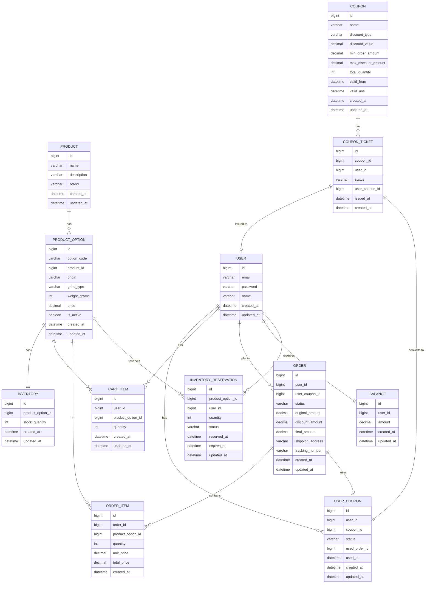

# 커피 원두 판매 시스템 ERD

## ERD 다이어그램



## 테이블 별 설계

### 1. USER (사용자)

**목적**: 고객 및 관리자 정보 관리

**주요 컬럼**:
- `id`: 기본키 (bigint)
- `email`: 이메일 (Unique, 로그인 ID)
- `password`: 비밀번호 (해시)
- `name`: 사용자 이름

**고려 사항**:
- `email`은 중복 불가 (로그인 식별자)

---

### 2. PRODUCT (상품)

**목적**: 커피 원두 상품 기본 정보 관리

**주요 컬럼**:
- `id`: 기본키
- `name`: 상품명 ("에티오피아 예가체프")
- `description`: 상품 설명
- `brand`: 커피 브랜드

**고려 사항**:
- 다양한 옵션(원산지, 분쇄 방식, 용량 조합)을 가진 상품을 표현하기 위해 PRODUCT 와 PRODUCT_OPTION 분리
- 상품은 여러 옵션을 가질 수 있음 (1:N 관계)

---

### 3. PRODUCT_OPTION (상품 옵션)

**목적**: 재고 관리 단위로 상품의 모든 옵션 조합을 고유하게 식별 (SKU 기반)

**주요 컬럼**:
- `id`: 기본키
- `option_code`: 옵션 코드 (**Unique**, "ETH-HD-200", "COL-WB-500") → SKU_CODE
- `product_id`: 상품 FK
- `origin`: 원산지 ("Ethiopia", "Colombia", "Brazil" 등)
- `grind_type`: 분쇄 방식 ("HAND_DRIP", "WHOLE_BEANS", "ESPRESSO")
- `weight_grams`: 용량 (200g, 500g)
- `price`: 가격
- `is_active`: 옵션 활성 여부 (soft delete)

**옵션 코드 체계**:
- 형식: `{ORIGIN_CODE}-{GRIND_CODE}-{WEIGHT}`
- 예시:
  - `ETH-HD-200`: 에티오피아-핸드드립-200g
  - `ETH-WB-200`: 에티오피아-원두-200g
  - `ETH-HD-500`: 에티오피아-핸드드립-500g
  - `COL-HD-500`: 콜롬비아-핸드드립-500g

**고려 사항**:
- `grind_code` 를 고려하면 별도 GRIND 테이블로 분리하거나 별도 컬럼을 두는 방식 고민
---

### 4. INVENTORY (재고)

**목적**: 상품 옵션별 재고 수량 관리

**주요 컬럼**:
- `id`: 기본키
- `product_option_id`: 상품 옵션 FK (**Unique** - 1:1 관계)
- `stock_quantity`: 현재 재고 수량

**고려사항**
- **동시성 제어**: PRODUCT_OPTION 과 분리하여 Lock 적용 용이
- **1:1 관계**: 각 상품 옵션은 하나의 재고 정보만 가짐

---

### 5. INVENTORY_RESERVATION (재고 예약)

**목적**: 재고 관리를 위한 임시 재고 예약 정보 관리

**주요 컬럼**:
- `id`: 기본키
- `product_option_id`: 상품 옵션 FK
- `user_id`: 사용자 FK
- `quantity`: 예약 수량
- `status`: 예약 상태
  - `RESERVED`: 주문 예약
  - `CONFIRMED`: 주문 확정
  - `EXPIRED`: 주문 만료 (10분 초과)
  - `CANCELLED`: 주문 취소
- `reserved_at`: 예약 시각
- `expires_at`: 만료 시각

**설계 배경**:
- **하이브리드 재고 관리**: 2단계 재고 차감 전략
  - **Phase 1 (예약)**: 주문창 진입 시 가상 예약 (실제 재고 차감 X)
  - **Phase 2 (차감)**: 결제 시 비관적 락으로 실제 재고 차감
- **사용자 경험 향상**: 주문창 진입 시 "내 재고"를 10분간 보장
- **악의적 선점 방지**: 타임아웃(10분) + 1인 1회 제한으로 재고 독점 방지

---

### 6. COUPON (쿠폰)

**목적**: 쿠폰 마스터 정보 관리

**주요 컬럼**:
- `id`: 기본키
- `name`: 쿠폰명
- `discount_type`: 할인 타입 
  - `PERCENTAGE`: 퍼센트 할인
  - `FIXED_AMOUNT`: 고정 금액 할인
- `discount_value`: 할인값
- `min_order_amount`: 최소 주문 금액
- `max_discount_amount`: 최대 할인 금액
- `total_quantity`: 총 발행 수량
- `valid_from`, `valid_until`: 유효 기간

**설계 변경사항**:
- `issued_quantity` 제거 → COUPON_TICKET으로 관리
- 쿠폰 메타데이터만 관리, 발급 관리는 COUPON_TICKET에서 처리

**제약 사항**:
- 전체 금액에 대한 할인을 전제

---

### 7. COUPON_TICKET (쿠폰 티켓)

**목적**: 선착순 쿠폰 발급을 위한 티켓 사전 생성 및 동시성 제어

**주요 컬럼**:
- `id`: 기본키
- `coupon_id`: 쿠폰 FK
- `user_id`: 사용자 FK (NULL: 미발급, NOT NULL: 발급됨)
- `status`: 티켓 상태 ('AVAILABLE', 'ISSUED', 'EXPIRED')
- `user_coupon_id`: 발급된 사용자 쿠폰 FK (nullable)
- `issued_at`: 발급 시각
- `created_at`: 생성 시각

**고려사항:**

**선착순 쿠폰 발급 특징**
- 정확성 : 정확히 1000명의 사용자에게만 발급 (수량 제어)
- 신속성 : 사용자가 최대한 대기하지 않고 빠르게 발급
- 유일성 : 한 사용자가 여러 번 발급받으면 안됨

⇒ 총 수량(`total_quantity`) 과 발급 수량(`issued_quantity`)을 하나의 Coupon 테이블로 관리할 경우
- 동시성 이슈 발생
- 동시성 이슈를 해결하기 위해 Lock 을 설정한다면, 발급 수량 컬럼을 관리하기 위해 1000명의 사용자가 하나의 레코드를 수정하기 위해 대기하는 상황 발생

```kotlin
fun 쿠폰발급(){
  // 1. 쿠폰 정보 조회
  // 2. 수량 체크 (total_quantity > issued_quantity)
  // 3. 발급 수량 증가 (issued_quantity = issued_quantity + 1)
  // 4. 사용자 쿠폰 발급
}
```

- 이 문제를 해결하기 위해 발급 수량만큼의 엔티티(1000개)를 미리 생성
  - `FOR UPDATE SKIP LOCKED` → UPDATE 중인 것을 건너뛰고 다음 엔티티 접근

---

### 8. USER_COUPON (사용자 쿠폰)

**목적**: 사용자별 쿠폰 발급 및 사용 이력 관리

**주요 컬럼**:
- `id`: 기본키
- `user_id`: 사용자 FK
- `coupon_id`: 쿠폰 FK
- `status`: 상태 
  - `ISSUED`: 발급됨
  - `USED`: 사용됨
  - `EXPIRED`: 만료됨
- `used_order_id`: 사용된 주문 ID (FK, nullable)
- `used_at`: 사용 시각

---

### 9. CART_ITEM (장바구니 아이템)

**목적**: 장바구니에 담긴 상품 목록 관리

**주요 컬럼**:
- `id`: 기본키
- `user_id` : 사용자 FK
- `product_option_id`: 상품 옵션 FK
- `quantity`: 수량

---

### 10. ORDER (주문)

**목적**: 주문 정보 관리

**주요 컬럼**:
- `id`: 기본키
- `user_id`: 사용자 FK
- `user_coupon_id`: 사용된 쿠폰 FK (nullable)
- `status`: 주문 상태
  - `PAYMENT_COMPLETED`: 결제 완료
  - `PREPARING`: 배송 준비중 
  - `SHIPPING` : 배송중 
  - `DELIVERED` : 배송 완료 
- `original_amount`: 원가
- `discount_amount`: 할인 금액
- `final_amount`: 최종 결제 금액
- `shipping_address`: 배송지 주소
- `tracking_number`: 운송장 번호

**고려 사항**
- `original_amount`, `discount_amount`, `final_amount` 는 내부값을 참조하여 계산 가능
  - 계산을 위한 테이블 조회와 관련된 성능 최적화를 줄이기 위해 별도 컬럼으로 관리
  - 이력 관리의 효과 (snapshot)

---

### 11. ORDER_ITEM (주문 아이템)

**목적**: 주문별 상품 목록 및 가격 정보 관리

**주요 컬럼**:
- `id`: 기본키
- `order_id`: 주문 FK
- `product_option_id`: 상품 옵션 FK
- `quantity`: 주문 수량
- `unit_price`: 단가 (주문 당시 가격)
- `total_price`: 총액

**고려 사항**:
- 주문 당시 가격을 `unit_price`에 저장 (가격 변동 대비 snapshot)

---

### 12. BALANCE (잔액)

**목적**: 사용자 별 현재 잔액 관리

**주요 컬럼**:
- `id`: 기본키
- `user_id`: 사용자 FK (**Unique** - 1:1 관계)
- `amount`: 현재 잔액

---

## 관계 설명

### 1:1 관계
- **USER ↔ BALANCE**: 사용자 1명은 1개의 잔액을 가짐
- **PRODUCT_OPTION ↔ INVENTORY**: 상품 옵션 1개는 1개의 재고 정보를 가짐
- **COUPON_TICKET ↔ USER_COUPON**: 쿠폰 티켓 1개는 정확히 1개의 사용자 쿠폰으로 변환됨

### 1:N 관계
- **USER → USER_COUPON**: 사용자는 여러 쿠폰을 발급받을 수 있음
- **USER → ORDER**: 사용자는 여러 주문을 할 수 있음
- **USER → CART_ITEM**: 사용자는 장바구니에 여러 개의 상품을 담을 수 있음
- **USER → INVENTORY_RESERVATION**: 사용자는 여러 재고 예약을 할 수 있음
- **PRODUCT → PRODUCT_OPTION**: 상품은 여러 옵션을 가짐
- **ORDER → ORDER_ITEM**: 주문은 여러 아이템을 포함
- **COUPON → COUPON_TICKET**: 쿠폰은 여러 티켓을 가짐 (total_quantity만큼 사전 생성)
- **PRODUCT_OPTION → CART_ITEM**: 상품 옵션은 여러 장바구니에 담길 수 있음
- **PRODUCT_OPTION → ORDER_ITEM**: 상품 옵션은 여러 주문에 포함될 수 있음
- **PRODUCT_OPTION → INVENTORY_RESERVATION**: 상품 옵션은 여러 예약을 가질 수 있음

### N:1 관계
- **ORDER → USER_COUPON**: 주문은 하나의 쿠폰을 사용 (단일 쿠폰 정책)
- **CART_ITEM → PRODUCT_OPTION**: 장바구니 아이템은 특정 상품 옵션을 참조
- **ORDER_ITEM → PRODUCT_OPTION**: 주문 아이템은 특정 상품 옵션을 참조
- **COUPON_TICKET → USER**: 티켓은 특정 사용자에게 발급됨 (nullable)
- **INVENTORY_RESERVATION → USER**: 재고 예약은 특정 사용자에게 속함
- **INVENTORY_RESERVATION → PRODUCT_OPTION**: 재고 예약은 특정 상품 옵션을 참조

