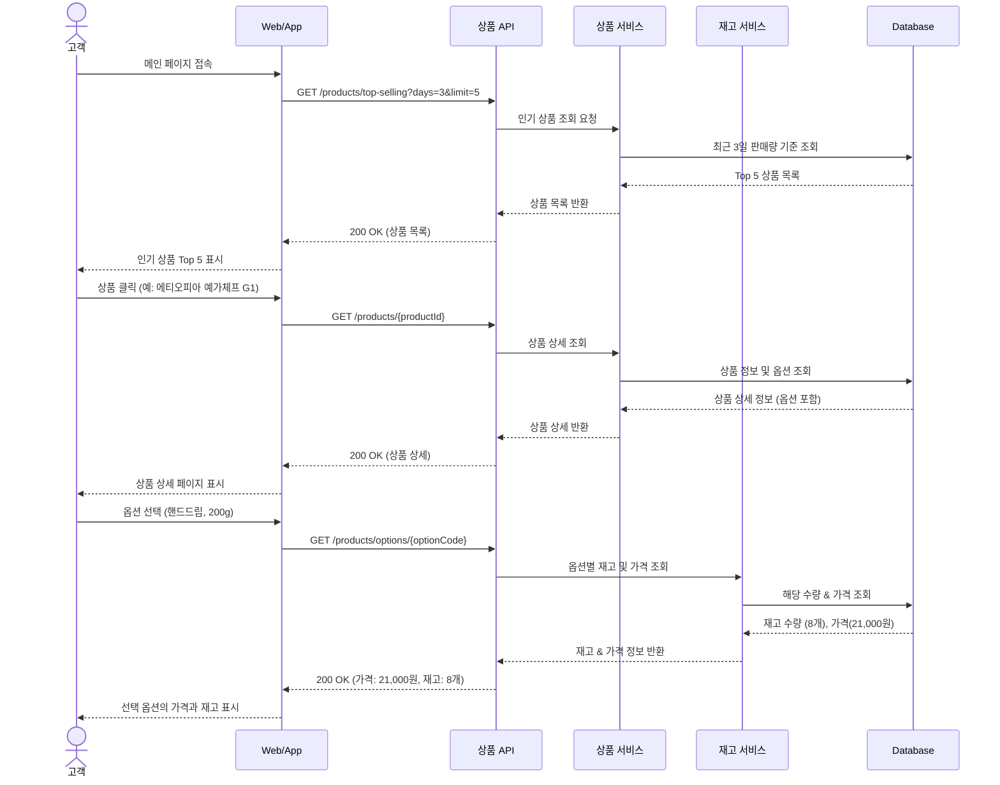
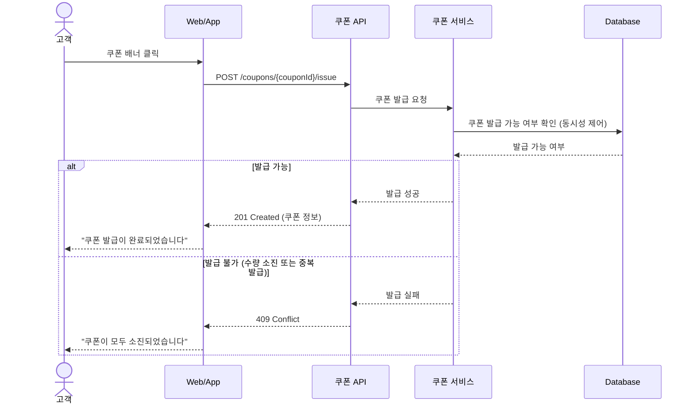
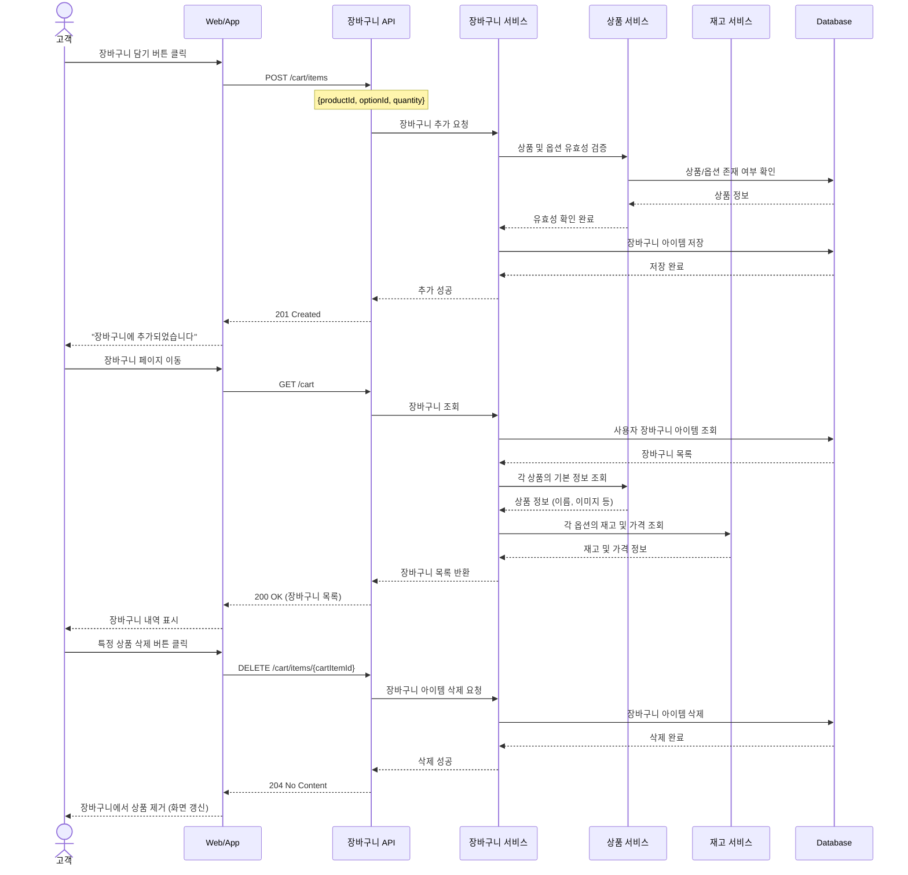
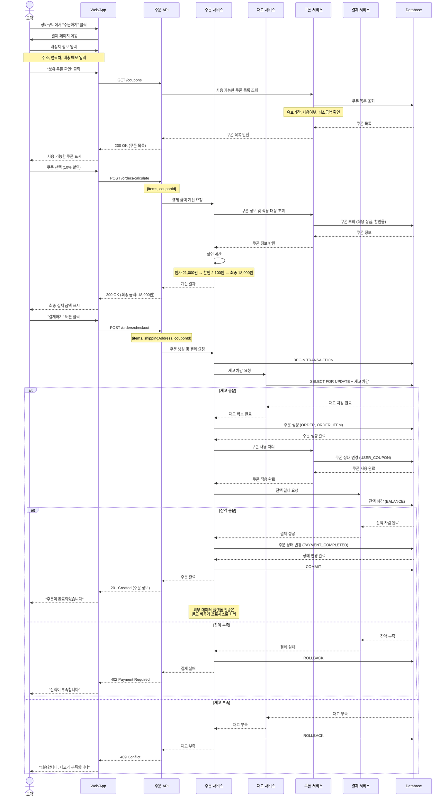
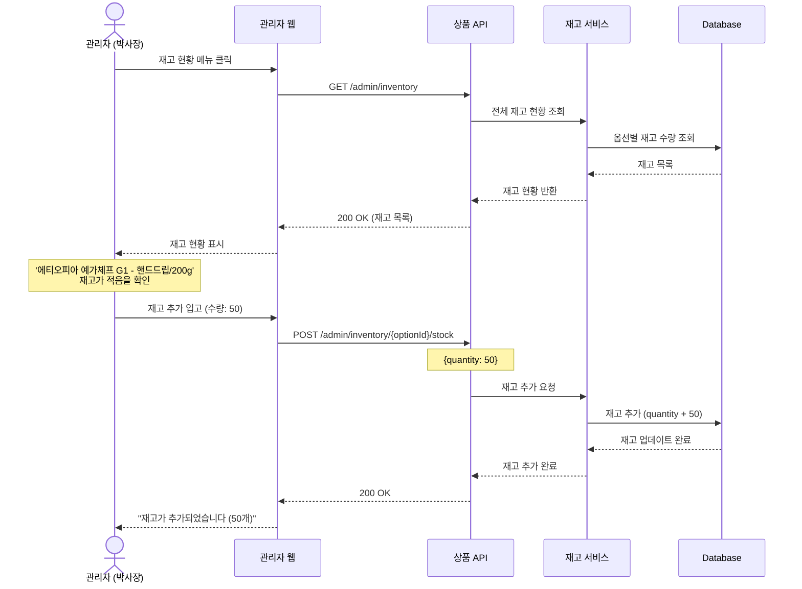
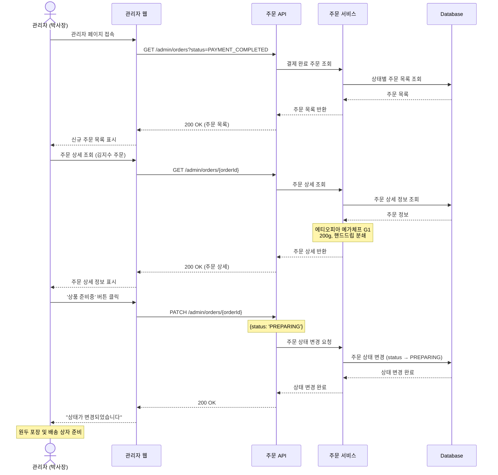
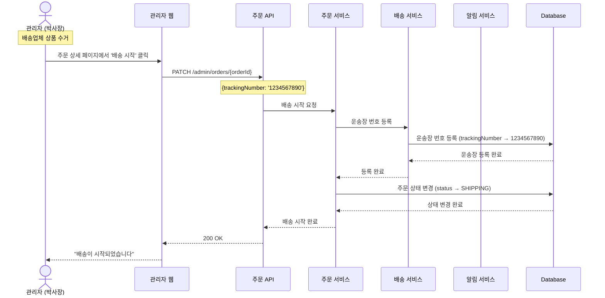
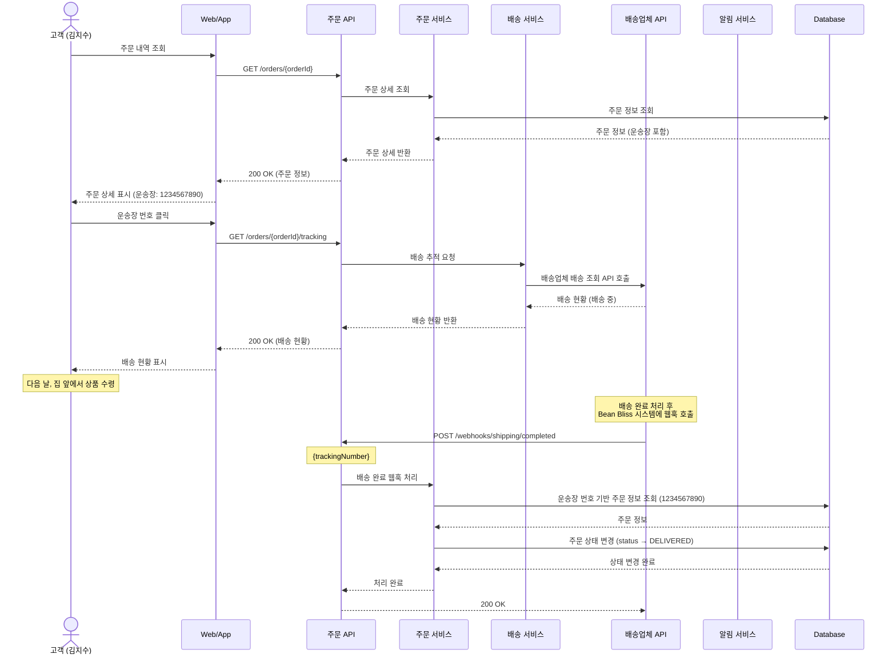
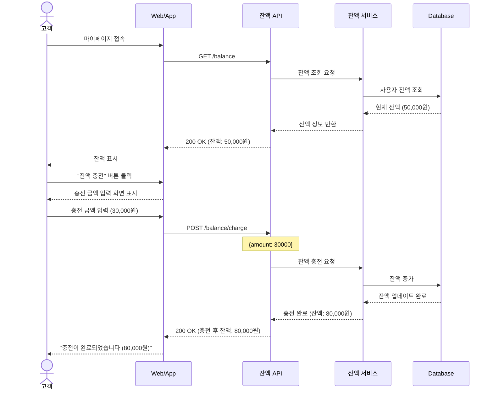

# 커피 원두 판매 시스템 시퀀스 다이어그램

## 1. 상품 조회 및 탐색

고객이 메인 페이지에 접속하여 인기 상품을 확인하고, 상품 상세 페이지에서 옵션별 상세 정보를 조회하는 기능

---

## 2. 쿠폰 발급

고객이 쿠폰 배너를 클릭하여 쿠폰을 발급하는 기능 (선착순 발급 상황 고려)

---

## 3. 장바구니 관리

고객이 선택한 상품을 장바구니에 담을 수 있고, 장바구니에 담은 상품을 조회하거나 삭제할 수 있는 기능

---

## 4. 주문 및 결제

고객이 장바구니에서 주문을 생성하고 주문 정보를 입력한 뒤, 쿠폰 선택 후 결제할 수 있는 기능

---

## 5. 관리자 재고 관리

관리자가 재고 현황을 파악하고, 부족한 재고를 추가 입고하는 기능

---

## 6. 주문 확인 및 상품 준비

관리자가 신규 주문을 확인하고 상품을 준비하여 상태를 변경하는 기능

---

## 7. 상품 배송 시작

관리자가 배송을 시작하고 운송장 번호를 등록하는 기능

---

## 8. 배송 조회 및 완료 처리

고객이 배송 현황을 조회하고, 배송이 완료되면 시스템이 자동으로 상태를 변경하는 기능

---

## 9. 잔액 조회 및 충전

고객이 자신의 잔액을 조회하고, 충전할 수 있는 기능

