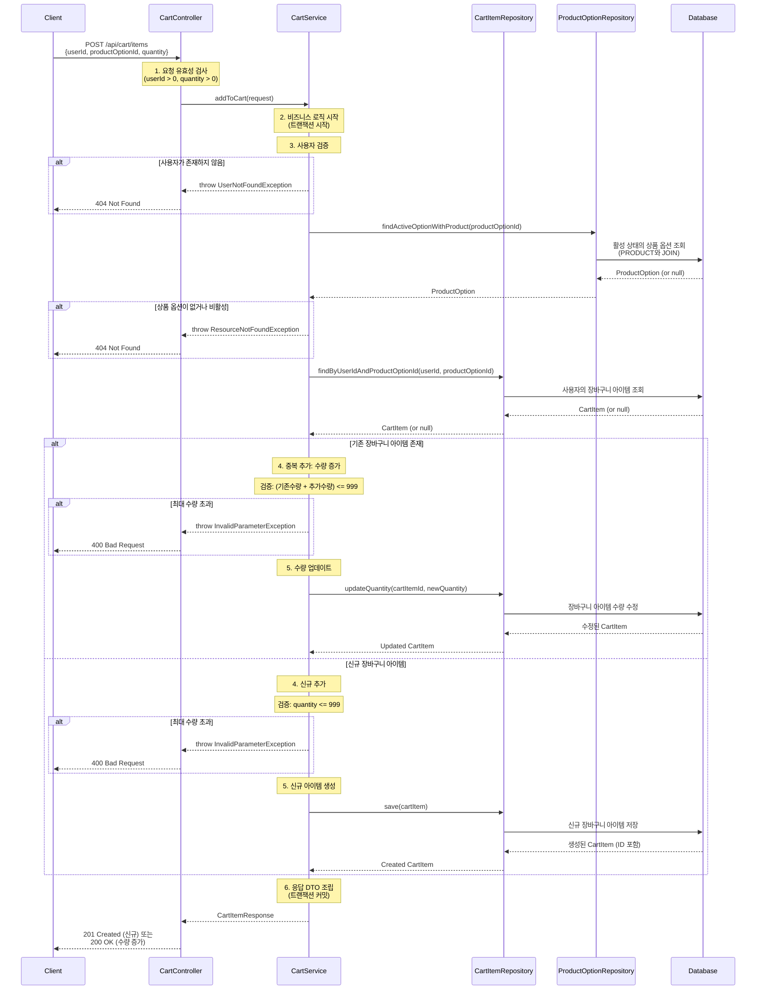

# 장바구니 추가 API 설계

## 1. 개요

### 목적
사용자가 상품 상세 페이지에서 선택한 상품 옵션을 장바구니에 추가하는 기능을 제공합니다.

### 사용 시나리오
- 사용자가 상품 상세 페이지에서 원하는 옵션(분쇄도, 용량)과 수량을 선택한 후 장바구니에 담기
- 같은 사용자가 같은 옵션을 다시 추가하면 기존 수량에 새 수량을 합산
- 재고 검증은 주문 결제 시점에 수행

### PRD 참고
- **시나리오**: 3.2 시나리오 2: 주문 및 결제
- **관련 기능**: CART-001 (장바구니 추가)

### 연관 테이블
- `CART_ITEM`: 장바구니 아이템 정보 저장
- `PRODUCT_OPTION`: 추가할 상품 옵션 정보 조회 (활성 여부 확인)
- `USER`: 사용자 정보 (userId 검증용)

---

## 2. API 명세

### Endpoint
```
POST /api/cart/items
```

### Request Body
```json
{
  "userId": 1,
  "productOptionId": 1,
  "quantity": 2
}
```

### Request Parameters

| 필드 | 타입 | 필수 | 제약사항 | 설명 |
|-----|------|------|---------|------|
| userId | Long | O | > 0 | 사용자 ID |
| productOptionId | Long | O | > 0 | 장바구니에 추가할 상품 옵션 ID (optionId) |
| quantity | Integer | O | 1 ~ 999 | 추가할 수량 |

### Response (Success - 201 Created)

**신규 추가 시**:
```json
{
  "data": {
    "cartItemId": 100,
    "productOptionId": 1,
    "productName": "에티오피아 예가체프 G1",
    "optionCode": "ETH-HD-200",
    "origin": "Ethiopia",
    "grindType": "HAND_DRIP",
    "weightGrams": 200,
    "price": 21000,
    "quantity": 2,
    "totalPrice": 42000,
    "createdAt": "2025-11-03T14:30:00",
    "updatedAt": "2025-11-03T14:30:00"
  }
}
```

**기존 아이템 수량 증가 시 (같은 옵션 재추가)**:
```json
{
  "data": {
    "cartItemId": 100,
    "productOptionId": 1,
    "productName": "에티오피아 예가체프 G1",
    "optionCode": "ETH-HD-200",
    "origin": "Ethiopia",
    "grindType": "HAND_DRIP",
    "weightGrams": 200,
    "price": 21000,
    "quantity": 5,
    "totalPrice": 105000,
    "createdAt": "2025-11-03T14:20:00",
    "updatedAt": "2025-11-03T14:30:00"
  }
}
```

### Response Schema
```
{
  "data": {
    "cartItemId": long,           // 장바구니 아이템 ID
    "productOptionId": long,      // 상품 옵션 ID
    "productName": string,        // 상품명
    "optionCode": string,         // 옵션 코드 (예: "ETH-HD-200")
    "origin": string,             // 원산지 (예: "Ethiopia")
    "grindType": string,          // 분쇄 타입 (HAND_DRIP, WHOLE_BEANS, ESPRESSO)
    "weightGrams": int,           // 용량 (그램)
    "price": int,                 // 옵션 단가 (원)
    "quantity": int,              // 장바구니에 담긴 수량
    "totalPrice": int,            // 총 가격 (price × quantity)
    "createdAt": datetime,        // 최초 추가 시각
    "updatedAt": datetime         // 마지막 수정 시각
  }
}
```

### HTTP Status Codes

| Status Code | 상황 | 설명 |
|------------|------|------|
| 201 Created | 성공 (신규 추가) | 장바구니에 새 아이템 추가 성공 |
| 200 OK | 성공 (기존 수량 증가) | 기존 아이템의 수량 증가 성공 |
| 400 Bad Request | 잘못된 요청 | 유효하지 않은 파라미터 (수량 범위 초과 등) |
| 404 Not Found | 리소스 없음 | 사용자 또는 상품 옵션이 존재하지 않거나 비활성 상태 |
| 500 Internal Server Error | 서버 오류 | 서버 내부 오류 |

### Error Codes

| Error Code | HTTP Status | 메시지 예시 | 설명 |
|-----------|-------------|------------|------|
| INVALID_PARAMETER | 400 | 수량은 1개 이상이어야 합니다. | 유효하지 않은 요청 파라미터 |
| USER_NOT_FOUND | 404 | 사용자 ID: 999를 찾을 수 없습니다. | 존재하지 않는 사용자 |
| RESOURCE_NOT_FOUND | 404 | 상품 옵션 ID: 999를 찾을 수 없습니다. | 존재하지 않는 상품 옵션 |
| INACTIVE_OPTION | 404 | 해당 상품 옵션은 현재 판매하지 않습니다. | 비활성 상태의 상품 옵션 |

---

## 3. 비즈니스 로직

### 3.1 핵심 비즈니스 규칙

#### 1. 중복 추가 처리
- 같은 사용자가 같은 `product_option_id`를 장바구니에 추가하는 경우
- 기존 장바구니 아이템의 `quantity`를 증가
- 새로운 `CART_ITEM` 레코드를 생성하지 않음

```
예시:
- 기존 장바구니: 옵션 ID 1, 수량 3
- 추가 요청: 옵션 ID 1, 수량 2
- 결과: 옵션 ID 1, 수량 5 (3 + 2)
```

#### 2. 활성 옵션만 추가 가능
- `PRODUCT_OPTION.is_active = true`인 옵션만 장바구니에 추가 가능
- 비활성 옵션 추가 시 → `404 Not Found` (INACTIVE_OPTION)

#### 3. 총 수량 제한
- 장바구니 내 동일 옵션의 최대 수량: 999개
- `(기존 수량 + 추가 수량) > 999` 시 → `400 Bad Request`

### 3.2 유효성 검사

| 검증 항목 | 조건 | 실패 시 응답 |
|---------|------|------------|
| 사용자 존재 | USER 레코드 존재 | 404, USER_NOT_FOUND |
| 수량 범위 | 1 <= quantity <= 999 | 400, INVALID_PARAMETER |
| 상품 옵션 존재 | PRODUCT_OPTION 레코드 존재 | 404, RESOURCE_NOT_FOUND |
| 옵션 활성 상태 | is_active = true | 404, INACTIVE_OPTION |
| 최대 수량 초과 | (기존 수량 + 추가 수량) <= 999 | 400, INVALID_PARAMETER |

### 3.3 계산 로직

#### 총 가격 계산
```kotlin
totalPrice = price × quantity
```

---

## 4. 구현 시 고려사항

### 4.1 성능 최적화
- **중복 조회 방지**:
  - 기존 장바구니 아이템 조회 시 인덱스 활용
  - Index: `(user_id, product_option_id)` 복합 인덱스
- **JOIN 활용**: 상품 정보 조회 시 PRODUCT와 PRODUCT_OPTION을 JOIN하여 한 번의 쿼리로 조회

### 4.2 동시성 제어
- **낙관적 락 (Optimistic Lock)** 사용
  - 장바구니는 결제 전 임시 데이터이므로 낙관적 락으로 충분
  - `@Version` 사용하여 동시 수정 감지
- **실제 재고 차감은 주문 결제 시점**에 비관적 락으로 처리

### 4.3 데이터 일관성
- **트랜잭션 범위**:
  - 장바구니 추가/수정은 단일 트랜잭션 내에서 처리
  - 상품 옵션 검증 → 장바구니 추가/수정 → 응답 반환
- **격리 수준**: `READ_COMMITTED` (기본값)

---

## 5. 레이어드 아키텍처 흐름



### 트랜잭션 범위
- **시작**: `CartService.addToCart()` 진입 시
- **커밋**: 장바구니 추가/수정 완료 후
- **롤백**: 예외 발생 시 (옵션 없음, 수량 초과 등)

### 격리 수준
- `READ_COMMITTED`: 다른 트랜잭션의 커밋된 데이터만 읽음

### 예외 처리 흐름
1. **UserNotFoundException** → 404 (사용자 없음)
2. **ResourceNotFoundException** → 404 (상품 옵션 없음 또는 비활성)
3. **InvalidParameterException** → 400 (유효하지 않은 수량)
4. **OptimisticLockException** → 409 (동시 수정 충돌)

---

## 6. 참고사항

### 관련 API
- `GET /api/cart` - 장바구니 목록 조회
- `PATCH /api/cart/items/{cartItemId}` - 장바구니 수량 수정
- `DELETE /api/cart/items/{cartItemId}` - 장바구니 아이템 삭제
- `GET /api/products/{productId}` - 상품 상세 조회 (장바구니 추가 전 옵션 확인용)

### 비즈니스 제약사항
- 유효한 userId를 전달해야 함 (존재하는 사용자)
- 장바구니에 추가해도 재고는 차감되지 않음 (주문 결제 시점에 차감)
- 비활성 옵션은 장바구니에 추가 불가
- 장바구니 총 금액에 대한 제한 없음 (주문 시 잔액 확인)
