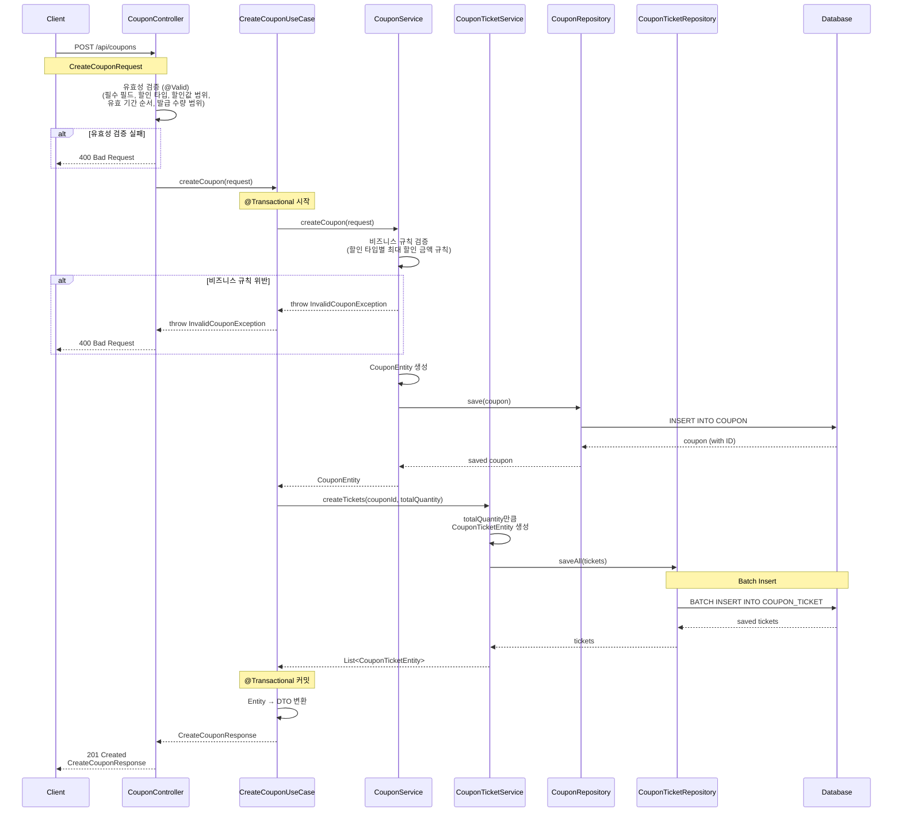

# 선착순 쿠폰 생성 API

## 1. 개요

### 목적
관리자가 선착순 쿠폰을 생성하고, 지정한 수량만큼 COUPON_TICKET을 미리 생성하여 동시성 제어를 위한 준비를 완료합니다.

### 사용 시나리오
1. 관리자가 "오픈 기념 10% 할인 쿠폰"을 100개 발급하려고 합니다.
2. 쿠폰 생성 API를 호출하여 쿠폰 정보와 발급 수량을 입력합니다.
3. 시스템은 COUPON 테이블에 쿠폰 마스터 정보를 생성하고, COUPON_TICKET 테이블에 100개의 티켓을 미리 생성합니다.
4. 이후 고객이 쿠폰 발급 API를 호출하면, 미리 생성된 티켓을 선착순으로 발급합니다.

### PRD 참고
- CPN-001: 선착순 쿠폰 발급
- CPN-004: 쿠폰 상태 변경

### 연관 테이블
- COUPON: 쿠폰 마스터 정보
- COUPON_TICKET: 선착순 쿠폰 발급을 위한 티켓

---

## 2. API 명세

### Endpoint
```
POST /api/coupons
```

### Request Body
```json
{
  "name": "오픈 기념 10% 할인 쿠폰",
  "discountType": "PERCENTAGE",
  "discountValue": 10.0,
  "minOrderAmount": 10000,
  "maxDiscountAmount": 5000,
  "totalQuantity": 100,
  "validFrom": "2025-01-01T00:00:00",
  "validUntil": "2025-01-31T23:59:59"
}
```

### Request Schema
| 필드 | 타입 | 필수 | 설명 |
|-----|------|-----|------|
| name | String | O | 쿠폰명 (최대 100자) |
| discountType | String | O | 할인 타입 (`PERCENTAGE`: 정률 할인, `FIXED_AMOUNT`: 정액 할인) |
| discountValue | Decimal | O | 할인값 (정률: 1~100, 정액: 최소 1원) |
| minOrderAmount | Decimal | X | 최소 주문 금액 (기본값: 0) |
| maxDiscountAmount | Decimal | X | 최대 할인 금액 (정률 할인 시만 적용 가능) |
| totalQuantity | Int | O | 총 발급 수량 (최소 1개, 최대 10,000개) |
| validFrom | DateTime | O | 유효 시작 일시 (ISO 8601 형식) |
| validUntil | DateTime | O | 유효 종료 일시 (ISO 8601 형식) |

### Response (Success)
**HTTP Status: 201 Created**

```json
{
  "couponId": 1,
  "name": "오픈 기념 10% 할인 쿠폰",
  "discountType": "PERCENTAGE",
  "discountValue": 10.0,
  "minOrderAmount": 10000,
  "maxDiscountAmount": 5000,
  "totalQuantity": 100,
  "validFrom": "2025-01-01T00:00:00",
  "validUntil": "2025-01-31T23:59:59",
  "createdAt": "2025-01-02T10:30:00"
}
```

### Response Schema
```
{
  "couponId": "long",              // 생성된 쿠폰 ID
  "name": "string",                // 쿠폰명
  "discountType": "string",        // 할인 타입 (PERCENTAGE, FIXED_AMOUNT)
  "discountValue": "decimal",      // 할인값
  "minOrderAmount": "decimal",     // 최소 주문 금액
  "maxDiscountAmount": "decimal",  // 최대 할인 금액
  "totalQuantity": "int",          // 총 발급 수량
  "validFrom": "datetime",         // 유효 시작 일시
  "validUntil": "datetime",        // 유효 종료 일시
  "createdAt": "datetime"          // 생성 일시
}
```

### HTTP Status Codes
| Code | 설명 |
|------|------|
| 201 | 쿠폰 생성 성공 |
| 400 | 잘못된 요청 (유효성 검증 실패) |
| 500 | 서버 오류 |

### Error Codes
| Code | Message | 설명 |
|------|---------|------|
| INVALID_INPUT | 유효성 검사에 실패했습니다. | 요청 데이터 유효성 검증 실패 |
| INVALID_DISCOUNT_TYPE | 잘못된 할인 타입입니다. | discountType이 PERCENTAGE 또는 FIXED_AMOUNT가 아님 |
| INVALID_DISCOUNT_VALUE | 할인값이 유효하지 않습니다. | 정률 할인 시 1~100 범위 외, 정액 할인 시 음수 |
| INVALID_DATE_RANGE | 유효 기간이 잘못되었습니다. | validFrom이 validUntil보다 이후 |
| INVALID_QUANTITY | 발급 수량이 유효하지 않습니다. | totalQuantity가 1 미만 또는 10,000 초과 |
| COUPON_CREATION_FAILED | 쿠폰 생성에 실패했습니다. | 서버 오류로 쿠폰 생성 실패 |

---

## 3. 비즈니스 로직

### UseCase 패턴 적용
- **CreateCouponUseCase**: CouponRepository와 CouponTicketRepository를 조율하는 복합 트랜잭션 처리
- COUPON과 COUPON_TICKET 생성을 하나의 원자적 트랜잭션으로 처리

### 핵심 비즈니스 규칙

1. **쿠폰 생성**
   - COUPON 테이블에 쿠폰 마스터 정보를 저장합니다.
   - 쿠폰 ID는 자동 생성됩니다.

2. **티켓 사전 생성**
   - totalQuantity만큼 COUPON_TICKET을 미리 생성합니다.
   - 각 티켓의 초기 상태는 `AVAILABLE`입니다.
   - user_id는 NULL로 설정됩니다 (미발급 상태).

3. **동시성 제어를 위한 준비**
   - 티켓을 미리 생성함으로써 `FOR UPDATE SKIP LOCKED`를 활용한 선착순 발급이 가능합니다.
   - 1,000명이 동시에 쿠폰을 요청해도 각자 다른 티켓을 선점하여 빠르게 발급할 수 있습니다.

### 유효성 검사

#### Controller 계층 검증 (Request DTO의 `@Valid`)

1. **필수 필드 검증**
   - name, discountType, discountValue, totalQuantity, validFrom, validUntil은 필수입니다.
   - Bean Validation: `@NotNull`, `@NotBlank`

2. **할인 타입 검증**
   - discountType은 `PERCENTAGE` 또는 `FIXED_AMOUNT`만 허용합니다.
   - Bean Validation: `@Pattern` 또는 커스텀 Validator

3. **할인값 범위 검증**
   - 정률 할인(PERCENTAGE): 1 이상 100 이하
   - 정액 할인(FIXED_AMOUNT): 1 이상
   - Bean Validation: `@Min`, `@Max`

4. **유효 기간 순서 검증**
   - validFrom은 validUntil보다 이전이어야 합니다.
   - Bean Validation: 커스텀 클래스 레벨 Validator

5. **발급 수량 범위 검증**
   - totalQuantity는 1 이상 10,000 이하여야 합니다.
   - Bean Validation: `@Min(1)`, `@Max(10000)`

#### CouponService 계층 검증 (비즈니스 규칙)

6. **최대 할인 금액 규칙 검증**
   - maxDiscountAmount는 정률 할인(PERCENTAGE) 시만 적용 가능합니다.
   - 정액 할인(FIXED_AMOUNT) 시 maxDiscountAmount가 설정되면 검증 오류를 반환합니다.
   - 이유: 할인 타입과 최대 할인 금액 간의 복잡한 비즈니스 규칙

---

## 4. 구현 시 고려사항

### 성능 최적화
- 대량의 티켓 생성 시 **배치 삽입(Batch Insert)**을 사용하여 성능을 최적화합니다.
- JDBC batch insert 또는 JPA `saveAll()`을 활용합니다.

### 동시성 제어
- 쿠폰 생성 자체는 관리자만 수행하므로 동시성 이슈가 적습니다.
- 티켓 생성은 단일 트랜잭션 내에서 처리하여 원자성을 보장합니다.

### 데이터 일관성
- COUPON과 COUPON_TICKET은 동일 트랜잭션 내에서 생성되어야 합니다.
- 쿠폰 생성 실패 시 티켓도 롤백되어야 합니다.

---

## 5. 레이어드 아키텍처 흐름



### 트랜잭션 범위
- **UseCase 계층 전체**: `@Transactional`로 묶여 COUPON과 COUPON_TICKET 생성이 원자적으로 수행됩니다.
- **격리 수준**: `READ_COMMITTED` (기본값)

### 예외 처리 흐름

1. **Controller 계층 (Request DTO 검증)**:
   - `@Valid` 검증 실패 (필수 필드, 할인 타입, 할인값 범위, 유효 기간, 발급 수량)
   - 예외: `MethodArgumentNotValidException`
   - HTTP Status: 400 Bad Request

2. **CouponService 계층 (비즈니스 규칙 검증)**:
   - 최대 할인 금액 규칙 위반 (정액 할인 시 maxDiscountAmount 설정)
   - 예외: `InvalidCouponException`
   - HTTP Status: 400 Bad Request
   - 트랜잭션 롤백

3. **DB 오류**:
   - COUPON 또는 COUPON_TICKET 저장 실패
   - 예외: `DataAccessException`
   - HTTP Status: 500 Internal Server Error
   - 트랜잭션 롤백

4. **GlobalExceptionHandler**:
   - 모든 예외를 통합 처리하여 일관된 에러 응답을 반환합니다.
