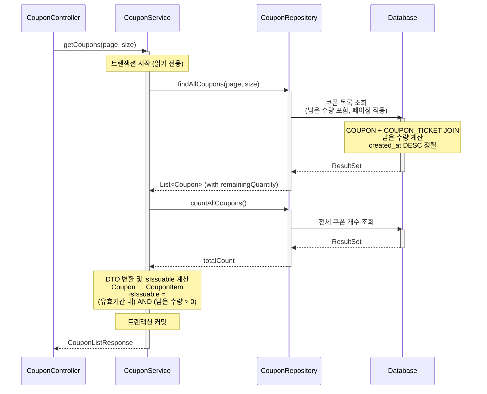

# 쿠폰 목록 조회 API

## 1. 개요

### 목적
현재 등록된 모든 쿠폰 목록을 조회하여, 쿠폰 발급 전에 어떤 쿠폰들이 있는지 확인할 수 있도록 합니다.

### 사용 시나리오
- 고객이 메인 페이지나 쿠폰 페이지에서 쿠폰 목록을 확인
- '오픈 기념! 선착순 100명 10% 할인 쿠폰' 배너를 클릭하여 쿠폰 상세 확인
- 쿠폰 발급 전에 할인율, 최소 주문 금액, 남은 수량, 발급 가능 여부 등을 확인

### PRD 참고
- **기능 ID**: CPN-001 (선착순 쿠폰 발급)의 전제 조건
- **시나리오**: (1) 고객의 상품 탐색 및 옵션 선택

### 연관 테이블
- `COUPON`: 쿠폰 마스터 정보 (이름, 할인 타입, 할인 값, 유효 기간 등)
- `COUPON_TICKET`: 선착순 티켓 정보 (발급 가능 수량 계산)

---

## 2. API 명세

### Endpoint
```
GET /api/coupons
```

### Request Parameters

| Parameter | Type   | Required | Default | Description                          |
|-----------|--------|----------|---------|--------------------------------------|
| page      | Int    | No       | 1       | 페이지 번호 (1부터 시작)             |
| size      | Int    | No       | 10      | 페이지 당 항목 수 (최대 100)         |

### Request Example
```http
GET /api/coupons?page=1&size=10
```

### Response (Success)

**HTTP Status**: `200 OK`

```json
{
  "data": {
    "content": [
      {
        "couponId": 1,
        "name": "오픈 기념! 선착순 100명 10% 할인 쿠폰",
        "discountType": "PERCENTAGE",
        "discountValue": 10,
        "minOrderAmount": 10000,
        "maxDiscountAmount": 5000,
        "remainingQuantity": 47,
        "totalQuantity": 100,
        "validFrom": "2025-01-01T00:00:00",
        "validUntil": "2025-12-31T23:59:59",
        "isIssuable": true
      },
      {
        "couponId": 2,
        "name": "신규 회원 5000원 할인 쿠폰",
        "discountType": "FIXED_AMOUNT",
        "discountValue": 5000,
        "minOrderAmount": 30000,
        "maxDiscountAmount": 5000,
        "remainingQuantity": 0,
        "totalQuantity": 500,
        "validFrom": "2025-01-01T00:00:00",
        "validUntil": "2025-03-31T23:59:59",
        "isIssuable": false
      },
      {
        "couponId": 3,
        "name": "만료된 쿠폰",
        "discountType": "PERCENTAGE",
        "discountValue": 15,
        "minOrderAmount": 20000,
        "maxDiscountAmount": 10000,
        "remainingQuantity": 100,
        "totalQuantity": 100,
        "validFrom": "2024-01-01T00:00:00",
        "validUntil": "2024-12-31T23:59:59",
        "isIssuable": false
      }
    ],
    "pageable": {
      "pageNumber": 1,
      "pageSize": 10,
      "totalElements": 3,
      "totalPages": 1
    }
  }
}
```

### Response Schema

```
{
  "data": {
    "content": [
      {
        "couponId": "long",              // 쿠폰 ID
        "name": "string",                // 쿠폰명
        "discountType": "string",        // 할인 타입 (PERCENTAGE, FIXED_AMOUNT)
        "discountValue": "int",          // 할인 값 (퍼센트: 10 → 10%, 고정: 5000 → 5000원)
        "minOrderAmount": "int",         // 최소 주문 금액
        "maxDiscountAmount": "int",      // 최대 할인 금액
        "remainingQuantity": "int",      // 남은 수량
        "totalQuantity": "int",          // 총 발급 수량
        "validFrom": "datetime",         // 유효 시작 일시
        "validUntil": "datetime",        // 유효 종료 일시
        "isIssuable": "boolean"          // 발급 가능 여부 (유효기간 내 + 남은 수량 > 0)
      }
    ],
    "pageable": {
      "pageNumber": "int",               // 현재 페이지 번호
      "pageSize": "int",                 // 페이지 크기
      "totalElements": "long",           // 전체 쿠폰 개수
      "totalPages": "int"                // 전체 페이지 수
    }
  }
}
```

### HTTP Status Codes

| Status Code | Description                                  |
|-------------|----------------------------------------------|
| 200         | 성공 (쿠폰 목록 반환)                        |
| 400         | 잘못된 요청 (유효하지 않은 페이징 파라미터)  |
| 500         | 서버 내부 오류                               |

### Error Codes

| Error Code             | HTTP Status | Message                                      |
|------------------------|-------------|----------------------------------------------|
| INVALID_PAGINATION     | 400         | 페이지 번호와 크기는 1 이상이어야 합니다.    |
| INTERNAL_SERVER_ERROR  | 500         | 서버 내부 오류가 발생했습니다.               |

---

## 3. 비즈니스 로직

### 핵심 비즈니스 규칙

1. **모든 쿠폰 조회**
   - 등록된 모든 쿠폰을 조회 (유효기간 관계없이)
   - 쿠폰의 현재 상태를 클라이언트에서 확인할 수 있도록 함

2. **remainingQuantity 계산**
   - `COUPON_TICKET` 테이블에서 `status = 'AVAILABLE'`인 티켓 개수
   - 계산: `remainingQuantity = COUNT(COUPON_TICKET WHERE coupon_id = {couponId} AND status = 'AVAILABLE')`

3. **isIssuable 계산**
   - 발급 가능 여부를 판단하는 boolean 필드
   - 조건:
     - 현재 시각이 유효 기간 내: `NOW() BETWEEN valid_from AND valid_until`
     - 남은 수량이 1개 이상: `remainingQuantity > 0`
   - 계산: `isIssuable = (NOW() BETWEEN valid_from AND valid_until) AND (remainingQuantity > 0)`

4. **페이징 처리**
   - 기본값: page=1, size=10
   - 최대 size: 100 (과도한 데이터 조회 방지)

### 정렬/필터링 조건

- **정렬 순서**: `created_at DESC` (최신 쿠폰 우선)
- **필터링**: 없음 (모든 쿠폰 조회)

---

## 4. 구현 시 고려사항

### 성능 최적화

1. **인덱스 설정**
   - `COUPON`: `created_at` 인덱스 (정렬용)
   - `COUPON_TICKET`: `(coupon_id, status)` 복합 인덱스

2. **N+1 문제 방지**
   - `remainingQuantity`를 계산할 때 각 쿠폰마다 개별 쿼리를 실행하지 않도록 Batch 조회
   - `COUPON` 조회 시 `COUPON_TICKET`을 JOIN하여 한 번에 가져오기
   - 또는 서브쿼리로 `remainingQuantity`를 계산하여 단일 쿼리로 처리

3. **캐싱 전략**
   - 쿠폰 목록은 자주 변경되지 않으므로 Redis 캐싱 고려 (TTL: 5분)
   - 캐시 키: `coupons:page:{page}:size:{size}`
   - 쿠폰 발급 시 해당 캐시 무효화

### 동시성 제어

- 조회 작업이므로 락 불필요
- `remainingQuantity`는 실시간 정확성보다 약간의 지연 허용 (캐싱 활용)

### 데이터 일관성

- `COUPON_TICKET`의 `status`가 정확하게 관리되어야 `remainingQuantity`가 올바름
- 쿠폰 발급 시 티켓 상태 업데이트 트랜잭션 보장 필요

---

## 5. 레이어드 아키텍처 흐름



### 트랜잭션 범위 및 격리 수준

- **트랜잭션 범위**: Service 계층 (읽기 전용)
- **격리 수준**: `READ_COMMITTED` (기본값)
  - 조회 작업이므로 Dirty Read만 방지하면 충분
  - `remainingQuantity`의 실시간 정확성보다 성능 우선

### 예외 처리 흐름

1. **InvalidInputException** (400)
   - 발생 시점: Controller의 `@Valid` 검증 실패
   - 처리: GlobalExceptionHandler에서 일괄 처리

2. **DataAccessException** (500)
   - 발생 시점: Repository 계층 DB 쿼리 실패
   - 처리: GlobalExceptionHandler에서 일괄 처리 후 500 반환
