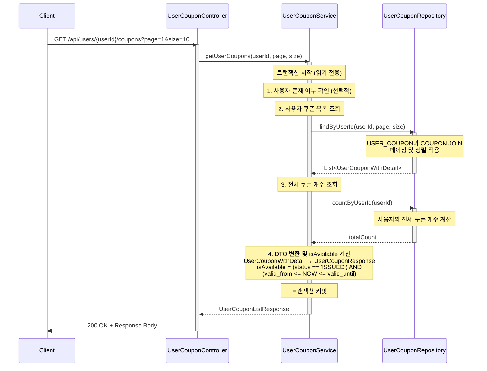

# 사용자 발급 쿠폰 목록 조회 API

## 1. 개요

### 목적
사용자가 발급받은 모든 쿠폰 목록을 조회합니다. 사용 가능 여부를 함께 제공하여 주문 시 적용 가능한 쿠폰을 선택할 수 있도록 합니다.

### 사용 시나리오
- 고객이 주문 페이지에서 '쿠폰 적용' 버튼 클릭
- 발급받은 쿠폰 목록을 확인하고 사용 가능한 쿠폰 선택
- 마이페이지에서 보유한 쿠폰 내역 확인 (사용한 쿠폰, 만료된 쿠폰 포함)

### PRD 참고
- **기능 ID**: CPN-005 (보유 쿠폰 목록 조회)
- **시나리오**: (2) 주문 및 결제

### 연관 테이블
- `USER_COUPON`: 사용자별 쿠폰 발급 및 사용 이력
- `COUPON`: 쿠폰 마스터 정보 (이름, 할인 타입, 유효 기간 등)

---

## 2. API 명세

### Endpoint
```
GET /api/users/{userId}/coupons
```

### Request Parameters

#### Path Parameters
| Parameter | Type   | Required | Description     |
|-----------|--------|----------|-----------------|
| userId    | Long   | Yes      | 사용자 ID       |

#### Query Parameters
| Parameter | Type   | Required | Default | Description                          |
|-----------|--------|----------|---------|--------------------------------------|
| page      | Int    | No       | 1       | 페이지 번호 (1부터 시작)             |
| size      | Int    | No       | 10      | 페이지 당 항목 수 (최대 100)         |

### Request Example
```http
GET /api/users/123/coupons?page=1&size=10
```

### Response (Success)

**HTTP Status**: `200 OK`

```json
{
  "data": {
    "content": [
      {
        "userCouponId": 456,
        "couponId": 1,
        "couponName": "오픈 기념! 선착순 100명 10% 할인 쿠폰",
        "discountType": "PERCENTAGE",
        "discountValue": 10,
        "minOrderAmount": 10000,
        "maxDiscountAmount": 5000,
        "status": "ISSUED",
        "validFrom": "2025-01-01T00:00:00",
        "validUntil": "2025-12-31T23:59:59",
        "issuedAt": "2025-11-03T14:30:00",
        "usedAt": null,
        "usedOrderId": null,
        "isAvailable": true
      },
      {
        "userCouponId": 457,
        "couponId": 2,
        "couponName": "신규 회원 5000원 할인 쿠폰",
        "discountType": "FIXED_AMOUNT",
        "discountValue": 5000,
        "minOrderAmount": 30000,
        "maxDiscountAmount": 5000,
        "status": "USED",
        "validFrom": "2025-01-01T00:00:00",
        "validUntil": "2025-03-31T23:59:59",
        "issuedAt": "2025-10-15T10:20:00",
        "usedAt": "2025-10-20T15:30:00",
        "usedOrderId": 789,
        "isAvailable": false
      },
      {
        "userCouponId": 458,
        "couponId": 3,
        "couponName": "만료된 쿠폰",
        "discountType": "PERCENTAGE",
        "discountValue": 15,
        "minOrderAmount": 20000,
        "maxDiscountAmount": 10000,
        "status": "EXPIRED",
        "validFrom": "2024-01-01T00:00:00",
        "validUntil": "2024-12-31T23:59:59",
        "issuedAt": "2024-06-01T12:00:00",
        "usedAt": null,
        "usedOrderId": null,
        "isAvailable": false
      }
    ],
    "pageable": {
      "pageNumber": 1,
      "pageSize": 10,
      "totalElements": 3,
      "totalPages": 1
    }
  }
}
```

### Response Schema

```
{
  "data": {
    "content": [
      {
        "userCouponId": "long",          // 사용자 쿠폰 ID
        "couponId": "long",              // 쿠폰 ID
        "couponName": "string",          // 쿠폰명
        "discountType": "string",        // 할인 타입 (PERCENTAGE, FIXED_AMOUNT)
        "discountValue": "int",          // 할인 값
        "minOrderAmount": "int",         // 최소 주문 금액
        "maxDiscountAmount": "int",      // 최대 할인 금액
        "status": "string",              // 쿠폰 상태 (ISSUED, USED, EXPIRED)
        "validFrom": "datetime",         // 유효 시작 일시
        "validUntil": "datetime",        // 유효 종료 일시
        "issuedAt": "datetime",          // 발급 일시
        "usedAt": "datetime",            // 사용 일시 (nullable)
        "usedOrderId": "long",           // 사용한 주문 ID (nullable)
        "isAvailable": "boolean"         // 사용 가능 여부
      }
    ],
    "pageable": {
      "pageNumber": "int",               // 현재 페이지 번호
      "pageSize": "int",                 // 페이지 크기
      "totalElements": "long",           // 전체 쿠폰 개수
      "totalPages": "int"                // 전체 페이지 수
    }
  }
}
```

### HTTP Status Codes

| Status Code | Description                                  |
|-------------|----------------------------------------------|
| 200         | 성공 (쿠폰 목록 반환)                        |
| 400         | 잘못된 요청 (유효하지 않은 페이징 파라미터)  |
| 404         | 사용자를 찾을 수 없음                        |
| 500         | 서버 내부 오류                               |

### Error Codes

| Error Code             | HTTP Status | Message                                      |
|------------------------|-------------|----------------------------------------------|
| USER_NOT_FOUND         | 404         | 사용자를 찾을 수 없습니다.                   |
| INVALID_PAGINATION     | 400         | 페이지 번호와 크기는 1 이상이어야 합니다.    |
| INTERNAL_SERVER_ERROR  | 500         | 서버 내부 오류가 발생했습니다.               |

---

## 3. 비즈니스 로직

### 핵심 비즈니스 규칙

#### 1. 사용자 발급 쿠폰 조회
- **조회 대상**: `USER_COUPON` 테이블에서 `user_id`로 필터링
- **조인**: `COUPON` 테이블과 JOIN하여 쿠폰 상세 정보 포함
- **범위**: 모든 상태의 쿠폰 포함 (`ISSUED`, `USED`, `EXPIRED`)

#### 2. isAvailable 계산
- **목적**: 현재 주문에 적용 가능한 쿠폰인지 판단
- **조건**:
  - `status = 'ISSUED'` (발급됨 상태)
  - 현재 시각이 유효 기간 내: `valid_from <= NOW <= valid_until`
- **계산식**:
  ```
  isAvailable = (status == 'ISSUED') AND (valid_from <= NOW <= valid_until)
  ```
- **결과**:
  - `true`: 사용 가능한 쿠폰
  - `false`: 이미 사용했거나 만료된 쿠폰

#### 3. 페이징 처리
- **기본값**: page=1, size=10
- **최대 size**: 100 (과도한 데이터 조회 방지)
- **offset 계산**: `(page - 1) * size`

#### 4. 정렬
- **기본 정렬**: `issued_at DESC` (최신 발급 순)
- **우선순위**:
  1. 사용 가능한 쿠폰 (`isAvailable = true`)
  2. 발급 일시가 최근인 쿠폰

### 유효성 검사

| 항목                   | 검증 조건                                          | 실패 시 예외                  |
|------------------------|----------------------------------------------------|-------------------------------|
| 사용자 존재 여부       | `USER.id = userId`                                 | `USER_NOT_FOUND`              |
| 페이지 번호            | `page >= 1`                                        | `INVALID_PAGINATION`          |
| 페이지 크기            | `1 <= size <= 100`                                 | `INVALID_PAGINATION`          |

### 정렬/필터링 조건

- **정렬 순서**:
  1. `isAvailable DESC` (사용 가능한 쿠폰 우선)
  2. `issued_at DESC` (최신 발급 순)
- **필터링**: 특정 사용자(`userId`)의 쿠폰만 조회

---

## 4. 구현 시 고려사항

### 성능 최적화

#### 1. 인덱스 설정
```sql
-- USER_COUPON 테이블
CREATE INDEX idx_user_coupon_user_id
ON USER_COUPON(user_id, created_at DESC);

-- COUPON 테이블 (JOIN 최적화)
CREATE INDEX idx_coupon_id
ON COUPON(id);
```

#### 2. JOIN 최적화
- `USER_COUPON`과 `COUPON`을 INNER JOIN하여 한 번의 쿼리로 조회
- `isAvailable` 계산은 애플리케이션 레벨에서 수행 (또는 DB의 CASE 문 활용)

#### 3. 캐싱 전략
- 사용자별 쿠폰 목록은 자주 변경되므로 캐싱 부적합
- 쿠폰 발급/사용 시마다 캐시 무효화가 필요하므로 실시간 조회 권장

### 동시성 제어

- **조회 작업**: 락 불필요
- **일관성**: `READ_COMMITTED` 격리 수준으로 충분

### 데이터 일관성

- **USER_COUPON.status**: 쿠폰 사용 시 정확하게 업데이트 필요
  - 주문 결제 시: `ISSUED` → `USED`
  - 배치 작업으로 만료: `ISSUED` → `EXPIRED` (유효 기간 지남)
- **트랜잭션**: 단순 조회이므로 읽기 전용 트랜잭션

---

## 5. 레이어드 아키텍처 흐름



### 트랜잭션 범위 및 격리 수준

#### 트랜잭션 범위
- **시작**: Service 계층 진입
- **종료**: DTO 변환 완료
- **속성**: 읽기 전용 (`@Transactional(readOnly = true)`)

#### 격리 수준
- **레벨**: `READ_COMMITTED` (기본값)
- **이유**:
  - 단순 조회 작업이므로 Dirty Read만 방지하면 충분
  - 쿠폰 목록의 실시간 정확성보다 성능 우선

### 예외 처리 흐름

#### 1. 사용자 미존재
- **예외**: `UserNotFoundException`
- **HTTP Status**: 404 Not Found
- **처리**: GlobalExceptionHandler에서 일괄 처리
- **발생 시점**: 사용자 존재 여부 확인 시 (선택적)

#### 2. 잘못된 페이징 파라미터
- **예외**: `InvalidPaginationException`
- **HTTP Status**: 400 Bad Request
- **처리**: Controller의 `@Valid` 검증 또는 Service 계층에서 검증
- **발생 시점**: 파라미터 유효성 검사 시

#### 3. DB 오류
- **예외**: `DataAccessException`
- **HTTP Status**: 500 Internal Server Error
- **처리**: GlobalExceptionHandler에서 일괄 처리
