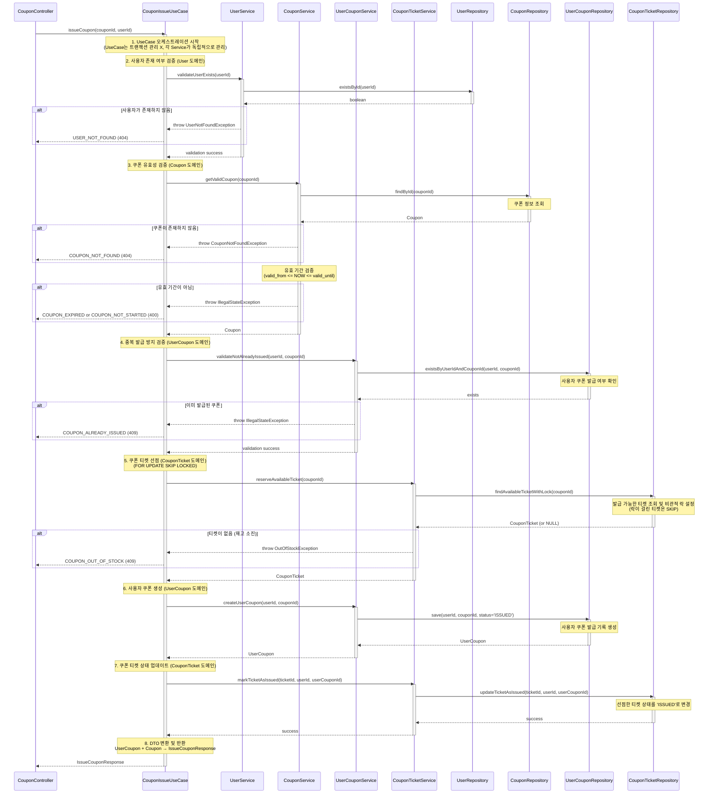

# 쿠폰 발급 API

## 1. 개요

### 목적
선착순 쿠폰을 사용자에게 발급합니다. 동시성 제어를 통해 정확한 수량 관리와 신속한 발급을 보장합니다.

### 사용 시나리오
- 고객이 '오픈 기념! 선착순 100명 10% 할인 쿠폰' 배너를 클릭
- 쿠폰 발급 버튼을 눌러 즉시 쿠폰을 발급받음
- 발급된 쿠폰은 주문 시 할인 적용 가능

### PRD 참고
- **기능 ID**: CPN-001 (선착순 쿠폰 발급)
- **시나리오**: (1) 고객의 상품 탐색 및 옵션 선택

### 연관 테이블
- `COUPON`: 쿠폰 마스터 정보 (이름, 할인 타입, 유효 기간 등)
- `COUPON_TICKET`: 선착순 티켓 정보 (사전 생성된 티켓, FOR UPDATE SKIP LOCKED 대상)
- `USER_COUPON`: 사용자별 발급된 쿠폰 정보
- `USER`: 사용자 정보

---

## 2. API 명세

### Endpoint
```
POST /api/coupons/{couponId}/issue
```

### Request Parameters

#### Path Parameters
| Parameter | Type   | Required | Description     |
|-----------|--------|----------|-----------------|
| couponId  | Long   | Yes      | 쿠폰 ID         |

#### Request Body
| Field  | Type   | Required | Description |
|--------|--------|----------|-------------|
| userId | Long   | Yes      | 사용자 ID   |

### Request Example
```http
{
  "userId": 123
}
```

### Response (Success)

**HTTP Status**: `200 OK`

```json
{
  "data": {
    "userCouponId": 456,
    "couponId": 1,
    "userId": 123,
    "couponName": "오픈 기념! 선착순 100명 10% 할인 쿠폰",
    "discountType": "PERCENTAGE",
    "discountValue": 10,
    "minOrderAmount": 10000,
    "maxDiscountAmount": 5000,
    "status": "ISSUED",
    "validFrom": "2025-01-01T00:00:00",
    "validUntil": "2025-12-31T23:59:59",
    "issuedAt": "2025-11-03T14:30:00"
  }
}
```

### Response Schema

```
{
  "data": {
    "userCouponId": "long",          // 발급된 사용자 쿠폰 ID
    "couponId": "long",              // 쿠폰 ID
    "userId": "long",                // 사용자 ID
    "couponName": "string",          // 쿠폰명
    "discountType": "string",        // 할인 타입 (PERCENTAGE, FIXED_AMOUNT)
    "discountValue": "int",          // 할인 값
    "minOrderAmount": "int",         // 최소 주문 금액
    "maxDiscountAmount": "int",      // 최대 할인 금액
    "status": "string",              // 쿠폰 상태 (ISSUED)
    "validFrom": "datetime",         // 유효 시작 일시
    "validUntil": "datetime",        // 유효 종료 일시
    "issuedAt": "datetime"           // 발급 일시
  }
}
```

### HTTP Status Codes

| Status Code | Description                                  |
|-------------|----------------------------------------------|
| 200         | 성공 (쿠폰 발급 완료)                        |
| 400         | 잘못된 요청 (유효하지 않은 입력값)           |
| 404         | 쿠폰을 찾을 수 없음                          |
| 409         | 중복 발급 또는 재고 부족                     |
| 500         | 서버 내부 오류                               |

### Error Codes

| Error Code                  | HTTP Status | Message                                                |
|-----------------------------|-------------|--------------------------------------------------------|
| COUPON_NOT_FOUND            | 404         | 쿠폰을 찾을 수 없습니다.                               |
| COUPON_EXPIRED              | 400         | 쿠폰 유효 기간이 만료되었습니다.                       |
| COUPON_NOT_STARTED          | 400         | 쿠폰 유효 기간이 아직 시작되지 않았습니다.             |
| COUPON_OUT_OF_STOCK         | 409         | 쿠폰이 모두 소진되었습니다.                            |
| COUPON_ALREADY_ISSUED       | 409         | 이미 발급받은 쿠폰입니다.                              |
| USER_NOT_FOUND              | 404         | 사용자를 찾을 수 없습니다.                             |
| INVALID_INPUT               | 400         | 입력값이 올바르지 않습니다.                            |
| INTERNAL_SERVER_ERROR       | 500         | 서버 내부 오류가 발생했습니다.                         |

---

## 3. 비즈니스 로직

### 핵심 비즈니스 규칙

#### 1. 쿠폰 유효성 검증
- **존재 여부 확인**: `COUPON` 테이블에서 `couponId`로 쿠폰 조회
- **유효 기간 확인**:
  - 현재 시각 >= `valid_from` (시작 시각)
  - 현재 시각 <= `valid_until` (종료 시각)
- **실패 시**: `COUPON_NOT_FOUND`, `COUPON_EXPIRED`, `COUPON_NOT_STARTED` 예외 발생

#### 2. 중복 발급 방지
- **검증**: `USER_COUPON` 테이블에서 `(user_id, coupon_id)` 조합으로 조회
- **제약**: DB 레벨 UNIQUE 제약 조건 설정
  ```sql
  CREATE UNIQUE INDEX idx_user_coupon_unique
  ON USER_COUPON(user_id, coupon_id);
  ```
- **실패 시**: `COUPON_ALREADY_ISSUED` 예외 발생 (409 Conflict)

#### 3. 쿠폰 티켓 선점 (FOR UPDATE SKIP LOCKED)
- **목적**: 동시성 제어를 통한 정확한 수량 관리 및 신속한 발급
- **방식**:
  ```sql
  SELECT * FROM COUPON_TICKET
  WHERE coupon_id = :couponId
    AND status = 'AVAILABLE'
    AND user_id IS NULL
  LIMIT 1
  FOR UPDATE SKIP LOCKED;
  ```
- **동작**:
  - `FOR UPDATE`: 해당 행에 비관적 락 설정
  - `SKIP LOCKED`: 이미 락이 걸린 행은 건너뛰고 다음 행 선택
  - 1,000개의 티켓 중 락이 걸리지 않은 티켓을 빠르게 선점
- **실패 시**: 조회된 티켓이 없으면 `COUPON_OUT_OF_STOCK` 예외 발생 (409 Conflict)

#### 4. 사용자 쿠폰 발급 (USER_COUPON 생성)
- **데이터 생성**:
  - `user_id`: 요청한 사용자 ID
  - `coupon_id`: 발급할 쿠폰 ID
  - `status`: `'ISSUED'` (발급됨)
  - `used_order_id`: `NULL` (아직 사용 안 됨)
  - `used_at`: `NULL`
  - `created_at`: 현재 시각
- **반환**: 생성된 `user_coupon_id`

#### 5. 쿠폰 티켓 상태 업데이트
- **업데이트 대상**: 3단계에서 선점한 `COUPON_TICKET`
- **업데이트 내용**:
  - `user_id`: 요청한 사용자 ID
  - `status`: `'ISSUED'` (발급됨)
  - `user_coupon_id`: 4단계에서 생성된 사용자 쿠폰 ID
  - `issued_at`: 현재 시각

#### 6. 트랜잭션 커밋 및 응답
- **트랜잭션 범위**: 1~5단계 전체
- **커밋 시점**: 모든 단계 성공 시
- **응답**: 발급된 쿠폰 정보 반환

### 유효성 검사

| 항목                   | 검증 조건                                          | 실패 시 예외                  |
|------------------------|----------------------------------------------------|-------------------------------|
| 쿠폰 존재 여부         | `COUPON.id = couponId`                             | `COUPON_NOT_FOUND`            |
| 유효 기간 시작         | `NOW() >= COUPON.valid_from`                       | `COUPON_NOT_STARTED`          |
| 유효 기간 종료         | `NOW() <= COUPON.valid_until`                      | `COUPON_EXPIRED`              |
| 중복 발급              | `USER_COUPON(user_id, coupon_id)` 존재하지 않음   | `COUPON_ALREADY_ISSUED`       |
| 재고 존재              | `COUPON_TICKET(status='AVAILABLE')` 존재           | `COUPON_OUT_OF_STOCK`         |

---

## 4. 구현 시 고려사항

### UseCase 패턴 적용

쿠폰 발급 기능은 **여러 Service**를 조율하는 복잡한 비즈니스 트랜잭션
- `UserService`: 사용자 존재 여부 검증
- `CouponService`: 쿠폰 정보 조회 및 유효성 검증
- `CouponTicketService`: 티켓 선점 및 상태 업데이트 (FOR UPDATE SKIP LOCKED)
- `UserCouponService`: 사용자 쿠폰 생성 및 중복 발급 확인

이러한 다중 도메인 의존성을 **UseCase 오케스트레이션 패턴**으로 조율하여:
1. **단일 책임**: 각 Service는 자신의 도메인 영역만 담당하고 Repository 접근
2. **조율 책임 분리**: UseCase가 여러 Service를 조율하여 비즈니스 플로우 완성
3. **트랜잭션 경계 명확화**: 각 Service가 독립적인 트랜잭션 관리 (필요 시 UseCase에서 전체 트랜잭션 관리)
4. **확장성**: 향후 알림, 이벤트 발행 등 인프라 컴포넌트 추가 시 UseCase에서 통합 관리

```kotlin
@Component
class CouponIssueUseCase(
    private val userService: UserService,
    private val couponService: CouponService,
    private val couponTicketService: CouponTicketService,
    private val userCouponService: UserCouponService
) {
    @Transactional
    fun issueCoupon(couponId: Long, userId: Long): IssueCouponResponse {
        // 1. 사용자 존재 여부 검증 (User 도메인)
        userService.validateUserExists(userId)

        // 2. 쿠폰 유효성 검증 (Coupon 도메인)
        val coupon = couponService.getValidCoupon(couponId)

        // 3. 중복 발급 방지 검증 (UserCoupon 도메인)
        userCouponService.validateNotAlreadyIssued(userId, couponId)

        // 4. 티켓 선점 (CouponTicket 도메인 - FOR UPDATE SKIP LOCKED)
        val ticket = couponTicketService.reserveAvailableTicket(couponId)

        // 5. 사용자 쿠폰 생성 (UserCoupon 도메인)
        val userCoupon = userCouponService.createUserCoupon(userId, couponId)

        // 6. 티켓 상태 업데이트 (CouponTicket 도메인)
        couponTicketService.markTicketAsIssued(ticket.ticketId, userId, userCoupon.userCouponId)

        // 7. DTO 변환 및 반환
        return IssueCouponResponse.from(userCoupon, coupon)
    }
}
```

### 동시성 제어

#### FOR UPDATE SKIP LOCKED 전략
- **목적**: 선착순 쿠폰 발급의 정확성과 신속성 보장
- **특징**:
  - **정확성**: 정확히 `total_quantity`만큼만 발급 (중복 발급 방지)
  - **신속성**: 락 대기 시간 최소화 (SKIP LOCKED)
  - **유일성**: 한 사용자가 여러 번 발급받지 못하도록 UNIQUE 제약 조건

#### 티켓 사전 생성 방식
- **배경**:
  - `COUPON` 테이블에서 `issued_quantity` 컬럼을 관리할 경우, 1,000명의 사용자가 하나의 레코드를 수정하기 위해 대기
  - 성능 병목 발생 및 신속한 발급 불가능
- **해결책**:
  - 관리자가 쿠폰 생성 시 `total_quantity`만큼의 `COUPON_TICKET` 사전 생성 (예: 1,000개)
  - 각 사용자는 독립적인 티켓을 선점하므로 락 경합 최소화

### 성능 최적화

#### 1. 인덱스 설정
```sql
-- COUPON_TICKET 테이블
CREATE INDEX idx_coupon_ticket_available
ON COUPON_TICKET(coupon_id, status, user_id);

-- USER_COUPON 테이블
CREATE UNIQUE INDEX idx_user_coupon_unique
ON USER_COUPON(user_id, coupon_id);

CREATE INDEX idx_user_coupon_status
ON USER_COUPON(status);
```

#### 2. 쿼리 최적화
- `LIMIT 1`: 하나의 티켓만 선점하므로 전체 스캔 방지
- `status = 'AVAILABLE' AND user_id IS NULL`: 인덱스 활용
- `FOR UPDATE SKIP LOCKED`: 락 대기 시간 최소화

#### 3. 트랜잭션 범위 최소화
- 쿠폰 유효성 검증: 트랜잭션 밖에서 먼저 수행 (빠른 실패)
- 티켓 선점 ~ 업데이트: 트랜잭션 내에서 원자적으로 수행

### 데이터 일관성

#### 트랜잭션 보장
- **격리 수준**: `READ_COMMITTED`
  - Dirty Read 방지
  - `FOR UPDATE` 락으로 Phantom Read 방지
- **원자성**: 티켓 선점 ~ 사용자 쿠폰 생성 ~ 티켓 업데이트가 모두 성공하거나 모두 실패

#### UNIQUE 제약 조건
- `USER_COUPON(user_id, coupon_id)`: DB 레벨에서 중복 발급 방지
- 동시에 여러 트랜잭션이 발급을 시도하더라도 UNIQUE 위반으로 롤백

---

## 5. 레이어드 아키텍처 흐름



### 트랜잭션 범위 및 격리 수준

#### 트랜잭션 범위
- **시작**: 중복 발급 방지 검증 (3단계)
- **종료**: 쿠폰 티켓 상태 업데이트 완료 (6단계)
- **이유**: 쿠폰 유효성 검증은 트랜잭션 밖에서 수행하여 빠른 실패 처리

#### 격리 수준
- **레벨**: `READ_COMMITTED`
- **이유**:
  - Dirty Read 방지 (커밋된 데이터만 읽음)
  - `FOR UPDATE` 락으로 동시성 제어 보장
  - 과도한 격리 수준(REPEATABLE_READ, SERIALIZABLE)은 성능 저하 유발

### 예외 처리 흐름

#### 1. 쿠폰 유효성 검증 실패
- **예외**: `ResourceNotFoundException`, `IllegalStateException` (유효기간 관련)
- **HTTP Status**: 404, 400
- **처리**: UseCase에서 검증 후 예외 발생 → GlobalExceptionHandler에서 일괄 처리
- **트랜잭션**: 시작 전이므로 롤백 불필요

#### 2. 중복 발급 방지 실패
- **예외**: `IllegalStateException` ("이미 발급받은 쿠폰입니다")
- **HTTP Status**: 409 Conflict
- **처리**: UseCase에서 트랜잭션 롤백 후 예외 반환

#### 3. 재고 부족 (티켓 선점 실패)
- **예외**: `IllegalStateException` ("쿠폰 재고가 부족합니다")
- **HTTP Status**: 409 Conflict
- **처리**: UseCase에서 트랜잭션 롤백 후 예외 반환

#### 4. DB 오류
- **예외**: `DataAccessException`
- **HTTP Status**: 500 Internal Server Error
- **처리**: 트랜잭션 자동 롤백, GlobalExceptionHandler에서 일괄 처리
