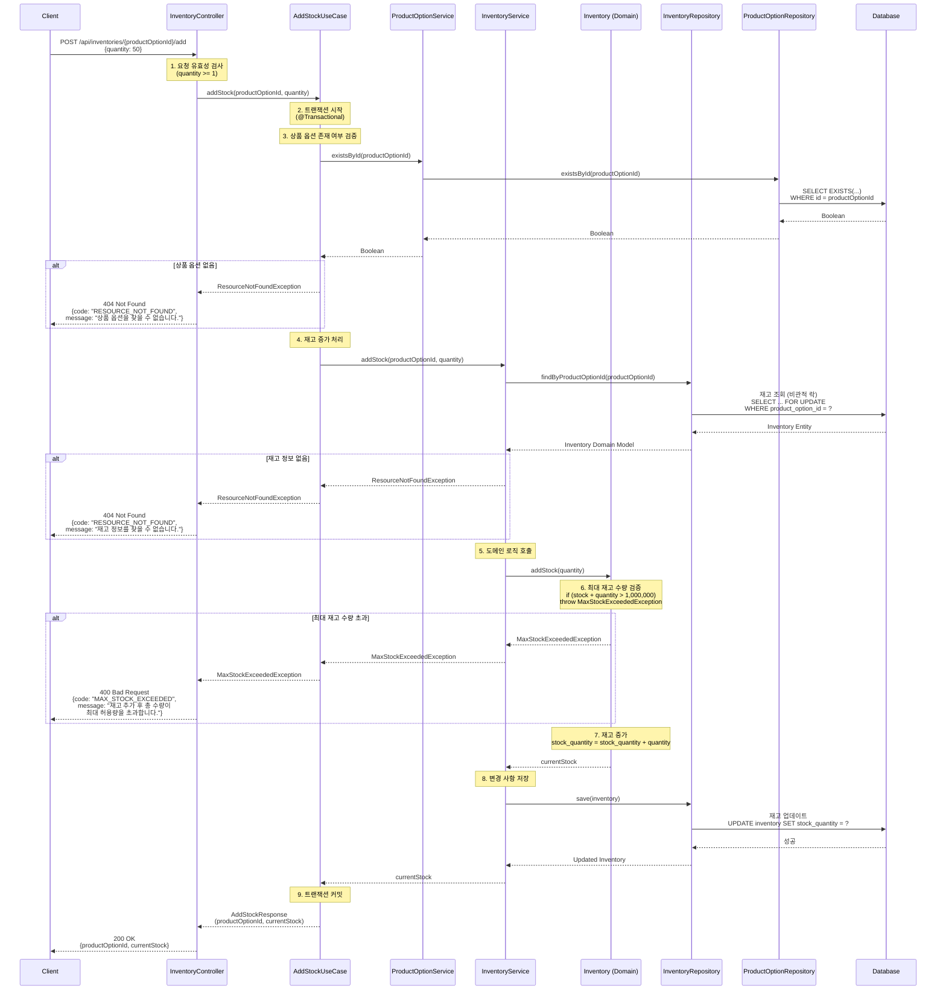

# 재고 추가 API

## 1. 개요

### 목적
관리자가 특정 상품의 재고 수량을 추가 입고 처리하는 API입니다.

### 사용 시나리오
- 관리자가 재고 현황을 확인하던 중, 특정 옵션의 재고가 부족한 것을 발견하고 추가 입고를 처리합니다.
- 신규 입고된 재고를 시스템에 반영하여 실시간 재고 정보를 최신화합니다.

### PRD 참고
- **기능 ID**: INV-003 (재고 추가 입고)
- **시나리오**: (3) 관리자 재고 관리
- **담당 역할**: 관리자

### 연관 테이블
- `inventory`: 재고 정보 (product_option_id, stock_quantity)
- `product_option`: 상품 옵션 정보 (SKU 기반)

---

## 2. API 명세

### Endpoint
```
POST /api/inventories/{productOptionId}/add
```

### Request Parameters

#### Path Parameters
| 파라미터 | 타입 | 필수 | 설명 |
|---------|------|------|------|
| productOptionId | Long | Y | 재고를 추가할 상품 옵션 ID (SKU 기반) |

#### Request Body
```json
{
  "quantity": 50
}
```

#### Request Body Schema
| 필드 | 타입 | 필수 | 제약사항 | 설명 |
|------|------|------|---------|------|
| quantity | Integer | Y | min: 1 | 추가할 재고 수량 (1개 이상) |

### Request Example
```bash
{
  "quantity": 50
}
```

### Response (Success)
```json
{
  "productOptionId": 1,
  "currentStock": 58
}
```

### Response Schema

```
{
  "productOptionId": "long",    // 상품 옵션 ID (SKU 기반)
  "currentStock": "int"         // 추가 후 현재 재고 수량
}
```

### HTTP Status Codes
| 상태 코드 | 설명 |
|----------|------|
| 200 OK | 재고 추가 성공 |
| 400 Bad Request | 유효하지 않은 요청 (수량이 1 미만) |
| 404 Not Found | 존재하지 않는 상품 옵션 |
| 500 Internal Server Error | 서버 오류 |

### Error Codes
| 에러 코드 | HTTP 상태 | 메시지 | 설명 |
|-----------|----------|--------|------|
| INVALID_INPUT | 400 | "수량은 1개 이상이어야 합니다." | 유효성 검사 실패 |
| MAX_STOCK_EXCEEDED | 400 | "재고 추가 후 총 수량이 최대 허용량(1,000,000개)을 초과합니다. 현재: {currentStock}, 추가 요청: {quantity}" | 최대 재고 수량 초과 |
| RESOURCE_NOT_FOUND | 404 | "상품 옵션 ID: {productOptionId}의 재고 정보를 찾을 수 없습니다." | 존재하지 않는 상품 옵션 |
| INTERNAL_ERROR | 500 | "재고 추가 처리 중 오류가 발생했습니다." | 서버 내부 오류 |

---

## 3. 비즈니스 로직

### 핵심 비즈니스 규칙
1. **상품 옵션 존재 여부 확인**: `ProductOptionService`를 통해 상품 옵션 ID의 존재 여부를 먼저 검증합니다.
2. **재고 존재 여부 확인**: 상품 옵션 ID에 해당하는 재고 정보가 존재해야 합니다.
3. **최대 재고 수량 검증**: 재고 추가 후 총 재고 수량이 1,000,000개를 초과하지 않아야 합니다. (악의적 사용 방지)
4. **재고 증가**: 기존 재고 수량(stock_quantity)에 요청된 수량을 더합니다.

### UseCase 패턴 적용
- **AddStockUseCase**: 여러 도메인 서비스(ProductOptionService, InventoryService)를 조율하는 Facade 역할
- **책임 분리**:
  - `ProductOptionService`: 상품 옵션 존재 여부 검증
  - `InventoryService`: 재고 증가 처리
  - `AddStockUseCase`: 두 서비스를 조합하여 전체 흐름 조율

### 유효성 검사
- `productOptionId`: 양수 값이어야 하며, 실제 존재하는 상품 옵션(SKU)이어야 합니다.
- `quantity`: 1 이상의 양수 값이어야 합니다.

### 계산 로직
```
새로운 재고 = 기존 재고 + 추가 수량
```

---

## 4. 구현 시 고려사항

### 성능 최적화
- **DB 인덱스**: `product_option_id`에 인덱스를 생성하여 조회 성능을 향상시킵니다.
- **단순 업데이트 쿼리**: 복잡한 조인 없이 단일 테이블 업데이트로 처리합니다.

### 동시성 제어
- **낙관적 락(Optimistic Lock)**: `@Version` 어노테이션을 사용하여 동시에 여러 관리자가 재고를 수정하는 경우를 방지합니다.
- 또는 **비관적 락(Pessimistic Lock)**: `SELECT ... FOR UPDATE`를 사용하여 재고 조회 시점에 락을 획득합니다.
- **트랜잭션 격리 수준**: `READ_COMMITTED` 이상 사용을 권장합니다.

### 데이터 일관성
- **트랜잭션 보장**: 재고 조회, 수량 증가, 저장이 하나의 트랜잭션으로 처리되어야 합니다.

---

## 5. 레이어드 아키텍처 흐름



### 트랜잭션 범위
- **시작**: `AddStockUseCase.addStock()` 메서드 진입 시
- **종료**: 메서드 정상 종료 시 커밋, 예외 발생 시 롤백
- **격리 수준**: `READ_COMMITTED` (기본값) 또는 `REPEATABLE_READ`
- **UseCase의 트랜잭션 책임**: 여러 도메인 서비스(ProductOptionService, InventoryService)를 하나의 트랜잭션으로 묶어 관리

### 예외 처리 흐름
1. **유효성 검사 실패** (`MethodArgumentNotValidException`):
   - Controller → GlobalExceptionHandler
   - 응답: 400 Bad Request, `INVALID_INPUT`

2. **상품 옵션 없음** (`ResourceNotFoundException`):
   - ProductOptionService → UseCase → GlobalExceptionHandler
   - 응답: 404 Not Found, `RESOURCE_NOT_FOUND`
   - 메시지: "상품 옵션 ID: {productOptionId}을(를) 찾을 수 없습니다."

3. **재고 정보 없음** (`ResourceNotFoundException`):
   - InventoryService → UseCase → GlobalExceptionHandler
   - 응답: 404 Not Found, `RESOURCE_NOT_FOUND`
   - 메시지: "상품 옵션 ID: {productOptionId}의 재고 정보를 찾을 수 없습니다."

4. **최대 재고 수량 초과** (`MaxStockExceededException`):
   - Domain (Inventory) → InventoryService → UseCase → GlobalExceptionHandler
   - 응답: 400 Bad Request, `MAX_STOCK_EXCEEDED`
   - 메시지: "재고 추가 후 총 수량이 최대 허용량(1,000,000개)을 초과합니다. 현재: {currentStock}, 추가 요청: {quantity}"

5. **동시성 충돌** (`OptimisticLockException` 또는 `PessimisticLockException`):
   - InventoryRepository → InventoryService → UseCase → GlobalExceptionHandler
   - 응답: 409 Conflict, `CONCURRENT_UPDATE_CONFLICT`
   - 클라이언트는 재시도 필요
