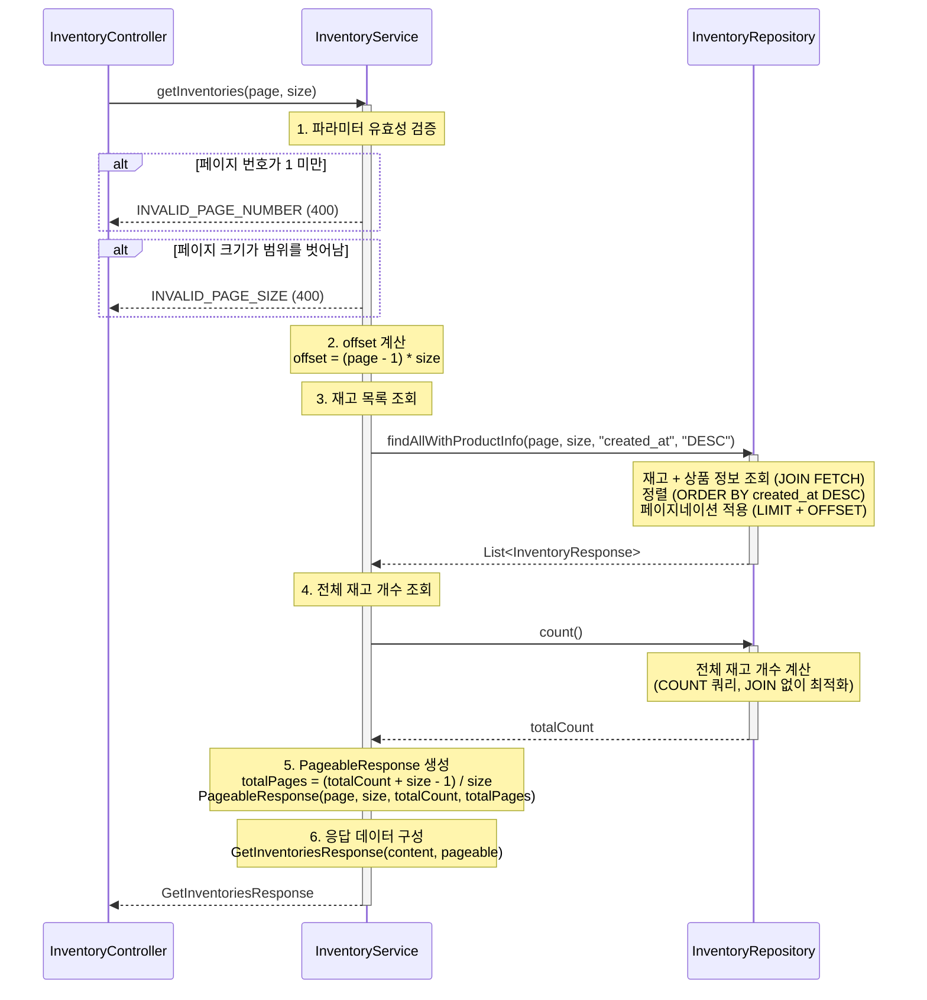

# 재고 목록 조회 API

## 1. 개요

### 목적
시스템 관리자가 상품별 재고 현황을 조회하여 재고 관리 및 재입고 계획을 수립할 수 있도록 합니다.

### 사용 시나리오
- 관리자가 전체 상품의 재고 수량을 확인
- 재고 부족 상품(임계값 이하) 필터링하여 재입고 필요 상품 파악
- 특정 상품의 재고 현황 조회
- 최근 업데이트된 재고 순서로 정렬하여 재고 변동 추적

### PRD 참고
- **기능 ID**: INV-001 (재고 조회)
- **시나리오**: (3) 재고 관리

### 연관 테이블
- `INVENTORY`: 재고 정보
- `PRODUCT_OPTION`: 상품 옵션 정보 (가격, 옵션명)
- `PRODUCT`: 상품 기본 정보 (상품명, 카테고리)

---

## 2. API 명세

### Endpoint
```
GET /api/inventories
```

### Query Parameters

| Parameter | Type    | Required | Default | Description                          |
|-----------|---------|----------|---------|--------------------------------------|
| page      | Integer | No       | 1       | 페이지 번호 (1부터 시작)             |
| size      | Integer | No       | 20      | 페이지 크기 (최대 100)               |

**정렬**: 최신 등록순으로 고정 (`created_at DESC`)

### Request Example

```http
GET /api/inventories?page=1&size=20
```

### Response (Success)

**HTTP Status**: `200 OK`

```json
{
  "data": {
    "content": [
      {
        "inventoryId": 1,
        "productId": 1,
        "productName": "에티오피아 예가체프 G1",
        "productOptionId": 1,
        "optionCode": "ETH-HD-200",
        "optionName": "핸드드립용 200g",
        "price": 15000,
        "stockQuantity": 50,
        "createdAt": "2025-11-04T10:30:00"
      },
      {
        "inventoryId": 2,
        "productId": 1,
        "productName": "에티오피아 예가체프 G1",
        "productOptionId": 2,
        "optionCode": "ETH-WB-500",
        "optionName": "원두 500g",
        "price": 28000,
        "stockQuantity": 30,
        "createdAt": "2025-11-04T09:15:00"
      }
    ],
    "pageable": {
      "pageNumber": 1,
      "pageSize": 20,
      "totalElements": 45,
      "totalPages": 3
    }
  }
}
```

### Response Schema

```
{
  "data": {
    "content": [                            // 재고 목록
      {
        "inventoryId": "long",              // 재고 ID
        "productId": "long",                // 상품 ID
        "productName": "string",            // 상품명
        "productOptionId": "long",          // 상품 옵션 ID
        "optionCode": "string",             // 옵션 코드
        "optionName": "string",             // 옵션명
        "price": "int",                     // 가격
        "stockQuantity": "int",             // 재고 수량
        "createdAt": "datetime"             // 재고 등록 시각
      }
    ],
    "pageable": {
      "pageNumber": "int",                  // 현재 페이지 번호 (1부터 시작)
      "pageSize": "int",                    // 페이지 크기
      "totalElements": "long",              // 전체 재고 개수
      "totalPages": "int"                   // 전체 페이지 수
    }
  }
}
```

### HTTP Status Codes

| Status Code | Description                                  |
|-------------|----------------------------------------------|
| 200         | 성공 (재고 목록 조회 완료)                   |
| 400         | 잘못된 요청 (유효하지 않은 파라미터)         |
| 500         | 서버 내부 오류                               |

### Error Codes

| Error Code                  | HTTP Status | Message                                                |
|-----------------------------|-------------|--------------------------------------------------------|
| INVALID_PAGE_SIZE           | 400         | 페이지 크기는 1 이상 100 이하여야 합니다.              |
| INVALID_PAGE_NUMBER         | 400         | 페이지 번호는 1 이상이어야 합니다.                     |
| INTERNAL_SERVER_ERROR       | 500         | 서버 내부 오류가 발생했습니다.                         |

---

## 3. 비즈니스 로직

### 핵심 비즈니스 규칙

#### 1. 쿼리 파라미터 유효성 검증

- **페이지 번호 검증**:
  - 범위: 1 이상
  - 기본값: 1
  - 실패 시: `INVALID_PAGE_NUMBER` 예외 발생 (400)

- **페이지 크기 검증**:
  - 범위: 1 ~ 100
  - 기본값: 20
  - 실패 시: `INVALID_PAGE_SIZE` 예외 발생 (400)

#### 2. 재고 목록 조회

- **조회 쿼리**:
  ```sql
  SELECT i.*, po.*, p.*
  FROM INVENTORY i
  JOIN PRODUCT_OPTION po ON i.product_option_id = po.id
  JOIN PRODUCT p ON po.product_id = p.id
  ORDER BY i.created_at DESC
  LIMIT :size OFFSET :offset
  ```
  - **정렬**: 최신 등록순 고정 (`created_at DESC`)
  - **offset 계산**: `offset = (page - 1) * size`
    - 예: page=1, size=20 → offset=0 (1~20번째)
    - 예: page=2, size=20 → offset=20 (21~40번째)

#### 3. 응답 데이터 변환
- **DTO 변환**:
  ```kotlin
  InventoryResponse(
      inventoryId = inventory.id,
      productId = product.id,
      productName = product.name,
      productOptionId = productOption.id,
      optionCode = productOption.code,
      optionName = productOption.name,
      price = productOption.price,
      stockQuantity = inventory.stockQuantity,
      createdAt = inventory.createdAt
  )
  ```

- **페이지 정보 포함**:
  ```kotlin
  val totalPages = (totalElements + size - 1) / size

  PageableResponse(
      pageNumber = page,
      pageSize = size,
      totalElements = totalCount,
      totalPages = totalPages
  )
  ```

### 유효성 검사

| 항목                   | 검증 조건                                          | 실패 시 예외                     |
|------------------------|----------------------------------------------------|----------------------------------|
| 페이지 번호            | `page >= 1`                                        | `INVALID_PAGE_NUMBER`            |
| 페이지 크기            | `1 <= size <= 100`                                 | `INVALID_PAGE_SIZE`              |

---

## 4. 구현 시 고려사항

### 성능 최적화

#### 1. 인덱스 설정
```sql
-- INVENTORY 테이블
CREATE INDEX idx_inventory_created_at
ON INVENTORY(created_at DESC);  -- 정렬 방향 포함

CREATE INDEX idx_inventory_product_option_id
ON INVENTORY(product_option_id);

-- PRODUCT_OPTION 테이블
CREATE INDEX idx_product_option_product_id
ON PRODUCT_OPTION(product_id);
```
- `created_at DESC` 인덱스: 최신 등록순 정렬 최적화

#### 2. 쿼리 최적화 (JOIN FETCH)
- **N+1 문제 방지**:
  ```kotlin
  fun findAllWithProductInfo(
      page: Int,
      size: Int,
      sortBy: String,
      sortDirection: String
  ): List<InventoryResponse>
  ```
  - page, size, sortBy, sortDirection을 직접 인자로 전달
  - Repository에서 OFFSET, LIMIT, ORDER BY 직접 처리

- **Service 호출 예시**:
  ```kotlin
  val inventories = inventoryRepository.findAllWithProductInfo(
      page = page,
      size = size,
      sortBy = "created_at",
      sortDirection = "DESC"
  )
  ```

- **효과**:
  - 단일 쿼리로 INVENTORY, PRODUCT_OPTION, PRODUCT 조회
  - N+1 문제 완전 방지

#### 3. 페이지네이션 최적화
- **COUNT 쿼리 분리**:
  ```kotlin
  // COUNT 쿼리는 JOIN 없이 최적화
  @Query("SELECT COUNT(i) FROM Inventory i")
  fun count(): Long
  ```

- **효과**: COUNT 쿼리에서 불필요한 JOIN 제거, 빠른 총 개수 계산

### 데이터 일관성

#### 트랜잭션 불필요
- **이유**: 단순 읽기 작업이므로 트랜잭션 필요 없음
- **격리 수준**: 기본값 사용 (`READ_COMMITTED`)
- **비관적 락 불필요**: 재고 수정 없음

#### 조회 시점의 데이터
- 조회 결과는 **조회 시점의 스냅샷**
- 실시간 재고 변동은 반영되지 않을 수 있음 (정합성 trade-off)
- 필요 시 캐싱 전략 고려 (Redis, 짧은 TTL)

---

## 5. 레이어드 아키텍처 흐름



### 예외 처리 흐름

#### 1. 파라미터 유효성 검증 실패
- **예외 종류**:
  - `INVALID_PAGE_NUMBER` (400): 페이지 번호가 1 미만
  - `INVALID_PAGE_SIZE` (400): 페이지 크기 범위 초과
- **처리**: Service에서 검증 후 예외 발생 → GlobalExceptionHandler

#### 2. DB 오류
- **예외**: `DataAccessException`
- **HTTP Status**: 500 Internal Server Error
- **처리**: GlobalExceptionHandler에서 일괄 처리
