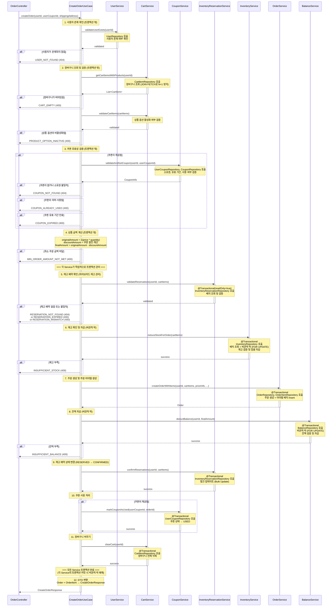
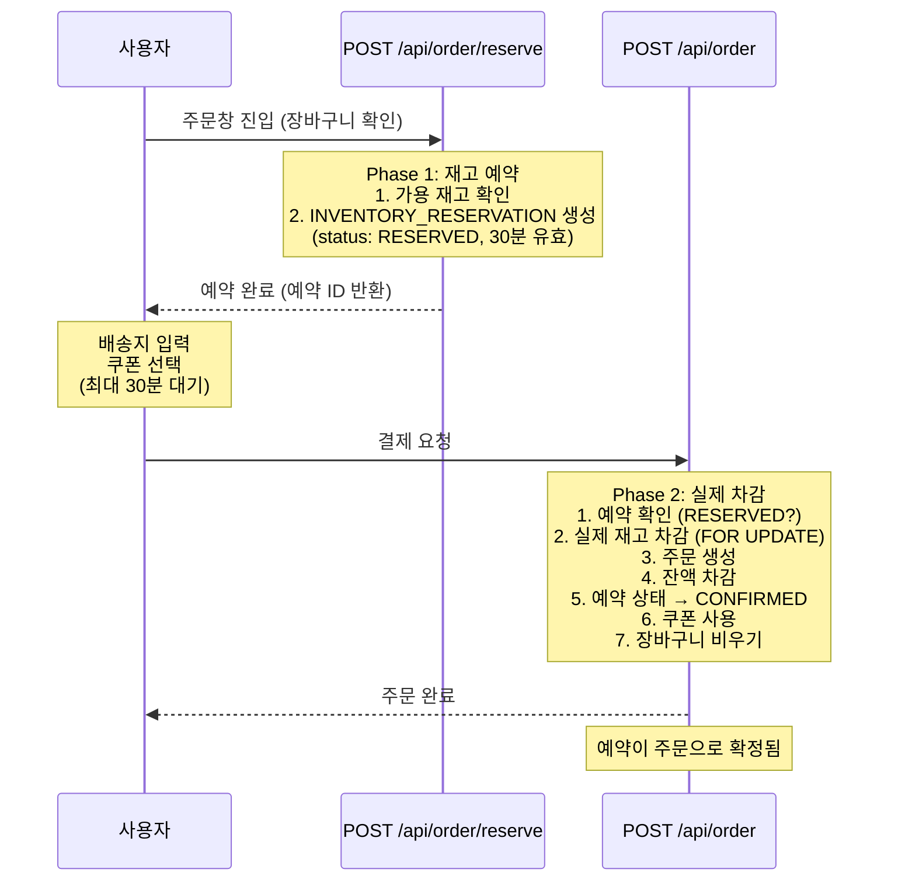

# 장바구니 상품 주문 API

## 1. 개요

### 목적
장바구니에 담긴 상품들을 주문하고 결제를 처리합니다. 재고 예약 확인, 재고 차감, 쿠폰 할인 적용, 잔액 결제를 포함한 복잡한 비즈니스 트랜잭션을 원자적으로 처리합니다.

### 사용 시나리오
- **사전 조건**: 주문창 진입 시 `POST /api/order/reserve`를 통해 재고 예약 완료 (30분 유효)
- 고객이 배송지 정보 입력 및 쿠폰 선택
- 결제 요청 시 재고 예약 확인
- 실제 재고 차감 및 예약 상태를 `CONFIRMED`로 변경
- 미리 충전한 잔액(예치금)으로 결제 진행
- 재고 예약 없음, 재고 부족, 또는 잔액 부족 시 주문 실패

### PRD 참고
- **기능 ID**: ORD-001 (주문 생성), ORD-003 (잔액 결제 처리), ORD-004 (결제 금액 계산), ORD-005 (결제 유효성 검증)
- **시나리오**: (2) 주문 및 결제

### 연관 테이블
- `CART_ITEM`: 장바구니 아이템 조회
- `PRODUCT_OPTION`: 상품 가격 및 활성 여부 조회
- `INVENTORY_RESERVATION`: 재고 예약 확인 및 상태 변경 (**하이브리드 재고 관리**)
- `INVENTORY`: 재고 확인 및 차감 (비관적 락)
- `USER_COUPON`: 쿠폰 유효성 검증 및 사용 처리
- `COUPON`: 쿠폰 할인 정보 조회
- `BALANCE`: 잔액 확인 및 차감 (비관적 락)
- `ORDER`: 주문 정보 생성
- `ORDER_ITEM`: 주문 아이템 생성
- `USER`: 사용자 정보 확인

---

## 2. API 명세

### Endpoint
```
POST /api/order
```

### Request Body
```json
{
  "userId": 123,
  "userCouponId": 456,
  "shippingAddress": "서울특별시 강남구 테헤란로 123, 101호"
}
```

### Request Parameters

| Field            | Type   | Required | Constraints                      | Description                        |
|------------------|--------|----------|----------------------------------|------------------------------------|
| userId           | Long   | Yes      | > 0                              | 사용자 ID                          |
| userCouponId     | Long   | No       | > 0                              | 사용할 쿠폰 ID (null 가능)         |
| shippingAddress  | String | Yes      | 10~200자                         | 배송지 주소                        |

### Request Example
```http
POST /api/order

{
  "userId": 123,
  "userCouponId": 456,
  "shippingAddress": "서울특별시 강남구 테헤란로 123, 101호"
}
```

### Response (Success)

**HTTP Status**: `201 Created`

```json
{
  "data": {
    "orderId": 789,
    "userId": 123,
    "status": "PAYMENT_COMPLETED",
    "orderItems": [
      {
        "orderItemId": 1001,
        "productOptionId": 1,
        "productName": "에티오피아 예가체프 G1",
        "optionCode": "ETH-HD-200",
        "origin": "Ethiopia",
        "grindType": "HAND_DRIP",
        "weightGrams": 200,
        "quantity": 2,
        "unitPrice": 21000,
        "totalPrice": 42000
      },
      {
        "orderItemId": 1002,
        "productOptionId": 5,
        "productName": "콜롬비아 수프리모",
        "optionCode": "COL-WB-500",
        "origin": "Colombia",
        "grindType": "WHOLE_BEANS",
        "weightGrams": 500,
        "quantity": 1,
        "unitPrice": 35000,
        "totalPrice": 35000
      }
    ],
    "appliedCoupon": {
      "userCouponId": 456,
      "couponName": "오픈 기념! 선착순 100명 10% 할인 쿠폰",
      "discountType": "PERCENTAGE",
      "discountValue": 10
    },
    "priceInfo": {
      "originalAmount": 77000,
      "discountAmount": 7700,
      "finalAmount": 69300
    },
    "shippingAddress": "서울특별시 강남구 테헤란로 123, 101호",
    "createdAt": "2025-11-04T15:30:00"
  }
}
```

### Response Schema

```
{
  "data": {
    "orderId": "long",                   // 주문 ID
    "userId": "long",                    // 사용자 ID
    "status": "string",                  // 주문 상태 (PAYMENT_COMPLETED)
    "orderItems": [                      // 주문 아이템 목록
      {
        "orderItemId": "long",           // 주문 아이템 ID
        "productOptionId": "long",       // 상품 옵션 ID
        "productName": "string",         // 상품명
        "optionCode": "string",          // 옵션 코드
        "origin": "string",              // 원산지
        "grindType": "string",           // 분쇄 타입
        "weightGrams": "int",            // 용량 (그램)
        "quantity": "int",               // 주문 수량
        "unitPrice": "int",              // 단가 (주문 당시 가격)
        "totalPrice": "int"              // 총액 (단가 * 수량)
      }
    ],
    "appliedCoupon": {                   // 적용된 쿠폰 (nullable)
      "userCouponId": "long",            // 사용자 쿠폰 ID
      "couponName": "string",            // 쿠폰명
      "discountType": "string",          // 할인 타입 (PERCENTAGE, FIXED_AMOUNT)
      "discountValue": "int"             // 할인 값
    },
    "priceInfo": {                       // 가격 정보
      "originalAmount": "int",           // 원가 (총 상품 금액)
      "discountAmount": "int",           // 할인 금액
      "finalAmount": "int"               // 최종 결제 금액
    },
    "shippingAddress": "string",         // 배송지 주소
    "createdAt": "datetime"              // 주문 생성 시각
  }
}
```

### HTTP Status Codes

| Status Code | Description                                  |
|-------------|----------------------------------------------|
| 201         | 성공 (주문 생성 완료)                        |
| 400         | 잘못된 요청 (유효하지 않은 입력값)           |
| 404         | 리소스를 찾을 수 없음                        |
| 409         | 충돌 (재고 부족, 잔액 부족 등)               |
| 500         | 서버 내부 오류                               |

### Error Codes

| Error Code                  | HTTP Status | Message                                                |
|-----------------------------|-------------|--------------------------------------------------------|
| USER_NOT_FOUND              | 404         | 사용자를 찾을 수 없습니다.                             |
| CART_EMPTY                  | 400         | 장바구니가 비어 있습니다.                              |
| PRODUCT_OPTION_INACTIVE     | 400         | 비활성화된 상품 옵션이 포함되어 있습니다.              |
| RESERVATION_NOT_FOUND       | 404         | 재고 예약 정보를 찾을 수 없습니다.                     |
| RESERVATION_EXPIRED         | 400         | 재고 예약이 만료되었습니다. (30분 초과)                |
| RESERVATION_MISMATCH        | 400         | 장바구니와 예약 정보가 일치하지 않습니다.              |
| INSUFFICIENT_STOCK          | 409         | 재고가 부족합니다. (상품 옵션 ID: {id})                |
| INSUFFICIENT_BALANCE        | 409         | 잔액이 부족합니다.                                     |
| COUPON_NOT_FOUND            | 404         | 쿠폰을 찾을 수 없습니다.                               |
| COUPON_ALREADY_USED         | 400         | 이미 사용된 쿠폰입니다.                                |
| COUPON_EXPIRED              | 400         | 쿠폰 유효 기간이 만료되었습니다.                       |
| MIN_ORDER_AMOUNT_NOT_MET    | 400         | 최소 주문 금액을 충족하지 못했습니다.                  |
| INVALID_INPUT               | 400         | 입력값이 올바르지 않습니다.                            |
| INTERNAL_SERVER_ERROR       | 500         | 서버 내부 오류가 발생했습니다.                         |

---

## 3. 비즈니스 로직

### 핵심 비즈니스 규칙

#### 1. 장바구니 조회 및 검증 (트랜잭션 밖)
- **조회**: `CART_ITEM` 테이블에서 `user_id`로 장바구니 아이템 목록 조회
- **검증**:
  - 장바구니가 비어있지 않은지 확인
  - 각 아이템의 `PRODUCT_OPTION.is_active = true` 확인 (비활성화된 상품 제외)
- **실패 시**:
  - `CART_EMPTY` 예외 발생 (400)
  - `PRODUCT_OPTION_INACTIVE` 예외 발생 (400)

#### 2. 쿠폰 유효성 검증 (트랜잭션 밖)
쿠폰이 제공된 경우에만 수행:
- **검증**:
  - `USER_COUPON` 존재 여부 및 소유권 확인 (`user_id` 일치)
  - `status = 'ISSUED'` (발급됨) 확인
  - `COUPON.valid_from <= NOW <= COUPON.valid_until` (유효 기간)
- **실패 시**:
  - `COUPON_NOT_FOUND` 예외 발생 (404)
  - `COUPON_ALREADY_USED` 예외 발생 (400)
  - `COUPON_EXPIRED` 예외 발생 (400)

#### 3. 상품 금액 계산 (트랜잭션 밖)
- **원가 계산**:
  ```kotlin
  originalAmount = cartItems.sumOf { item ->
      item.productOption.price * item.quantity
  }
  ```
- **할인 금액 계산** (쿠폰이 제공된 경우):
  ```kotlin
  discountAmount = when (coupon.discountType) {
      "PERCENTAGE" -> {
          val calculated = (originalAmount * coupon.discountValue) / 100
          min(calculated, coupon.maxDiscountAmount ?: Int.MAX_VALUE)
      }
      "FIXED_AMOUNT" -> coupon.discountValue
  }
  ```
- **최소 주문 금액 검증**:
  ```kotlin
  if (originalAmount < coupon.minOrderAmount) {
      throw IllegalStateException("최소 주문 금액 미달")
  }
  ```
- **최종 금액 계산**:
  ```kotlin
  finalAmount = originalAmount - discountAmount
  ```
- **실패 시**: `MIN_ORDER_AMOUNT_NOT_MET` 예외 발생 (400)

#### 4. 재고 예약 확인 (트랜잭션 내)
**목적**: 하이브리드 재고 관리 전략 - 사전에 예약된 재고 확인

각 장바구니 아이템에 대해:
- **예약 정보 조회**:
  ```sql
  SELECT * FROM INVENTORY_RESERVATION
  WHERE user_id = :userId
    AND product_option_id = :productOptionId
    AND status = 'RESERVED'
    AND expires_at > NOW();
  ```
- **예약 검증**:
  - **예약 존재 여부**: 해당 상품에 대한 예약이 있는지 확인
  - **예약 만료 여부**: `expires_at > NOW()` (30분 이내)
  - **수량 일치 여부**: `reservation.quantity >= cartItem.quantity`
- **실패 시**:
  - 예약 없음: `RESERVATION_NOT_FOUND` 예외 발생 (404)
  - 예약 만료: `RESERVATION_EXPIRED` 예외 발생 (400)
  - 수량 불일치: `RESERVATION_MISMATCH` 예외 발생 (400)

#### 5. 재고 확인 및 차감 (트랜잭션 내 - 비관적 락)
**목적**: 동시 주문 요청 시 실제 재고 정합성 보장

**배치 처리 방식으로 DB 커넥션 최적화**:

**5-1. 재고 일괄 조회 (비관적 락 획득)**
- **목적**: N+1 문제 방지, DB 커넥션 효율 향상
- **조회**:
  ```sql
  SELECT * FROM INVENTORY
  WHERE product_option_id IN (:productOptionIds)
  ORDER BY product_option_id ASC
  FOR UPDATE;
  ```
  - `productOptionIds`: 장바구니 아이템의 모든 `product_option_id` 목록
  - `FOR UPDATE`: 모든 재고 행에 비관적 쓰기 락 동시 획득
  - **효과**: 다른 트랜잭션은 이 재고들을 읽거나 수정할 수 없음 (대기)
  - **데드락 방지**: `product_option_id` 오름차순 정렬로 락 획득 순서 보장
  - **락 해제**:
    - **성공 시**: 트랜잭션 커밋 시 모든 재고 락 자동 해제 (Step 12 완료 후)
    - **실패 시**: 트랜잭션 롤백 시 모든 재고 락 즉시 해제

**5-2. 재고 검증**
- **검증 로직**:
  ```kotlin
  val inventoryMap = inventories.associateBy { it.productOptionId }

  cartItems.forEach { cartItem ->
      val inventory = inventoryMap[cartItem.productOptionId]
          ?: throw IllegalStateException("재고 정보 없음")

      if (inventory.stockQuantity < cartItem.quantity) {
          throw InsufficientStockException(
              "재고 부족: 상품 옵션 ID ${cartItem.productOptionId}"
          )
      }
  }
  ```
  - **참고**: 예약이 이미 확인되었으므로 실제 재고만 검증

**5-3. 재고 일괄 차감**
- **차감 계산**:
  ```kotlin
  val stockUpdates = cartItems.map { cartItem ->
      val inventory = inventoryMap[cartItem.productOptionId]!!
      StockUpdate(
          productOptionId = cartItem.productOptionId,
          newQuantity = inventory.stockQuantity - cartItem.quantity
      )
  }
  ```
- **배치 업데이트**:
  ```sql
  -- 방법 1: CASE WHEN을 활용한 단일 쿼리
  UPDATE INVENTORY
  SET stock_quantity = CASE product_option_id
      WHEN :id1 THEN :qty1
      WHEN :id2 THEN :qty2
      ...
      END,
      updated_at = :now
  WHERE product_option_id IN (:productOptionIds);

  -- 방법 2: JPA Batch Update (spring.jpa.properties.hibernate.jdbc.batch_size 설정)
  inventories.forEach { inventory ->
      inventory.stockQuantity -= quantityMap[inventory.productOptionId]!!
  }
  inventoryRepository.saveAll(inventories) // 배치로 처리됨
  ```
- **실패 시**: `INSUFFICIENT_STOCK` 예외 발생 → 트랜잭션 롤백 (409)

#### 6. 주문 생성 (트랜잭션 내)
- **ORDER 레코드 생성**:
  - `user_id`: 요청한 사용자 ID
  - `user_coupon_id`: 사용한 쿠폰 ID (nullable)
  - `status`: `'PAYMENT_COMPLETED'` (결제 완료)
  - `original_amount`: 원가
  - `discount_amount`: 할인 금액
  - `final_amount`: 최종 결제 금액
  - `shipping_address`: 배송지 주소
  - `tracking_number`: `NULL` (배송 시작 시 입력)
  - `created_at`: 현재 시각

#### 7. 주문 아이템 생성 (트랜잭션 내)
**배치 Insert로 DB 커넥션 최적화**:

- **아이템 목록 생성**:
  ```kotlin
  val orderItems = cartItems.map { cartItem ->
      OrderItem(
          orderId = order.id,
          productOptionId = cartItem.productOptionId,
          quantity = cartItem.quantity,
          unitPrice = cartItem.productOption.price,
          totalPrice = cartItem.productOption.price * cartItem.quantity,
          createdAt = now
      )
  }
  ```

- **배치 Insert**:
  ```kotlin
  // JPA Batch Insert (spring.jpa.properties.hibernate.jdbc.batch_size 설정)
  orderItemRepository.saveAll(orderItems)

  // 또는 커스텀 Batch Insert 쿼리
  @Modifying
  @Query("""
      INSERT INTO ORDER_ITEM (order_id, product_option_id, quantity, unit_price, total_price, created_at)
      VALUES (:orderId, :productOptionId, :quantity, :unitPrice, :totalPrice, :createdAt)
  """)
  fun batchInsert(@Param("orderItems") orderItems: List<OrderItem>)
  ```
  - **효과**: N개의 INSERT를 하나의 배치로 처리 → DB 왕복 횟수 감소

#### 8. 잔액 차감 (트랜잭션 내 - 비관적 락)
- **잔액 조회 (비관적 락 획득)**:
  ```sql
  SELECT * FROM BALANCE
  WHERE user_id = :userId
  FOR UPDATE;
  ```
  - **락 획득**: BALANCE 테이블의 해당 사용자 행에 비관적 쓰기 락 설정
  - **효과**: 다른 트랜잭션은 이 사용자의 잔액을 읽거나 수정할 수 없음 (대기)

- **잔액 검증**:
  ```kotlin
  if (balance.amount < finalAmount) {
      throw InsufficientBalanceException("잔액 부족")
  }
  ```

- **잔액 차감**:
  ```kotlin
  balance.amount -= finalAmount
  ```

- **업데이트**:
  ```sql
  UPDATE BALANCE
  SET amount = :newAmount,
      updated_at = :now
  WHERE user_id = :userId;
  ```

- **락 해제 시점**:
  - **성공 시**: 트랜잭션 커밋 시 자동 해제 (Step 12 완료 후)
  - **실패 시**: 트랜잭션 롤백 시 자동 해제 (즉시)
  - **타임아웃**: 락 대기 시간 초과 시 `LockTimeoutException` 발생 (설정: 5초)

- **실패 시**: `INSUFFICIENT_BALANCE` 예외 발생 → 트랜잭션 롤백 + 락 즉시 해제 (409)

#### 9. 재고 예약 상태 변경 (트랜잭션 내)
**목적**: 예약을 확정 상태로 변경

**배치 Update로 DB 커넥션 최적화**:

- **예약 ID 목록 추출**:
  ```kotlin
  val reservationIds = reservations.map { it.id }
  ```

- **일괄 상태 변경**:
  ```sql
  UPDATE INVENTORY_RESERVATION
  SET status = 'CONFIRMED',
      updated_at = :now
  WHERE id IN (:reservationIds);
  ```
  - **효과**: N개의 UPDATE를 단일 쿼리로 처리
  - **의미**: 재고 예약이 실제 주문으로 확정됨

- **JPA 방식**:
  ```kotlin
  @Modifying
  @Query("""
      UPDATE InventoryReservation ir
      SET ir.status = 'CONFIRMED', ir.updatedAt = :now
      WHERE ir.id IN (:reservationIds)
  """)
  fun bulkUpdateStatus(
      @Param("reservationIds") reservationIds: List<Long>,
      @Param("now") now: LocalDateTime
  ): Int
  ```

#### 10. 쿠폰 사용 처리 (트랜잭션 내)
쿠폰이 제공된 경우에만 수행:
- **쿠폰 상태 업데이트**:
  ```sql
  UPDATE USER_COUPON
  SET status = 'USED',
      used_order_id = :orderId,
      used_at = :now,
      updated_at = :now
  WHERE id = :userCouponId;
  ```

#### 11. 장바구니 비우기 (트랜잭션 내)
- **삭제**:
  ```sql
  DELETE FROM CART_ITEM
  WHERE user_id = :userId;
  ```

#### 12. 트랜잭션 커밋 및 응답
- **트랜잭션 범위**: 4~11단계 전체
- **커밋 시점**: 모든 단계 성공 시
- **응답**: 생성된 주문 정보 반환

### 유효성 검사

| 항목                          | 검증 조건                                                  | 실패 시 예외                  |
|-------------------------------|-----------------------------------------------------------|-------------------------------|
| 사용자 존재 여부              | `USER.id = userId`                                         | `USER_NOT_FOUND`              |
| 장바구니 비어있지 않음        | `CART_ITEM` 레코드 존재                                    | `CART_EMPTY`                  |
| 상품 옵션 활성화              | `PRODUCT_OPTION.is_active = true`                          | `PRODUCT_OPTION_INACTIVE`     |
| 재고 예약 존재                | `INVENTORY_RESERVATION` 레코드 존재                        | `RESERVATION_NOT_FOUND`       |
| 재고 예약 유효                | `status = 'RESERVED' AND expires_at > NOW`                 | `RESERVATION_EXPIRED`         |
| 재고 예약 수량 일치           | `reservation.quantity >= cartItem.quantity`                | `RESERVATION_MISMATCH`        |
| 쿠폰 존재 및 소유권           | `USER_COUPON.user_id = userId`                             | `COUPON_NOT_FOUND`            |
| 쿠폰 상태                     | `USER_COUPON.status = 'ISSUED'`                            | `COUPON_ALREADY_USED`         |
| 쿠폰 유효 기간                | `valid_from <= NOW <= valid_until`                         | `COUPON_EXPIRED`              |
| 최소 주문 금액                | `originalAmount >= COUPON.min_order_amount`                | `MIN_ORDER_AMOUNT_NOT_MET`    |
| 재고 충분                     | `INVENTORY.stock_quantity >= CART_ITEM.quantity`           | `INSUFFICIENT_STOCK`          |
| 잔액 충분                     | `BALANCE.amount >= finalAmount`                            | `INSUFFICIENT_BALANCE`        |

---

## 4. 구현 시 고려사항

### UseCase 패턴 적용 (필수)

장바구니 상품 주문 기능은 **여러 도메인 Service**를 조율하는 매우 복잡한 비즈니스 트랜잭션:
1. `CartService`: 장바구니 조회 및 삭제
2. `ProductService`: 상품 정보 및 가격 조회
3. `InventoryReservationService`: 재고 예약 확인 및 상태 변경 (**하이브리드 재고 관리**)
4. `InventoryService`: 재고 확인 및 차감
5. `CouponService`: 쿠폰 유효성 검증 및 사용 처리
6. `BalanceService`: 잔액 확인 및 차감
7. `OrderService`: 주문 생성 및 주문 아이템 생성
8. `UserService`: 사용자 확인

이러한 다중 도메인 의존성을 **UseCase 패턴**으로 추상화:
1. **단일 책임 (SRP)**: 각 Service는 자신의 도메인 영역만 담당, Repository 접근은 Service 내부에서만
2. **오케스트레이션 분리**: UseCase는 여러 Service를 조율하는 역할만 수행
3. **트랜잭션 경계 명확화**: 각 Service는 독립적인 트랜잭션 관리, UseCase는 전체 흐름 조율
4. **확장성**: 향후 알림, 이벤트 발행, 포인트 적립 등 인프라 컴포넌트 추가 시 UseCase에서 통합 관리

```kotlin
@Component
class CreateOrderUseCase(
    private val userService: UserService,
    private val cartService: CartService,
    private val productService: ProductService,
    private val couponService: CouponService,
    private val inventoryReservationService: InventoryReservationService,
    private val inventoryService: InventoryService,
    private val balanceService: BalanceService,
    private val orderService: OrderService
) {
    fun createOrder(request: CreateOrderRequest): CreateOrderResponse {
        // 1. 사용자 존재 확인 (트랜잭션 밖)
        userService.validateUserExists(request.userId)

        // 2. 장바구니 조회 및 검증 (트랜잭션 밖)
        val cartItems = cartService.getCartItemsWithProducts(request.userId)
        cartService.validateCartItems(cartItems)

        // 3. 쿠폰 유효성 검증 (트랜잭션 밖)
        val couponInfo = request.userCouponId?.let {
            couponService.validateAndGetCoupon(request.userId, it)
        }

        // 4. 상품 금액 계산 (트랜잭션 밖)
        val priceInfo = calculatePriceInfo(cartItems, couponInfo)

        // === 각 Service가 독립적으로 트랜잭션 관리 ===

        // 5. 재고 예약 확인 (하이브리드 재고 관리)
        inventoryReservationService.validateReservations(request.userId, cartItems)

        // 6. 재고 확인 및 차감 (FOR UPDATE)
        inventoryService.reduceStockForOrder(cartItems)

        // 7. 주문 생성 및 주문 아이템 생성
        val order = orderService.createOrderWithItems(
            userId = request.userId,
            cartItems = cartItems,
            priceInfo = priceInfo,
            userCouponId = request.userCouponId,
            shippingAddress = request.shippingAddress
        )

        // 8. 잔액 차감 (FOR UPDATE)
        balanceService.deductBalance(request.userId, priceInfo.finalAmount)

        // 9. 재고 예약 상태 변경 (RESERVED → CONFIRMED)
        inventoryReservationService.confirmReservations(request.userId, cartItems)

        // 10. 쿠폰 사용 처리
        request.userCouponId?.let {
            couponService.markCouponAsUsed(it, order.id)
        }

        // 11. 장바구니 비우기
        cartService.clearCart(request.userId)

        // 12. DTO 변환 및 반환
        return toCreateOrderResponse(order, cartItems, couponInfo, priceInfo)
    }
}
```

### 동시성 제어

#### FOR UPDATE 비관적 락 전략
**목적**: 동시 주문 요청 시 재고 및 잔액 정합성 보장

##### 1. 재고 차감 (INVENTORY)
- **락 대상**: `INVENTORY` 테이블의 각 `product_option_id` 행
- **동작**:
  - 각 장바구니 아이템의 재고를 순차적으로 락 획득 및 차감
  - 다른 트랜잭션은 락이 해제될 때까지 대기
- **데드락 방지**: `product_option_id` 오름차순 정렬 후 락 획득

```kotlin
// 데드락 방지: 상품 옵션 ID 순으로 정렬 후 재고 차감
val sortedCartItems = cartItems.sortedBy { it.productOptionId }

sortedCartItems.forEach { cartItem ->
    val inventory = inventoryRepository.findByProductOptionIdWithLock(cartItem.productOptionId)
        ?: throw IllegalStateException("재고 정보를 찾을 수 없습니다")

    if (inventory.stockQuantity < cartItem.quantity) {
        throw InsufficientStockException("재고 부족")
    }

    inventory.stockQuantity -= cartItem.quantity
    inventoryRepository.save(inventory)
}
```

##### 2. 잔액 차감 (BALANCE)
- **락 대상**: `BALANCE` 테이블의 `user_id` 행
- **동작**:
  - 사용자 잔액을 락 획득 후 차감
  - 다른 트랜잭션(동시 주문, 잔액 충전 등)은 대기

```kotlin
val balance = balanceRepository.findByUserIdWithLock(userId)
    ?: throw IllegalStateException("잔액 정보를 찾을 수 없습니다")

if (balance.amount < finalAmount) {
    throw InsufficientBalanceException("잔액 부족")
}

balance.amount -= finalAmount
balanceRepository.save(balance)
```

### 성능 최적화

#### 1. 인덱스 설정
```sql
-- CART_ITEM 테이블
CREATE INDEX idx_cart_item_user_id
ON CART_ITEM(user_id);

-- INVENTORY 테이블
CREATE UNIQUE INDEX idx_inventory_product_option_id
ON INVENTORY(product_option_id);

-- BALANCE 테이블
CREATE UNIQUE INDEX idx_balance_user_id
ON BALANCE(user_id);

-- ORDER 테이블
CREATE INDEX idx_order_user_id
ON ORDER(user_id);

CREATE INDEX idx_order_status
ON ORDER(status);

-- ORDER_ITEM 테이블
CREATE INDEX idx_order_item_order_id
ON ORDER_ITEM(order_id);

-- USER_COUPON 테이블
CREATE INDEX idx_user_coupon_user_id
ON USER_COUPON(user_id, status);
```

#### 2. 배치 처리 전략 (DB 커넥션 최적화)

**문제**: 장바구니에 N개 아이템이 있을 때, 루프 처리 시 N번의 DB 쿼리 발생 → 커넥션 병목

**해결**: 배치 처리로 DB 왕복 횟수 최소화

**2-1. 장바구니 조회 (JOIN FETCH)**
```kotlin
@Query("""
    SELECT ci FROM CartItem ci
    JOIN FETCH ci.productOption po
    JOIN FETCH po.product p
    WHERE ci.userId = :userId
""")
fun findByUserIdWithProductOption(@Param("userId") userId: Long): List<CartItem>
```
- **효과**: N+1 문제 방지, 단일 쿼리로 모든 연관 데이터 조회

**2-2. 재고 일괄 조회 (IN 절 + FOR UPDATE)**
```kotlin
@Query("""
    SELECT i FROM Inventory i
    WHERE i.productOptionId IN (:productOptionIds)
    ORDER BY i.productOptionId ASC
""")
@Lock(LockModeType.PESSIMISTIC_WRITE)
fun findAllByProductOptionIdsWithLock(
    @Param("productOptionIds") productOptionIds: List<Long>
): List<Inventory>
```
- **효과**: N번의 SELECT → 1번의 SELECT
- **데드락 방지**: ORDER BY로 락 획득 순서 보장

**2-3. 재고 일괄 차감 (Batch Update)**
```kotlin
// 방법 1: CASE WHEN (단일 쿼리)
@Modifying
@Query("""
    UPDATE Inventory i
    SET i.stockQuantity = CASE i.productOptionId
        WHEN :id1 THEN :qty1
        WHEN :id2 THEN :qty2
        END,
        i.updatedAt = :now
    WHERE i.productOptionId IN (:productOptionIds)
""")
fun bulkUpdateStock(...)

// 방법 2: JPA Batch Update
// application.yml 설정:
// spring.jpa.properties.hibernate.jdbc.batch_size: 50
inventoryRepository.saveAll(inventories) // 자동으로 배치 처리
```
- **효과**: N번의 UPDATE → 1번의 UPDATE (또는 배치 크기만큼)

**2-4. 주문 아이템 일괄 생성 (Batch Insert)**
```kotlin
// application.yml 설정:
// spring.jpa.properties.hibernate.jdbc.batch_size: 50
// spring.jpa.properties.hibernate.order_inserts: true
orderItemRepository.saveAll(orderItems)
```
- **효과**: N번의 INSERT → Batch Size만큼 묶어서 처리

**2-5. 예약 상태 일괄 변경 (Bulk Update)**
```kotlin
@Modifying
@Query("""
    UPDATE InventoryReservation ir
    SET ir.status = 'CONFIRMED', ir.updatedAt = :now
    WHERE ir.id IN (:reservationIds)
""")
fun bulkUpdateStatus(
    @Param("reservationIds") reservationIds: List<Long>,
    @Param("now") now: LocalDateTime
): Int
```
- **효과**: N번의 UPDATE → 1번의 UPDATE

**성능 개선 효과**:
- 아이템 10개 주문 시:
  - **Before**: 약 30~40개의 개별 쿼리
  - **After**: 약 10개 미만의 배치 쿼리
  - **개선**: DB 왕복 횟수 70~80% 감소

#### 3. 트랜잭션 범위 최적화
- **검증 로직 트랜잭션 밖 수행**:
  - 장바구니 조회 및 검증
  - 쿠폰 유효성 검증
  - 상품 금액 계산
  - → 빠른 실패 처리로 불필요한 트랜잭션 방지

- **트랜잭션 내 최소화**:
  - 재고 차감
  - 주문 생성
  - 잔액 차감
  - 쿠폰 사용 처리
  - 장바구니 비우기
  - → 락 보유 시간 최소화

### 데이터 일관성

#### 트랜잭션 보장
- **격리 수준**: `READ_COMMITTED`
  - Dirty Read 방지
  - `FOR UPDATE` 락으로 Lost Update 방지
- **원자성**: 재고 차감 ~ 장바구니 비우기가 모두 성공하거나 모두 실패
- **롤백 시나리오**:
  - 재고 부족 → 전체 롤백
  - 잔액 부족 → 전체 롤백 (재고 차감 취소)
  - DB 오류 → 전체 롤백

#### 데드락 방지
- **재고 차감 순서 정렬**: `product_option_id` 오름차순 정렬 후 락 획득
- **타임아웃 설정**: 락 대기 시간 10초 (설정 가능)

```kotlin
// 데드락 방지: product_option_id 순으로 정렬
val sortedCartItems = cartItems.sortedBy { it.productOptionId }
```

---

## 5. 레이어드 아키텍처 흐름



### 트랜잭션 범위 및 격리 수준

#### 트랜잭션 범위
- **UseCase 레벨 (트랜잭션 없음)**:
  - UseCase는 트랜잭션을 관리하지 않고 **오케스트레이션만 담당**
  - 각 Service 호출 시 Service 내부에서 독립적으로 트랜잭션 관리

- **트랜잭션 밖 (UseCase 직접 처리)**:
  - 사용자 존재 확인 (1단계) - UserService 호출
  - 장바구니 조회 및 검증 (2단계) - CartService 호출
  - 쿠폰 유효성 검증 (3단계) - CouponService 호출
  - 상품 금액 계산 (4단계) - UseCase 내부 계산
  - → 빠른 실패 처리

- **각 Service의 독립적인 트랜잭션**:
  - **InventoryReservationService.validateReservations()**: `@Transactional(readOnly=true)`
  - **InventoryService.reduceStockForOrder()**: `@Transactional` (비관적 락 포함)
  - **OrderService.createOrderWithItems()**: `@Transactional`
  - **BalanceService.deductBalance()**: `@Transactional` (비관적 락 포함)
  - **InventoryReservationService.confirmReservations()**: `@Transactional`
  - **CouponService.markCouponAsUsed()**: `@Transactional`
  - **CartService.clearCart()**: `@Transactional`

**중요**: Service 간 트랜잭션이 분리되어 있으므로, 전체 플로우의 원자성은 **비즈니스 레벨 보상 트랜잭션(Saga 패턴)** 또는 **외부 트랜잭션 매니저**로 관리해야 합니다.

#### 격리 수준
- **레벨**: `READ_COMMITTED` (각 Service의 기본 격리 수준)
- **이유**:
  - Dirty Read 방지
  - `FOR UPDATE` 락으로 Lost Update 방지 (InventoryService, BalanceService)
  - 과도한 격리 수준(REPEATABLE_READ, SERIALIZABLE)은 성능 저하 유발

### 예외 처리 흐름

#### 1. 트랜잭션 밖 예외 (1~4단계)
- **예외 종류**:
  - `USER_NOT_FOUND` (404)
  - `CART_EMPTY` (400)
  - `PRODUCT_OPTION_INACTIVE` (400)
  - `COUPON_NOT_FOUND` (404)
  - `COUPON_ALREADY_USED` (400)
  - `COUPON_EXPIRED` (400)
  - `MIN_ORDER_AMOUNT_NOT_MET` (400)
- **처리**: UseCase에서 Service 호출 결과 예외 발생 → GlobalExceptionHandler에서 일괄 처리
- **트랜잭션**: Service 내부 트랜잭션만 롤백, UseCase는 트랜잭션 없음

#### 2. 각 Service 트랜잭션 내 예외 (5~11단계)
- **예외 종류**:
  - `RESERVATION_NOT_FOUND` (404): 재고 예약 없음
  - `RESERVATION_EXPIRED` (400): 재고 예약 만료
  - `RESERVATION_MISMATCH` (400): 예약 수량 불일치
  - `INSUFFICIENT_STOCK` (409): 재고 부족
  - `INSUFFICIENT_BALANCE` (409): 잔액 부족
- **처리**:
  - 해당 Service의 트랜잭션만 롤백
  - 이전에 성공한 Service의 변경사항은 **그대로 유지됨** (보상 트랜잭션 필요)
  - GlobalExceptionHandler에서 일괄 처리

#### 3. 락 타임아웃
- **예외**: `LockTimeoutException`
- **HTTP Status**: 503 Service Unavailable
- **처리**:
  - 트랜잭션 자동 롤백
  - GlobalExceptionHandler에서 일괄 처리
  - 클라이언트에게 재시도 요청

#### 4. DB 오류
- **예외**: `DataAccessException`
- **HTTP Status**: 500 Internal Server Error
- **처리**:
  - 트랜잭션 자동 롤백
  - GlobalExceptionHandler에서 일괄 처리

---

## 6. 주문 예약 API와의 연계 (하이브리드 재고 관리)

본 API는 **2-Phase 재고 관리 전략**의 **Phase 2 (결제 및 실제 재고 차감)**에 해당합니다.

### Phase 1: 주문 예약 (`POST /api/order/reserve`)
상세 내용은 [`reserve-order.md`](./reserve-order.md) 참고

**목적**: 주문창 진입 시 재고를 가상으로 예약 (30분 유효)

**수행 작업**:
1. 장바구니 조회
2. 가용 재고 계산: `실제 재고 - 예약된 재고`
3. `INVENTORY_RESERVATION` 테이블에 예약 생성
   - `status`: `'RESERVED'`
   - `expires_at`: 현재 시각 + 30분
4. 실제 재고는 차감하지 않음

**사용자 경험**:
- 주문창에서 30분간 재고 보장
- 악의적 재고 독점 방지 (1인 1회 제한, 30분 타임아웃)

### Phase 2: 주문 결제 (`POST /api/order` - 본 API)

**목적**: 실제 재고 차감 및 주문 완료

**수행 작업**:
1. 재고 예약 확인 (4단계)
   - 예약 존재 여부
   - 예약 만료 여부 (30분 이내)
   - 수량 일치 여부
2. 실제 재고 차감 (5단계 - 비관적 락)
3. 주문 생성 (6단계)
4. 주문 아이템 생성 (7단계)
5. 잔액 차감 (8단계)
6. **재고 예약 상태 변경** (9단계)
   - `status`: `'RESERVED'` → `'CONFIRMED'`
   - 의미: 예약이 실제 주문으로 확정됨
7. 쿠폰 사용 처리 (10단계)
8. 장바구니 비우기 (11단계)

### 전체 플로우



### 재고 예약 없이 결제 시도 시

사용자가 주문 예약 API를 호출하지 않고 바로 결제 시도하는 경우:

- **예외 발생**: `RESERVATION_NOT_FOUND` (404)
- **메시지**: "재고 예약 정보를 찾을 수 없습니다"
- **처리**: 트랜잭션 롤백, 결제 실패
- **클라이언트 가이드**: 주문창 진입 시 반드시 `POST /api/order/reserve` 호출 필요

### 예약 만료 시 (30분 초과)

사용자가 주문창에서 30분 이상 대기한 후 결제 시도하는 경우:

- **예외 발생**: `RESERVATION_EXPIRED` (400)
- **메시지**: "재고 예약이 만료되었습니다. (30분 초과)"
- **처리**: 트랜잭션 롤백, 결제 실패
- **클라이언트 가이드**: `POST /api/order/reserve` 재호출 필요

### 하이브리드 재고 관리의 장점

#### 1. 사용자 경험 향상
- 주문창 진입 시 "내 재고" 30분간 보장
- 다른 사용자가 선점할 위험 없음
- 안심하고 배송지 입력 및 쿠폰 선택 가능

#### 2. 악의적 재고 독점 방지
- 1인 1회 예약 제한
- 30분 타임아웃으로 장기 점유 방지
- 예약 만료 시 자동 해제 (v1.0에서는 수동, 향후 스케줄러 적용)

#### 3. 동시성 제어 최적화
- Phase 1 (예약): 비관적 락 불필요, 빠른 예약
- Phase 2 (차감): 비관적 락 적용, 정확한 재고 차감
- 락 보유 시간 최소화로 성능 향상
