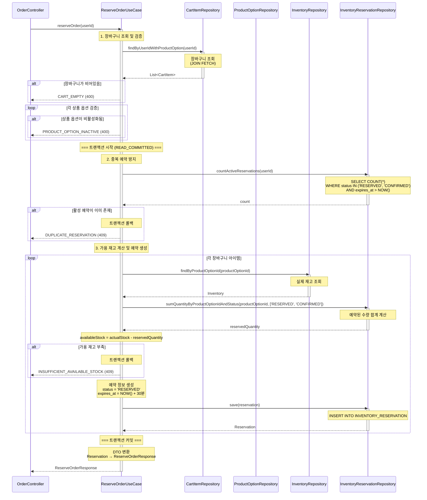
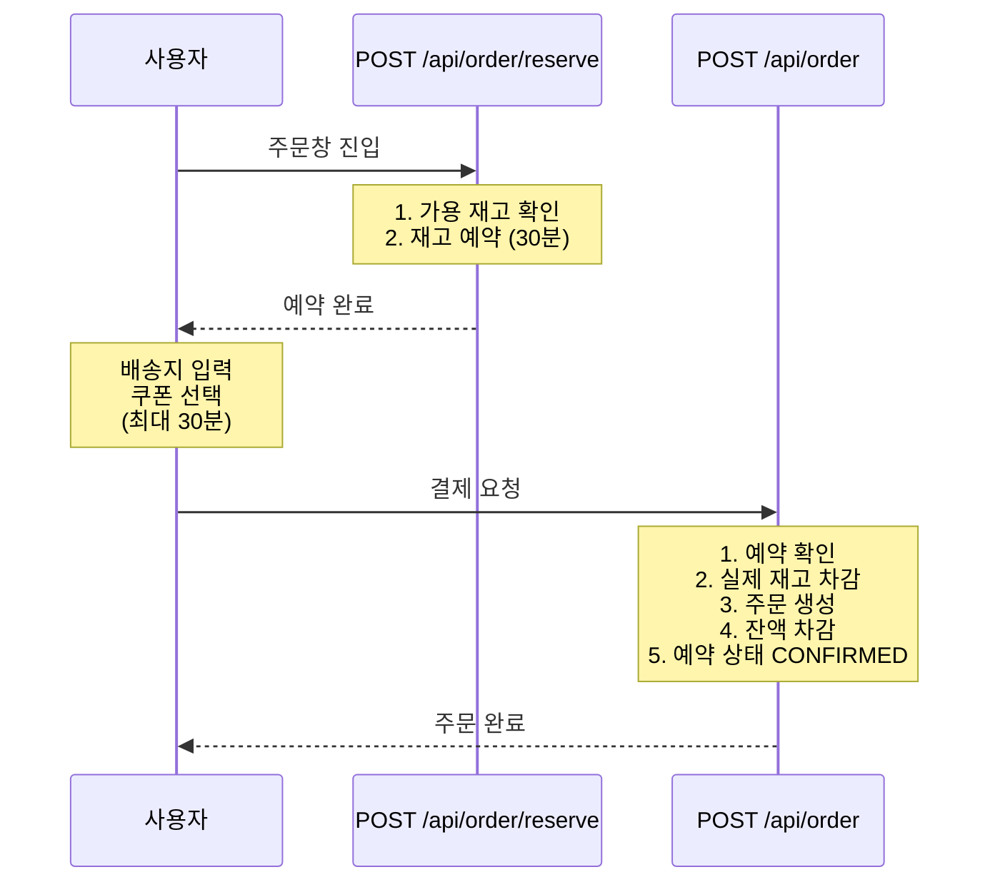

# 주문 예약 API (재고 예약)

## 1. 개요

### 목적
사용자가 주문창에 진입할 때 재고를 가상으로 예약하여 일정 시간(30분) 동안 해당 재고를 보장합니다. 실제 재고는 차감하지 않으며, 예약 정보만 기록합니다.

### 사용 시나리오
- 사용자가 장바구니에서 "주문하기" 버튼 클릭 시 호출
- 장바구니 상품들에 대한 재고를 30분간 예약
- 예약된 재고는 다른 사용자의 가용 재고 계산 시 차감됨
- 30분 내 결제하지 않으면 예약 자동 만료 (v1.0에서는 미구현)

### PRD 참고
- **관련 테이블**: `INVENTORY_RESERVATION`
- **시나리오**: 하이브리드 재고 관리 전략 (Phase 1)

### 연관 테이블
- `CART_ITEM`: 장바구니 조회
- `PRODUCT_OPTION`: 상품 가격 및 활성 여부 조회
- `INVENTORY`: 재고 조회 (가용 재고 계산)
- `INVENTORY_RESERVATION`: 재고 예약 정보 저장
- `USER`: 사용자 정보 확인

---

## 2. API 명세

### Endpoint
```
POST /api/order/reserve
```

### Request Body
```json
{
  "userId": 123
}
```

### Request Parameters

| Field  | Type | Required | Constraints | Description |
|--------|------|----------|-------------|-------------|
| userId | Long | Yes      | > 0         | 사용자 ID   |

### Request Example
```http
POST /api/order/reserve

{
  "userId": 123
}
```

### Response (Success)

**HTTP Status**: `200 OK`

```json
{
  "data": {
    "reservations": [
      {
        "reservationId": 1001,
        "productOptionId": 1,
        "productName": "에티오피아 예가체프 G1",
        "optionCode": "ETH-HD-200",
        "quantity": 2,
        "status": "RESERVED",
        "availableStock": 8,
        "reservedAt": "2025-11-04T15:30:00",
        "expiresAt": "2025-11-04T15:40:00"
      },
      {
        "reservationId": 1002,
        "productOptionId": 5,
        "productName": "콜롬비아 수프리모",
        "optionCode": "COL-WB-500",
        "quantity": 1,
        "status": "RESERVED",
        "availableStock": 15,
        "reservedAt": "2025-11-04T15:30:00",
        "expiresAt": "2025-11-04T15:40:00"
      }
    ]
  }
}
```

### Response Schema

```
{
  "data": {
    "reservations": [                   // 예약 목록
      {
        "reservationId": "long",        // 예약 ID
        "productOptionId": "long",      // 상품 옵션 ID
        "productName": "string",        // 상품명
        "optionCode": "string",         // 옵션 코드
        "quantity": "int",              // 예약 수량
        "status": "string",             // 예약 상태 (RESERVED)
        "availableStock": "int",        // 예약 후 남은 가용 재고
        "reservedAt": "datetime",       // 예약 시각
        "expiresAt": "datetime"         // 만료 시각 (예약 시각 + 30분)
      }
    ]
  }
}
```

### HTTP Status Codes

| Status Code | Description                                  |
|-------------|----------------------------------------------|
| 200         | 성공 (재고 예약 완료)                        |
| 400         | 잘못된 요청 (유효하지 않은 입력값)           |
| 404         | 리소스를 찾을 수 없음                        |
| 409         | 충돌 (가용 재고 부족, 중복 예약)             |
| 500         | 서버 내부 오류                               |

### Error Codes

| Error Code                  | HTTP Status | Message                                                |
|-----------------------------|-------------|--------------------------------------------------------|
| USER_NOT_FOUND              | 404         | 사용자를 찾을 수 없습니다.                             |
| CART_EMPTY                  | 400         | 장바구니가 비어 있습니다.                              |
| PRODUCT_OPTION_INACTIVE     | 400         | 비활성화된 상품 옵션이 포함되어 있습니다.              |
| INSUFFICIENT_AVAILABLE_STOCK| 409         | 가용 재고가 부족합니다. (상품 옵션 ID: {id})           |
| DUPLICATE_RESERVATION       | 409         | 이미 진행 중인 주문 예약이 있습니다.                   |
| INVALID_INPUT               | 400         | 입력값이 올바르지 않습니다.                            |
| INTERNAL_SERVER_ERROR       | 500         | 서버 내부 오류가 발생했습니다.                         |

---

## 3. 비즈니스 로직

### 핵심 비즈니스 규칙

#### 1. 장바구니 조회 및 검증
- **조회**: `CART_ITEM` 테이블에서 `user_id`로 장바구니 아이템 목록 조회
- **검증**:
  - 장바구니가 비어있지 않은지 확인
  - 각 아이템의 `PRODUCT_OPTION.is_active = true` 확인
- **실패 시**:
  - `CART_EMPTY` 예외 발생 (400)
  - `PRODUCT_OPTION_INACTIVE` 예외 발생 (400)

#### 2. 중복 예약 방지
- **검증**: 해당 사용자의 활성 예약이 있는지 확인
  ```sql
  SELECT COUNT(*) FROM INVENTORY_RESERVATION
  WHERE user_id = :userId
    AND status IN ('RESERVED', 'CONFIRMED')
    AND expires_at > NOW();
  ```
- **조건**: 활성 예약이 없어야 함
- **실패 시**: `DUPLICATE_RESERVATION` 예외 발생 (409)
- **참고**: 1인 1회 제한으로 악의적 재고 독점 방지

#### 3. 가용 재고 계산 (트랜잭션 내)
각 장바구니 아이템에 대해:

**3-1. 비관적 락 획득 (동시성 제어)**
- **목적**: 동시 예약 요청 시 재고 정합성 보장
- **락 획득**:
  ```kotlin
  val inventory = inventoryRepository
      .findByProductOptionIdWithLock(productOptionId)
      ?: throw IllegalStateException("재고 정보를 찾을 수 없습니다")
  ```
- **동작**: `FOR UPDATE` 비관적 락으로 INVENTORY 행 잠금
- **효과**: 다른 트랜잭션은 락이 해제될 때까지 대기

**3-2. 가용 재고 계산**
- **계산식**:
  ```sql
  availableStock = INVENTORY.stock_quantity -
    SUM(INVENTORY_RESERVATION.quantity WHERE status IN ('RESERVED', 'CONFIRMED'))
  ```
- **상세 구현**:
  ```kotlin
  val actualStock = inventory.stockQuantity
  val reservedQuantity = reservationRepository
      .sumQuantityByProductOptionIdAndStatus(
          productOptionId,
          listOf("RESERVED", "CONFIRMED")
      ) ?: 0
  val availableStock = actualStock - reservedQuantity
  ```

**3-3. 재고 충분성 검증**
- **검증 로직**:
  ```kotlin
  if (availableStock < cartItem.quantity) {
      throw InsufficientAvailableStockException(
          "가용 재고 부족: 상품 옵션 ID $productOptionId"
      )
  }
  ```
- **실패 시**: `INSUFFICIENT_AVAILABLE_STOCK` 예외 발생 (409)
- **트랜잭션**: 자동 롤백 (비관적 락 해제)

#### 4. 재고 예약 생성 (트랜잭션 내)
각 장바구니 아이템에 대해 `INVENTORY_RESERVATION` 레코드 생성:
- `product_option_id`: 상품 옵션 ID
- `user_id`: 사용자 ID
- `quantity`: 예약 수량
- `status`: `'RESERVED'` (예약됨)
- `reserved_at`: 현재 시각
- `expires_at`: 현재 시각 + 30분
- `updated_at`: 현재 시각

#### 5. 트랜잭션 커밋 및 응답
- **트랜잭션 범위**: 2~4단계 전체
- **커밋 시점**: 모든 예약 생성 성공 시
- **응답**: 예약된 재고 정보 목록 반환

### 유효성 검사

| 항목                          | 검증 조건                                                  | 실패 시 예외                      |
|-------------------------------|-----------------------------------------------------------|-----------------------------------|
| 사용자 존재 여부              | `USER.id = userId`                                         | `USER_NOT_FOUND`                  |
| 장바구니 비어있지 않음        | `CART_ITEM` 레코드 존재                                    | `CART_EMPTY`                      |
| 상품 옵션 활성화              | `PRODUCT_OPTION.is_active = true`                          | `PRODUCT_OPTION_INACTIVE`         |
| 중복 예약 방지                | 활성 예약 없음                                             | `DUPLICATE_RESERVATION`           |
| 가용 재고 충분                | `availableStock >= quantity`                               | `INSUFFICIENT_AVAILABLE_STOCK`    |

---

## 4. 구현 시 고려사항

### UseCase 패턴 적용

주문 예약 기능은 **4개의 도메인**을 조율:
1. `CartItemRepository`: 장바구니 조회
2. `ProductOptionRepository`: 상품 정보 조회
3. `InventoryRepository`: 재고 조회
4. `InventoryReservationRepository`: 예약 생성 및 조회

```kotlin
@Component
class ReserveOrderUseCase(
    private val cartItemRepository: CartItemRepository,
    private val productOptionRepository: ProductOptionRepository,
    private val inventoryRepository: InventoryRepository,
    private val inventoryReservationRepository: InventoryReservationRepository,
    private val userRepository: UserRepository
) {
    @Transactional
    fun reserveOrder(userId: Long): ReserveOrderResponse {
        // 1. 장바구니 조회 및 검증
        // 2. 중복 예약 방지
        // 3. 가용 재고 계산 및 예약 생성
        // 4. 응답 반환
    }
}
```

### 동시성 제어

#### FOR UPDATE 비관적 락 전략
**목적**: 동시 예약 요청 시 가용 재고 정합성 보장 및 오버 예약 방지

#### 문제 상황: Race Condition

서로 다른 사용자가 하나 남은 재고를 동시에 예약하려고 할 때:

**시나리오**:
- 실제 재고: 10개
- 이미 예약된 재고: 9개
- **가용 재고: 1개**
- **사용자 A와 B가 동시에 1개씩 예약 시도**

**비관적 락 없이 (❌ 오버 예약 발생)**:
```
시간    사용자 A                          사용자 B
──────────────────────────────────────────────────────────
T1     트랜잭션 시작                    트랜잭션 시작
T2     재고 조회 (10개)                 재고 조회 (10개)
T3     예약 합계 조회 (9개)             예약 합계 조회 (9개)
T4     가용 재고 계산 = 1               가용 재고 계산 = 1
T5     검증 통과 (1 >= 1) ✓             검증 통과 (1 >= 1) ✓
T6     예약 생성 (A의 예약)
T7     커밋 ✓                           예약 생성 (B의 예약)
T8                                      커밋 ✓
──────────────────────────────────────────────────────────
결과: 예약 합계 11개, 실제 재고 10개 → 오버 예약! ❌
```

**비관적 락 적용 (✅ 오버 예약 방지)**:
```
시간    사용자 A                          사용자 B
──────────────────────────────────────────────────────────
T1     트랜잭션 시작                    트랜잭션 시작
T2     재고 조회 + 락 획득 (10개) 🔒   재고 조회 시도 (대기...)
T3     예약 합계 조회 (9개)             (대기 중...)
T4     가용 재고 계산 = 1               (대기 중...)
T5     검증 통과 (1 >= 1) ✓             (대기 중...)
T6     예약 생성 (A의 예약)             (대기 중...)
T7     커밋 ✓ (락 해제)                 락 획득 🔒
T8                                      재고 조회 (10개)
T9                                      예약 합계 조회 (10개)
T10                                     가용 재고 계산 = 0
T11                                     검증 실패 (0 < 1) ❌
T12                                     롤백
──────────────────────────────────────────────────────────
결과: 사용자 A만 예약 성공, 사용자 B는 재고 부족 ✅
```

#### 해결책: INVENTORY 테이블에 비관적 락 적용

```kotlin
@Transactional(isolation = Isolation.READ_COMMITTED)
fun reserveOrder(userId: Long): ReserveOrderResponse {
    // 1. 장바구니 조회 (트랜잭션 밖에서 이미 수행)

    // 2. 중복 예약 방지

    // 3. 각 상품에 대해 순차적으로 비관적 락 획득 (데드락 방지)
    val sortedCartItems = cartItems.sortedBy { it.productOptionId }

    sortedCartItems.forEach { cartItem ->
        // 재고에 비관적 락 설정 (다른 트랜잭션은 대기)
        val inventory = inventoryRepository
            .findByProductOptionIdWithLock(cartItem.productOptionId)
            ?: throw IllegalStateException("재고 정보 없음")

        // 예약된 수량 합계 조회 (커밋된 예약만)
        val reservedQuantity = reservationRepository
            .sumQuantityByProductOptionIdAndStatus(
                cartItem.productOptionId,
                listOf("RESERVED", "CONFIRMED")
            ) ?: 0

        // 가용 재고 계산
        val availableStock = inventory.stockQuantity - reservedQuantity

        // 검증 (먼저 락을 획득한 사용자만 통과)
        if (availableStock < cartItem.quantity) {
            throw InsufficientAvailableStockException(
                "가용 재고 부족: 상품 옵션 ID ${cartItem.productOptionId}"
            )
        }

        // 예약 생성
        reservationRepository.save(reservation)
    }

    // 커밋 시 락 해제
}
```

#### 비관적 락 설정

```kotlin
@Query("""
    SELECT i FROM Inventory i
    WHERE i.productOptionId = :productOptionId
""")
@Lock(LockModeType.PESSIMISTIC_WRITE)
@QueryHints(
    QueryHint(name = "javax.persistence.lock.timeout", value = "5000")
)
fun findByProductOptionIdWithLock(
    @Param("productOptionId") productOptionId: Long
): Inventory?
```

#### 데드락 방지
- **재고 락 획득 순서**: `product_option_id` 오름차순 정렬
- **타임아웃 설정**: 락 대기 시간 5초
- **이유**: 여러 상품을 동시에 예약할 때 순서를 보장하여 데드락 방지

### 성능 최적화

#### 1. 인덱스 설정
```sql
-- INVENTORY_RESERVATION 테이블
CREATE INDEX idx_inventory_reservation_product_option_status
ON INVENTORY_RESERVATION(product_option_id, status);

CREATE INDEX idx_inventory_reservation_user_status_expires
ON INVENTORY_RESERVATION(user_id, status, expires_at);

CREATE INDEX idx_inventory_reservation_expires_at
ON INVENTORY_RESERVATION(expires_at);
```

#### 2. 쿼리 최적화
- **가용 재고 계산**: 인덱스 활용 (product_option_id, status)
- **중복 예약 확인**: 인덱스 활용 (user_id, status, expires_at)
- **예약 일괄 생성**: Batch Insert 사용

#### 3. 트랜잭션 범위 최소화
- 장바구니 조회 및 검증: 트랜잭션 밖에서 수행 (빠른 실패)
- 가용 재고 계산 ~ 예약 생성: 트랜잭션 내에서 원자적 수행

### 데이터 일관성

#### 트랜잭션 보장
- **격리 수준**: `READ_COMMITTED`
  - Dirty Read 방지
  - 커밋된 예약만 가용 재고 계산에 포함
- **원자성**: 모든 예약이 생성되거나 모두 실패

#### 타임아웃 처리 (v1.0에서는 미구현)
향후 구현 시:
- **만료 시각**: `reserved_at + 30분`
- **만료 처리**:
  - 스케줄러 또는 메시지 큐로 만료 시각 체크
  - `status`를 `'EXPIRED'`로 변경
  - 가용 재고 계산 시 제외

```kotlin
// 향후 스케줄러 구현 예시
@Scheduled(fixedRate = 60000) // 1분마다 실행
fun expireReservations() {
    val expiredReservations = reservationRepository.findByStatusAndExpiresAtBefore(
        status = "RESERVED",
        expiresAt = LocalDateTime.now()
    )

    expiredReservations.forEach { reservation ->
        reservation.status = "EXPIRED"
        reservationRepository.save(reservation)
    }
}
```

---

## 5. 레이어드 아키텍처 흐름



### 트랜잭션 범위 및 격리 수준

#### 트랜잭션 범위
- **트랜잭션 밖**:
  - 장바구니 조회 및 검증 (1단계)
  - → 빠른 실패 처리

- **트랜잭션 내**:
  - 중복 예약 방지 (2단계)
  - 가용 재고 계산 및 예약 생성 (3단계)
  - → 원자적 처리 보장

#### 격리 수준
- **레벨**: `READ_COMMITTED`
- **이유**:
  - Dirty Read 방지 (커밋된 예약만 계산)
  - 실제 재고를 차감하지 않으므로 비관적 락 불필요
  - 높은 동시성 지원

### 예외 처리 흐름

#### 1. 트랜잭션 밖 예외 (1단계)
- **예외 종류**:
  - `CART_EMPTY` (400)
  - `PRODUCT_OPTION_INACTIVE` (400)
- **처리**: UseCase에서 검증 후 예외 발생 → GlobalExceptionHandler
- **트랜잭션**: 시작 전이므로 롤백 불필요

#### 2. 트랜잭션 내 예외 (2~3단계)
- **예외 종류**:
  - `DUPLICATE_RESERVATION` (409): 중복 예약
  - `INSUFFICIENT_AVAILABLE_STOCK` (409): 가용 재고 부족
- **처리**: UseCase에서 트랜잭션 롤백 → GlobalExceptionHandler

#### 3. DB 오류
- **예외**: `DataAccessException`
- **HTTP Status**: 500 Internal Server Error
- **처리**: 트랜잭션 자동 롤백 → GlobalExceptionHandler

---

## 6. 주문 결제 API와의 연계

주문 예약 API는 주문 결제 API(`POST /api/order`)의 전 단계입니다:

### Phase 1: 주문 예약 (본 API)
```
POST /api/order/reserve
```
- 가용 재고 확인
- `INVENTORY_RESERVATION` 테이블에 예약 생성
- 실제 재고는 차감하지 않음
- 30분 타임아웃

### Phase 2: 주문 결제 (`create-order.md` 참고)
```
POST /api/order
```
- 예약 정보 확인
- 실제 재고 차감 (비관적 락)
- 예약 상태를 `'CONFIRMED'`로 변경
- 주문 생성, 잔액 차감, 쿠폰 사용 처리

### 전체 플로우

