# 주문 예약 API (재고 예약)

## 1. 개요

### 목적
사용자가 주문창에 진입할 때 재고를 가상으로 예약하여 일정 시간(30분) 동안 해당 재고를 보장합니다. 실제 재고는 차감하지 않으며, 예약 정보만 기록합니다.

### 사용 시나리오
- 사용자가 장바구니에서 "주문하기" 버튼 클릭 시 호출
- 장바구니 상품들에 대한 재고를 30분간 예약
- 예약된 재고는 다른 사용자의 가용 재고 계산 시 차감됨

### PRD 참고
- **관련 테이블**: `INVENTORY_RESERVATION`
- **시나리오**: 하이브리드 재고 관리 전략 (Phase 1)

### 연관 도메인 및 테이블
- **Cart 도메인**: `CART_ITEM` (장바구니 조회)
- **Product 도메인**: `PRODUCT_OPTION` (상품 가격 및 활성 여부 조회)
- **Inventory 도메인**: `INVENTORY`, `INVENTORY_RESERVATION` (재고 조회, 예약 생성)
- **User 도메인**: `USER` (사용자 정보 확인)

---

## 2. API 명세

### Endpoint
```
POST /api/order/reserve
```

### Request Body
```json
{
  "userId": 123
}
```

### Request Parameters

| Field  | Type | Required | Constraints | Description |
|--------|------|----------|-------------|-------------|
| userId | Long | Yes      | > 0         | 사용자 ID   |

### Request Example
```http
POST /api/order/reserve

{
  "userId": 123
}
```

### Response (Success)

**HTTP Status**: `200 OK`

```json
{
  "data": {
    "reservations": [
      {
        "reservationId": 1001,
        "productOptionId": 1,
        "productName": "에티오피아 예가체프 G1",
        "optionCode": "ETH-HD-200",
        "quantity": 2,
        "status": "RESERVED",
        "availableStock": 8,
        "reservedAt": "2025-11-04T15:30:00",
        "expiresAt": "2025-11-04T15:40:00"
      },
      {
        "reservationId": 1002,
        "productOptionId": 5,
        "productName": "콜롬비아 수프리모",
        "optionCode": "COL-WB-500",
        "quantity": 1,
        "status": "RESERVED",
        "availableStock": 15,
        "reservedAt": "2025-11-04T15:30:00",
        "expiresAt": "2025-11-04T15:40:00"
      }
    ]
  }
}
```

### Response Schema

```
{
  "data": {
    "reservations": [                   // 예약 목록
      {
        "reservationId": "long",        // 예약 ID
        "productOptionId": "long",      // 상품 옵션 ID
        "productName": "string",        // 상품명
        "optionCode": "string",         // 옵션 코드
        "quantity": "int",              // 예약 수량
        "status": "string",             // 예약 상태 (RESERVED)
        "availableStock": "int",        // 예약 후 남은 가용 재고
        "reservedAt": "datetime",       // 예약 시각
        "expiresAt": "datetime"         // 만료 시각 (예약 시각 + 30분)
      }
    ]
  }
}
```

### HTTP Status Codes

| Status Code | Description                                  |
|-------------|----------------------------------------------|
| 200         | 성공 (재고 예약 완료)                        |
| 400         | 잘못된 요청 (유효하지 않은 입력값)           |
| 404         | 리소스를 찾을 수 없음                        |
| 409         | 충돌 (가용 재고 부족, 중복 예약)             |
| 500         | 서버 내부 오류                               |

### Error Codes

| Error Code                  | HTTP Status | Message                                                |
|-----------------------------|-------------|--------------------------------------------------------|
| USER_NOT_FOUND              | 404         | 사용자를 찾을 수 없습니다.                             |
| CART_EMPTY                  | 400         | 장바구니가 비어 있습니다.                              |
| PRODUCT_OPTION_INACTIVE     | 400         | 비활성화된 상품 옵션이 포함되어 있습니다.              |
| INSUFFICIENT_AVAILABLE_STOCK| 409         | 가용 재고가 부족합니다. (상품 옵션 ID: {id})           |
| DUPLICATE_RESERVATION       | 409         | 이미 진행 중인 주문 예약이 있습니다.                   |
| INVALID_INPUT               | 400         | 입력값이 올바르지 않습니다.                            |
| INTERNAL_SERVER_ERROR       | 500         | 서버 내부 오류가 발생했습니다.                         |

---

## 3. 비즈니스 로직

### 핵심 비즈니스 규칙

#### 1. 장바구니 조회 및 검증
- **조회**: `CART_ITEM` 테이블에서 `user_id`로 장바구니 아이템 목록 조회
- **검증**:
  - 장바구니가 비어있지 않은지 확인
  - 각 아이템의 `PRODUCT_OPTION.is_active = true` 확인
- **실패 시**:
  - `CART_EMPTY` 예외 발생 (400)
  - `PRODUCT_OPTION_INACTIVE` 예외 발생 (400)

#### 2. 중복 예약 방지
- **검증**: 해당 사용자의 활성 예약이 있는지 확인
  ```sql
  SELECT COUNT(*) FROM INVENTORY_RESERVATION
  WHERE user_id = :userId
    AND status IN ('RESERVED', 'CONFIRMED')
    AND expires_at > NOW();
  ```
- **조건**: 활성 예약이 없어야 함
- **실패 시**: `DUPLICATE_RESERVATION` 예외 발생 (409)
- **참고**: 1인 1회 제한으로 악의적 재고 독점 방지

#### 3. 가용 재고 계산 (트랜잭션 내)
각 장바구니 아이템에 대해:

**3-1. 비관적 락 획득 (동시성 제어)**
- **목적**: 동시 예약 요청 시 재고 정합성 보장
- **락 획득**:
  ```kotlin
  val inventory = inventoryRepository
      .findByProductOptionIdWithLock(productOptionId)
      ?: throw IllegalStateException("재고 정보를 찾을 수 없습니다")
  ```
- **동작**: `FOR UPDATE` 비관적 락으로 INVENTORY 행 잠금
- **효과**: 다른 트랜잭션은 락이 해제될 때까지 대기

**3-2. 가용 재고 계산**
- **계산식**:
  ```sql
  availableStock = INVENTORY.stock_quantity -
    SUM(INVENTORY_RESERVATION.quantity WHERE status IN ('RESERVED', 'CONFIRMED'))
  ```
- **상세 구현**:
  ```kotlin
  val actualStock = inventory.stockQuantity
  val reservedQuantity = reservationRepository
      .sumQuantityByProductOptionIdAndStatus(
          productOptionId,
          listOf("RESERVED", "CONFIRMED")
      ) ?: 0
  val availableStock = actualStock - reservedQuantity
  ```

**3-3. 재고 충분성 검증**
- **검증 로직**:
  ```kotlin
  if (availableStock < cartItem.quantity) {
      throw InsufficientAvailableStockException(
          "가용 재고 부족: 상품 옵션 ID $productOptionId"
      )
  }
  ```
- **실패 시**: `INSUFFICIENT_AVAILABLE_STOCK` 예외 발생 (409)
- **트랜잭션**: 자동 롤백 (비관적 락 해제)

#### 4. 재고 예약 생성 (트랜잭션 내)
각 장바구니 아이템에 대해 `INVENTORY_RESERVATION` 레코드 생성:
- `product_option_id`: 상품 옵션 ID
- `user_id`: 사용자 ID
- `quantity`: 예약 수량
- `status`: `'RESERVED'` (예약됨)
- `reserved_at`: 현재 시각
- `expires_at`: 현재 시각 + 30분
- `updated_at`: 현재 시각

#### 5. 트랜잭션 커밋 및 응답
- **트랜잭션 범위**: 2~4단계 전체
- **커밋 시점**: 모든 예약 생성 성공 시
- **응답**: 예약된 재고 정보 목록 반환

### 유효성 검사

| 항목                          | 검증 조건                                                  | 실패 시 예외                      |
|-------------------------------|-----------------------------------------------------------|-----------------------------------|
| 사용자 존재 여부              | `USER.id = userId`                                         | `USER_NOT_FOUND`                  |
| 장바구니 비어있지 않음        | `CART_ITEM` 레코드 존재                                    | `CART_EMPTY`                      |
| 상품 옵션 활성화              | `PRODUCT_OPTION.is_active = true`                          | `PRODUCT_OPTION_INACTIVE`         |
| 중복 예약 방지                | 활성 예약 없음                                             | `DUPLICATE_RESERVATION`           |
| 가용 재고 충분                | `availableStock >= quantity`                               | `INSUFFICIENT_AVAILABLE_STOCK`    |

---

## 4. 구현 시 고려사항

### 동시성 제어

InventoryService에서 비관적 락을 사용하여 동시 예약 요청 시 재고 정합성을 보장합니다.

- **비관적 락**: `InventoryRepository.findByProductOptionIdWithLock()`을 통해 INVENTORY 행 잠금 (FOR UPDATE)
- **데드락 방지**: 여러 상품 동시 예약 시 `product_option_id` 오름차순 정렬로 락 획득 순서 보장
- **격리 수준**: `READ_COMMITTED`로 커밋된 예약만 가용 재고 계산에 포함

### 성능 최적화

#### 1. 인덱스 설정
```sql
-- INVENTORY_RESERVATION 테이블
CREATE INDEX idx_inventory_reservation_product_option_status
ON INVENTORY_RESERVATION(product_option_id, status);

CREATE INDEX idx_inventory_reservation_user_status_expires
ON INVENTORY_RESERVATION(user_id, status, expires_at);

CREATE INDEX idx_inventory_reservation_expires_at
ON INVENTORY_RESERVATION(expires_at);
```

#### 2. 쿼리 최적화
- **가용 재고 계산**: 인덱스 활용 (product_option_id, status)
- **중복 예약 확인**: 인덱스 활용 (user_id, status, expires_at)
- **예약 일괄 생성**: Batch Insert 사용

#### 3. 트랜잭션 범위
- UseCase의 `@Transactional`에 의해 전체 플로우가 하나의 트랜잭션으로 처리
- 모든 Service 호출이 성공하거나 모두 실패 (원자성 보장)

### 데이터 일관성

#### 트랜잭션 보장
- **격리 수준**: `READ_COMMITTED`
  - Dirty Read 방지
  - 커밋된 예약만 가용 재고 계산에 포함
- **원자성**: 모든 예약이 생성되거나 모두 실패

---

## 5. 레이어드 아키텍처 흐름

```mermaid
sequenceDiagram
    participant Controller as OrderController
    participant UseCase as ReserveOrderUseCase
    participant UserSvc as UserService
    participant CartSvc as CartService
    participant ProductSvc as ProductService
    participant InventorySvc as InventoryService
    participant CartRepo as CartItemRepository
    participant InventoryRepo as InventoryRepository
    participant ReservationRepo as InventoryReservationRepository

    Controller->>UseCase: reserveOrder(userId)
    activate UseCase

    Note over UseCase: === 검증 로직 (트랜잭션 밖) ===

    Note over UseCase: 1. 사용자 검증

    UseCase->>UserSvc: validateUserExists(userId)
    activate UserSvc
    Note over UserSvc: 사용자 존재 여부 확인
    UserSvc-->>UseCase: ✓
    deactivate UserSvc

    alt 사용자가 존재하지 않음
        UseCase-->>Controller: USER_NOT_FOUND (404)
    end

    Note over UseCase: 2. 장바구니 조회 및 검증

    UseCase->>CartSvc: getCartItemsWithProducts(userId)
    activate CartSvc
    CartSvc->>CartRepo: findByUserIdWithProductOption(userId)
    activate CartRepo
    Note over CartRepo: 장바구니 조회<br/>(JOIN FETCH)
    CartRepo-->>CartSvc: List<CartItem>
    deactivate CartRepo
    CartSvc-->>UseCase: List<CartItem>
    deactivate CartSvc

    alt 장바구니가 비어있음
        UseCase-->>Controller: CART_EMPTY (400)
    end

    Note over UseCase: 3. 상품 옵션 활성화 검증

    UseCase->>ProductSvc: validateProductOptionsActive(optionIds)
    activate ProductSvc
    Note over ProductSvc: 각 상품 옵션의<br/>is_active = true 확인
    ProductSvc-->>UseCase: ✓
    deactivate ProductSvc

    alt 비활성화된 상품 옵션 존재
        UseCase-->>Controller: PRODUCT_OPTION_INACTIVE (400)
    end

    Note over UseCase: === 재고 예약 (InventoryService 트랜잭션 내) ===

    Note over UseCase: 4. 재고 예약 (InventoryService에 위임)

    UseCase->>InventorySvc: reserveInventory(userId, cartItems)
    activate InventorySvc

    Note over InventorySvc: @Transactional 시작<br/>(READ_COMMITTED)

    Note over InventorySvc: 4-1. 중복 예약 방지

    InventorySvc->>ReservationRepo: countActiveReservations(userId)
    activate ReservationRepo
    Note over ReservationRepo: SELECT COUNT(*)<br/>WHERE status IN ('RESERVED', 'CONFIRMED')<br/>AND expires_at > NOW()
    ReservationRepo-->>InventorySvc: count
    deactivate ReservationRepo

    alt 활성 예약이 이미 존재
        Note over InventorySvc: 트랜잭션 롤백
        InventorySvc-->>UseCase: DUPLICATE_RESERVATION (409)
        UseCase-->>Controller: DUPLICATE_RESERVATION (409)
    end

    Note over InventorySvc: 4-2. 가용 재고 계산 및 예약 생성

    loop 각 장바구니 아이템
        InventorySvc->>InventoryRepo: findByProductOptionIdWithLock(productOptionId)
        activate InventoryRepo
        Note over InventoryRepo: 비관적 락 획득<br/>(FOR UPDATE)
        InventoryRepo-->>InventorySvc: Inventory (🔒 Locked)
        deactivate InventoryRepo

        InventorySvc->>ReservationRepo: sumQuantityByProductOptionIdAndStatusIn(productOptionId, ['RESERVED', 'CONFIRMED'])
        activate ReservationRepo
        Note over ReservationRepo: 예약된 수량 합계 계산
        ReservationRepo-->>InventorySvc: reservedQuantity
        deactivate ReservationRepo

        Note over InventorySvc: availableStock = actualStock - reservedQuantity

        alt 가용 재고 부족
            Note over InventorySvc: 트랜잭션 롤백
            InventorySvc-->>UseCase: INSUFFICIENT_AVAILABLE_STOCK (409)
            UseCase-->>Controller: INSUFFICIENT_AVAILABLE_STOCK (409)
        end

        Note over InventorySvc: 예약 정보 생성<br/>status = 'RESERVED'<br/>expires_at = NOW() + 30분

        InventorySvc->>ReservationRepo: save(reservation)
        activate ReservationRepo
        Note over ReservationRepo: INSERT INTO INVENTORY_RESERVATION
        ReservationRepo-->>InventorySvc: Reservation
        deactivate ReservationRepo
    end

    Note over InventorySvc: @Transactional 커밋 (락 해제)

    InventorySvc-->>UseCase: List<InventoryReservation>
    deactivate InventorySvc

    Note over UseCase: 5. DTO 변환<br/>Reservation → ReserveOrderResponse

    UseCase-->>Controller: ReserveOrderResponse
    deactivate UseCase
```



### 트랜잭션 범위 및 격리 수준

#### 트랜잭션 범위
트랜잭션은 InventoryService의 `@Transactional` 어노테이션에 의해 재고 예약 작업만 트랜잭션으로 묶입니다:

- **트랜잭션 밖 (빠른 실패 처리)**:
  1. 사용자 검증 (`UserService.validateUserExists()`)
  2. 장바구니 조회 및 검증 (`CartService.getCartItemsWithProducts()`)
  3. 상품 옵션 활성화 검증 (`ProductService.validateProductOptionsActive()`)
  - **장점**: 검증 실패 시 트랜잭션을 시작하지 않아 DB 리소스 절약

- **트랜잭션 내 (InventoryService.reserveInventory())**:
  1. 중복 예약 방지 검증
  2. 비관적 락 + 가용 재고 계산
  3. 예약 생성

- **원자성 보장**:
  - 재고 예약 작업이 모두 성공하거나 모두 실패
  - 예외 발생 시 자동 롤백

- **비관적 락 범위**:
  - `InventoryService.reserveInventory()` 내에서 발생
  - Repository의 `findByProductOptionIdWithLock()`으로 INVENTORY 행 잠금
  - InventoryService 트랜잭션 커밋 시 락 자동 해제

#### 격리 수준
- **레벨**: `READ_COMMITTED`
- **이유**:
  - Dirty Read 방지 (커밋된 예약만 계산)
  - 비관적 락으로 동시성 제어 (InventoryService에서 처리)
  - 높은 동시성 지원

### 예외 처리 흐름

#### 1. 트랜잭션 밖 예외 (검증 로직)
검증 로직에서 예외 발생 시 트랜잭션이 시작되지 않습니다:

- **UserService**:
  - `USER_NOT_FOUND` (404): 사용자가 존재하지 않음

- **CartService**:
  - `CART_EMPTY` (400): 장바구니가 비어있음

- **ProductService**:
  - `PRODUCT_OPTION_INACTIVE` (400): 비활성화된 상품 옵션 포함

#### 2. 트랜잭션 내 예외 (InventoryService)
InventoryService의 트랜잭션 내에서 예외 발생 시 자동 롤백됩니다:

- **InventoryService**:
  - `DUPLICATE_RESERVATION` (409): 중복 예약 존재
  - `INSUFFICIENT_AVAILABLE_STOCK` (409): 가용 재고 부족

- **롤백 처리**:
  - Spring의 `@Transactional`에 의한 자동 롤백
  - 모든 DB 변경사항 롤백
  - 비관적 락 자동 해제
  - UseCase에서 예외를 Controller로 전파 → GlobalExceptionHandler

#### 3. DB 오류
- **예외**: `DataAccessException`
- **HTTP Status**: 500 Internal Server Error
- **처리**: 트랜잭션 자동 롤백 → GlobalExceptionHandler

---

## 6. 주문 결제 API와의 연계

주문 예약 API는 주문 결제 API(`POST /api/order`)의 전 단계입니다:

### Phase 1: 주문 예약 (본 API)
```
POST /api/order/reserve
```
- 가용 재고 확인
- `INVENTORY_RESERVATION` 테이블에 예약 생성
- 실제 재고는 차감하지 않음
- 30분 타임아웃

### Phase 2: 주문 결제 (`create-order.md` 참고)
```
POST /api/order
```
- 예약 정보 확인
- 실제 재고 차감 (비관적 락)
- 예약 상태를 `'CONFIRMED'`로 변경
- 주문 생성, 잔액 차감, 쿠폰 사용 처리

### 전체 플로우

```mermaid
sequenceDiagram
    participant User as 사용자
    participant ReserveAPI as POST /api/order/reserve
    participant CreateAPI as POST /api/order

    User->>ReserveAPI: 주문창 진입
    Note over ReserveAPI: 1. 가용 재고 확인<br/>2. 재고 예약 (30분)
    ReserveAPI-->>User: 예약 완료

    Note over User: 배송지 입력<br/>쿠폰 선택<br/>(최대 30분)

    User->>CreateAPI: 결제 요청
    Note over CreateAPI: 1. 예약 확인<br/>2. 실제 재고 차감<br/>3. 주문 생성<br/>4. 잔액 차감<br/>5. 예약 상태 CONFIRMED
    CreateAPI-->>User: 주문 완료
```

