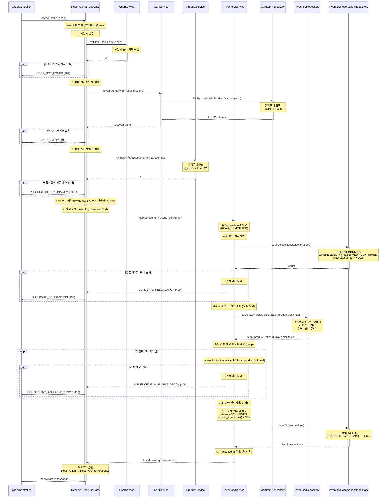

# 주문 예약 API (재고 예약)

## 1. 개요

### 목적
사용자가 주문창에 진입할 때 재고를 가상으로 예약하여 일정 시간(30분) 동안 해당 재고를 보장합니다. 실제 재고는 차감하지 않으며, 예약 정보만 기록합니다.

### 사용 시나리오
- 사용자가 장바구니에서 "주문하기" 버튼 클릭 시 호출
- 장바구니 상품들에 대한 재고를 30분간 예약
- 예약된 재고는 다른 사용자의 가용 재고 계산 시 차감됨

### PRD 참고
- **관련 테이블**: `INVENTORY_RESERVATION`
- **시나리오**: 하이브리드 재고 관리 전략 (Phase 1)

### 연관 도메인 및 테이블
- **Cart 도메인**: `CART_ITEM` (장바구니 조회)
- **Product 도메인**: `PRODUCT_OPTION` (상품 가격 및 활성 여부 조회)
- **Inventory 도메인**: `INVENTORY`, `INVENTORY_RESERVATION` (재고 조회, 예약 생성)
- **User 도메인**: `USER` (사용자 정보 확인)

---

## 2. API 명세

### Endpoint
```
POST /api/order/reserve
```

### Request Body
```json
{
  "userId": 123
}
```

### Request Parameters

| Field  | Type | Required | Constraints | Description |
|--------|------|----------|-------------|-------------|
| userId | Long | Yes      | > 0         | 사용자 ID   |

### Request Example
```http
POST /api/order/reserve

{
  "userId": 123
}
```

### Response (Success)

**HTTP Status**: `200 OK`

```json
{
  "data": {
    "reservations": [
      {
        "reservationId": 1001,
        "productOptionId": 1,
        "productName": "에티오피아 예가체프 G1",
        "optionCode": "ETH-HD-200",
        "quantity": 2,
        "status": "RESERVED",
        "availableStock": 8,
        "reservedAt": "2025-11-04T15:30:00",
        "expiresAt": "2025-11-04T15:40:00"
      },
      {
        "reservationId": 1002,
        "productOptionId": 5,
        "productName": "콜롬비아 수프리모",
        "optionCode": "COL-WB-500",
        "quantity": 1,
        "status": "RESERVED",
        "availableStock": 15,
        "reservedAt": "2025-11-04T15:30:00",
        "expiresAt": "2025-11-04T15:40:00"
      }
    ]
  }
}
```

### Response Schema

```
{
  "data": {
    "reservations": [                   // 예약 목록
      {
        "reservationId": "long",        // 예약 ID
        "productOptionId": "long",      // 상품 옵션 ID
        "productName": "string",        // 상품명
        "optionCode": "string",         // 옵션 코드
        "quantity": "int",              // 예약 수량
        "status": "string",             // 예약 상태 (RESERVED)
        "availableStock": "int",        // 예약 후 남은 가용 재고
        "reservedAt": "datetime",       // 예약 시각
        "expiresAt": "datetime"         // 만료 시각 (예약 시각 + 30분)
      }
    ]
  }
}
```

### HTTP Status Codes

| Status Code | Description                                  |
|-------------|----------------------------------------------|
| 200         | 성공 (재고 예약 완료)                        |
| 400         | 잘못된 요청 (유효하지 않은 입력값)           |
| 404         | 리소스를 찾을 수 없음                        |
| 409         | 충돌 (가용 재고 부족, 중복 예약)             |
| 500         | 서버 내부 오류                               |

### Error Codes

| Error Code                  | HTTP Status | Message                                                |
|-----------------------------|-------------|--------------------------------------------------------|
| USER_NOT_FOUND              | 404         | 사용자를 찾을 수 없습니다.                             |
| CART_EMPTY                  | 400         | 장바구니가 비어 있습니다.                              |
| PRODUCT_OPTION_INACTIVE     | 400         | 비활성화된 상품 옵션이 포함되어 있습니다.              |
| INSUFFICIENT_AVAILABLE_STOCK| 409         | 가용 재고가 부족합니다. (상품 옵션 ID: {id})           |
| DUPLICATE_RESERVATION       | 409         | 이미 진행 중인 주문 예약이 있습니다.                   |
| INVALID_INPUT               | 400         | 입력값이 올바르지 않습니다.                            |
| INTERNAL_SERVER_ERROR       | 500         | 서버 내부 오류가 발생했습니다.                         |

---

## 3. 비즈니스 로직

### 핵심 비즈니스 규칙

#### 1. 장바구니 조회 및 검증
- **조회**: `CART_ITEM` 테이블에서 `user_id`로 장바구니 아이템 목록 조회
- **검증**:
  - 장바구니가 비어있지 않은지 확인
  - 각 아이템의 `PRODUCT_OPTION.is_active = true` 확인
- **실패 시**:
  - `CART_EMPTY` 예외 발생 (400)
  - `PRODUCT_OPTION_INACTIVE` 예외 발생 (400)

#### 2. 중복 예약 방지
- **검증**: 해당 사용자의 활성 예약이 있는지 확인
  ```sql
  SELECT COUNT(*) FROM INVENTORY_RESERVATION
  WHERE user_id = :userId
    AND status IN ('RESERVED', 'CONFIRMED')
    AND expires_at > NOW();
  ```
- **조건**: 활성 예약이 없어야 함
- **실패 시**: `DUPLICATE_RESERVATION` 예외 발생 (409)
- **참고**: 1인 1회 제한으로 악의적 재고 독점 방지

#### 3. 가용 재고 계산 (트랜잭션 내)
각 장바구니 아이템에 대해:

**3-1. 비관적 락 획득 (동시성 제어)**
- **목적**: 동시 예약 요청 시 재고 정합성 보장
- **락 획득**:
  ```kotlin
  val inventory = inventoryRepository
      .findByProductOptionIdWithLock(productOptionId)
      ?: throw IllegalStateException("재고 정보를 찾을 수 없습니다")
  ```
- **동작**: `FOR UPDATE` 비관적 락으로 INVENTORY 행 잠금
- **효과**: 다른 트랜잭션은 락이 해제될 때까지 대기

**3-2. 가용 재고 계산**
- **계산식**:
  ```sql
  availableStock = INVENTORY.stock_quantity -
    SUM(INVENTORY_RESERVATION.quantity WHERE status IN ('RESERVED', 'CONFIRMED'))
  ```
- **상세 구현**:
  ```kotlin
  val actualStock = inventory.stockQuantity
  val reservedQuantity = reservationRepository
      .sumQuantityByProductOptionIdAndStatus(
          productOptionId,
          listOf("RESERVED", "CONFIRMED")
      ) ?: 0
  val availableStock = actualStock - reservedQuantity
  ```

**3-3. 재고 충분성 검증**
- **검증 로직**:
  ```kotlin
  if (availableStock < cartItem.quantity) {
      throw InsufficientAvailableStockException(
          "가용 재고 부족: 상품 옵션 ID $productOptionId"
      )
  }
  ```
- **실패 시**: `INSUFFICIENT_AVAILABLE_STOCK` 예외 발생 (409)
- **트랜잭션**: 자동 롤백 (비관적 락 해제)

#### 4. 재고 예약 생성 (트랜잭션 내)
각 장바구니 아이템에 대해 `INVENTORY_RESERVATION` 레코드 생성:
- `product_option_id`: 상품 옵션 ID
- `user_id`: 사용자 ID
- `quantity`: 예약 수량
- `status`: `'RESERVED'` (예약됨)
- `reserved_at`: 현재 시각
- `expires_at`: 현재 시각 + 30분
- `updated_at`: 현재 시각

#### 5. 트랜잭션 커밋 및 응답
- **트랜잭션 범위**: 2~4단계 전체
- **커밋 시점**: 모든 예약 생성 성공 시
- **응답**: 예약된 재고 정보 목록 반환

### 유효성 검사

| 항목                          | 검증 조건                                                  | 실패 시 예외                      |
|-------------------------------|-----------------------------------------------------------|-----------------------------------|
| 사용자 존재 여부              | `USER.id = userId`                                         | `USER_NOT_FOUND`                  |
| 장바구니 비어있지 않음        | `CART_ITEM` 레코드 존재                                    | `CART_EMPTY`                      |
| 상품 옵션 활성화              | `PRODUCT_OPTION.is_active = true`                          | `PRODUCT_OPTION_INACTIVE`         |
| 중복 예약 방지                | 활성 예약 없음                                             | `DUPLICATE_RESERVATION`           |
| 가용 재고 충분                | `availableStock >= quantity`                               | `INSUFFICIENT_AVAILABLE_STOCK`    |

---

## 4. 구현 시 고려사항

### 동시성 제어

InventoryService에서 비관적 락을 사용하여 동시 예약 요청 시 재고 정합성을 보장합니다.

- **비관적 락**: `InventoryRepository.findByProductOptionIdWithLock()`을 통해 INVENTORY 행 잠금 (FOR UPDATE)
- **데드락 방지**: 여러 상품 동시 예약 시 `product_option_id` 오름차순 정렬로 락 획득 순서 보장
- **격리 수준**: `READ_COMMITTED`로 커밋된 예약만 가용 재고 계산에 포함

### 성능 최적화

#### 1. 인덱스 설정
```sql
-- INVENTORY_RESERVATION 테이블
CREATE INDEX idx_inventory_reservation_product_option_status
ON INVENTORY_RESERVATION(product_option_id, status);

CREATE INDEX idx_inventory_reservation_user_status_expires
ON INVENTORY_RESERVATION(user_id, status, expires_at);

CREATE INDEX idx_inventory_reservation_expires_at
ON INVENTORY_RESERVATION(expires_at);
```

#### 2. 쿼리 최적화
- **가용 재고 계산**: 인덱스 활용 (product_option_id, status)
- **중복 예약 확인**: 인덱스 활용 (user_id, status, expires_at)
- **예약 일괄 생성**: Batch Insert 사용

#### 3. 트랜잭션 범위
- UseCase의 `@Transactional`에 의해 전체 플로우가 하나의 트랜잭션으로 처리
- 모든 Service 호출이 성공하거나 모두 실패 (원자성 보장)

### 데이터 일관성

#### 트랜잭션 보장
- **격리 수준**: `READ_COMMITTED`
  - Dirty Read 방지
  - 커밋된 예약만 가용 재고 계산에 포함
- **원자성**: 모든 예약이 생성되거나 모두 실패

---

## 5. 레이어드 아키텍처 흐름



### 트랜잭션 범위 및 격리 수준

#### 트랜잭션 범위
트랜잭션은 InventoryService의 `@Transactional` 어노테이션에 의해 재고 예약 작업만 트랜잭션으로 묶입니다:

- **트랜잭션 밖 (빠른 실패 처리)**:
  1. 사용자 검증 (`UserService.validateUserExists()`)
  2. 장바구니 조회 및 검증 (`CartService.getCartItemsWithProducts()`)
  3. 상품 옵션 활성화 검증 (`ProductService.validateProductOptionsActive()`)
  - **장점**: 검증 실패 시 트랜잭션을 시작하지 않아 DB 리소스 절약

- **트랜잭션 내 (InventoryService.reserveInventory())**:
  1. 중복 예약 방지 검증
  2. 비관적 락 + 가용 재고 계산
  3. 예약 생성

- **원자성 보장**:
  - 재고 예약 작업이 모두 성공하거나 모두 실패
  - 예외 발생 시 자동 롤백

- **비관적 락 범위**:
  - `InventoryService.reserveInventory()` 내에서 발생
  - Repository의 `findByProductOptionIdWithLock()`으로 INVENTORY 행 잠금
  - InventoryService 트랜잭션 커밋 시 락 자동 해제

#### 격리 수준
- **레벨**: `READ_COMMITTED`
- **이유**:
  - Dirty Read 방지 (커밋된 예약만 계산)
  - 비관적 락으로 동시성 제어 (InventoryService에서 처리)
  - 높은 동시성 지원

### 예외 처리 흐름

#### 1. 트랜잭션 밖 예외 (검증 로직)
검증 로직에서 예외 발생 시 트랜잭션이 시작되지 않습니다:

- **UserService**:
  - `USER_NOT_FOUND` (404): 사용자가 존재하지 않음

- **CartService**:
  - `CART_EMPTY` (400): 장바구니가 비어있음

- **ProductService**:
  - `PRODUCT_OPTION_INACTIVE` (400): 비활성화된 상품 옵션 포함

#### 2. 트랜잭션 내 예외 (InventoryService)
InventoryService의 트랜잭션 내에서 예외 발생 시 자동 롤백됩니다:

- **InventoryService**:
  - `DUPLICATE_RESERVATION` (409): 중복 예약 존재
  - `INSUFFICIENT_AVAILABLE_STOCK` (409): 가용 재고 부족

- **롤백 처리**:
  - Spring의 `@Transactional`에 의한 자동 롤백
  - 모든 DB 변경사항 롤백
  - 비관적 락 자동 해제
  - UseCase에서 예외를 Controller로 전파 → GlobalExceptionHandler

#### 3. DB 오류
- **예외**: `DataAccessException`
- **HTTP Status**: 500 Internal Server Error
- **처리**: 트랜잭션 자동 롤백 → GlobalExceptionHandler

---

## 6. 주문 결제 API와의 연계

주문 예약 API는 주문 결제 API(`POST /api/order`)의 전 단계입니다:

### Phase 1: 주문 예약 (본 API)
```
POST /api/order/reserve
```
- 가용 재고 확인
- `INVENTORY_RESERVATION` 테이블에 예약 생성
- 실제 재고는 차감하지 않음
- 30분 타임아웃

### Phase 2: 주문 결제 (`create-order.md` 참고)
```
POST /api/order
```
- 예약 정보 확인
- 실제 재고 차감 (비관적 락)
- 예약 상태를 `'CONFIRMED'`로 변경
- 주문 생성, 잔액 차감, 쿠폰 사용 처리

### 전체 플로우

