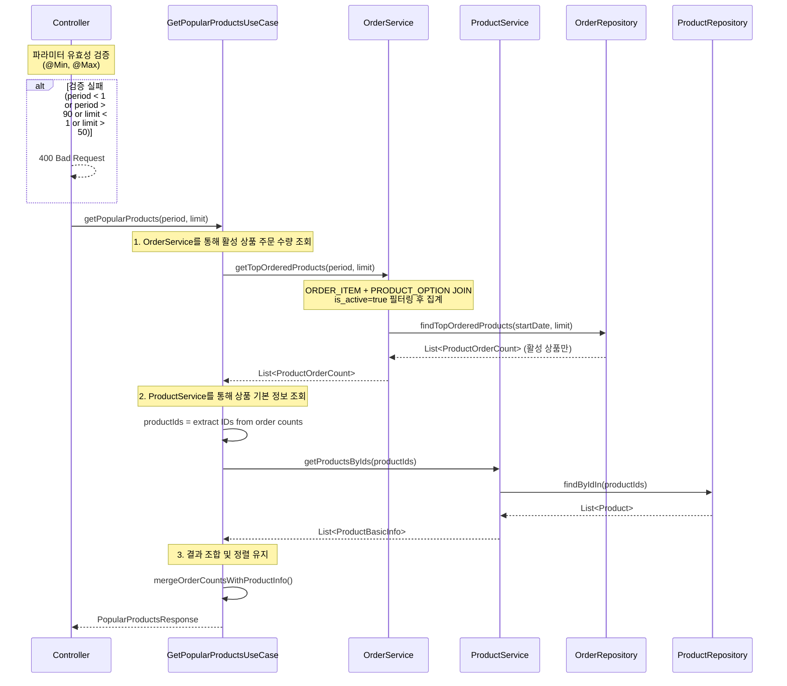

# 인기 상품 목록 조회 API

## 1. 개요

### 1.1 목적
- 특정 기간 동안 가장 많이 주문된 상품 목록을 조회하여 고객에게 인기 상품을 추천합니다.

### 1.2 사용 시나리오
- 메인 페이지의 "인기 상품" 섹션 표시
- 마케팅 캠페인을 위한 인기 상품 분석
- 재고 관리를 위한 수요 예측

### 1.3 PRD 참고
- 상품 도메인: 상품 기본 정보 제공
- 주문 도메인: 주문 수량 집계

### 1.4 연관 테이블
- `PRODUCT`: 상품 기본 정보
- `PRODUCT_OPTION`: 상품 옵션 정보 (가격, 옵션명)
- `ORDER_ITEM`: 주문 상품 정보 (주문 수량 집계용, created_at으로 기간 필터링)

---

## 2. API 명세

### 2.1 Endpoint
```
GET /api/products/popular
```

### 2.2 Request Parameters

| 파라미터 | 타입 | 필수 | 기본값 | 설명 |
|---------|------|------|--------|------|
| period | Integer | N | 7 | 조회 기간 (일 단위, 1~90일) |
| limit | Integer | N | 10 | 조회할 상품 개수 (1~50개) |

### 2.3 Request Example
```http
GET /api/products/popular?period=7&limit=10
```

### 2.4 Response (Success)

**HTTP Status**: `200 OK`

```json
{
  "data": {
    "products": [
      {
        "productId": 1,
        "productName": "에티오피아 예가체프 G1",
        "brand": "Bean Bliss",
        "totalOrderCount": 150,
        "description": "플로럴하고 과일향이 풍부한 에티오피아 대표 원두"
      },
      {
        "productId": 2,
        "productName": "콜롬비아 수프리모",
        "brand": "Bean Bliss",
        "totalOrderCount": 120,
        "description": "부드러운 맛과 균형잡힌 바디감"
      }
    ]
  }
}
```

### 2.5 Response Schema

```
{
  data: {
    products: [                  // 인기 상품 목록
      {
        productId: number,       // 상품 ID
        productName: string,     // 상품명
        brand: string,           // 브랜드
        totalOrderCount: number, // 총 주문 수량 (period 기간 내)
        description: string      // 상품 설명
      }
    ]
  }
}
```

### 2.6 HTTP Status Codes

| Status Code | 설명 |
|------------|------|
| 200 OK | 조회 성공 |
| 400 Bad Request | 유효하지 않은 파라미터 (period 또는 limit 범위 초과) |
| 500 Internal Server Error | 서버 내부 오류 |

### 2.7 Error Codes

| Error Code | HTTP Status | 설명 |
|-----------|-------------|------|
| INVALID_PARAMETER | 400 | period 또는 limit 파라미터가 유효하지 않음 |

---

## 3. 비즈니스 로직

### 3.1 핵심 비즈니스 규칙

1. **인기 상품 판별 기준**
   - 주문 수(`ORDER_ITEM.quantity`의 합계) 기준으로 정렬
   - 동일한 주문 수일 경우, 상품 ID 오름차순 정렬

2. **기간 필터링**
   - `ORDER_ITEM.created_at` 기준으로 `period` 일 이전부터 현재까지의 주문 집계
   - 예: period=7 → 최근 7일간의 ORDER_ITEM 데이터
   - **성능 최적화**: JOIN 전에 created_at으로 먼저 필터링하여 JOIN 대상 축소

3. **활성 상품 필터링**
   - **중요**: ORDER_ITEM (기간 필터링 후) + PRODUCT_OPTION JOIN 시 `PRODUCT_OPTION.is_active = true` 필터링
   - 집계 전에 비활성 상품을 제외해야 정확히 `limit` 개수만큼 결과 반환 가능
   - 비활성 상품을 나중에 필터링하면 요청한 limit보다 적은 결과가 반환될 수 있음

### 3.2 유효성 검사

**Controller 계층에서 파라미터 검증을 수행합니다.**

1. **period 검증**
   - 1 이상 90 이하여야 함
   - 범위를 벗어나면 400 Bad Request 반환

2. **limit 검증**
   - 1 이상 50 이하여야 함
   - 범위를 벗어나면 400 Bad Request 반환

### 3.3 정렬 규칙

- 주문 수, productId 순

---

## 4. 구현 시 고려사항

### 4.1 성능 최적화

1. **인덱스 활용**
   ```sql
   -- ORDER_ITEM 테이블
   INDEX idx_order_item_created_at ON ORDER_ITEM(created_at)
   INDEX idx_order_item_product_option_id ON ORDER_ITEM(product_option_id)
   ```

2. **쿼리 최적화**
   - **1차 쿼리 (OrderService)**: ORDER_ITEM 필터링 후 PRODUCT_OPTION JOIN
     - WHERE: `ORDER_ITEM.created_at >= (현재 - period일)` (먼저 필터링하여 JOIN 대상 축소)
     - JOIN: PRODUCT_OPTION ON product_option_id
     - WHERE: `PRODUCT_OPTION.is_active = true`
     - GROUP BY: product_id
     - ORDER BY: SUM(quantity) DESC, product_id ASC
     - LIMIT: limit
   - **2차 쿼리 (ProductService)**: PRODUCT 조회
     - WHERE: product_id IN (...)
     - SELECT: id, name, brand, description
   - 두 번의 쿼리로 분리하여 N+1 문제 방지

3. **캐싱 전략**
   - 인기 상품은 자주 변경되지 않으므로 5~10분 캐싱 고려
   - Redis를 활용한 캐시 레이어 구성 (선택사항)

### 4.2 데이터 일관성

1. **활성 상품 필터링**
   - ORDER_ITEM 집계 시점에 `PRODUCT_OPTION.is_active = true` 필터링 (필수)
   - 비활성 상품을 포함하여 집계 후 필터링하면 limit 개수 미달 발생

### 4.3 확장성

1. **기간별 집계 테이블 고려**
   - 주문 수가 많아지면 실시간 집계 부담 증가
   - 배치 작업으로 일별/주별 집계 테이블 생성 고려

2. **페이징 미지원**
   - 인기 상품은 제한된 개수(최대 50개)만 조회
   - 페이징 불필요

---

## 5. 레이어드 아키텍처 흐름

### 5.1 UseCase 기반 서비스 오케스트레이션



### 5.2 트랜잭션 범위

- **읽기 전용 작업**: `@Transactional(readOnly = true)`
- UseCase 레벨에 트랜잭션 적용
- 데이터 일관성 보장
