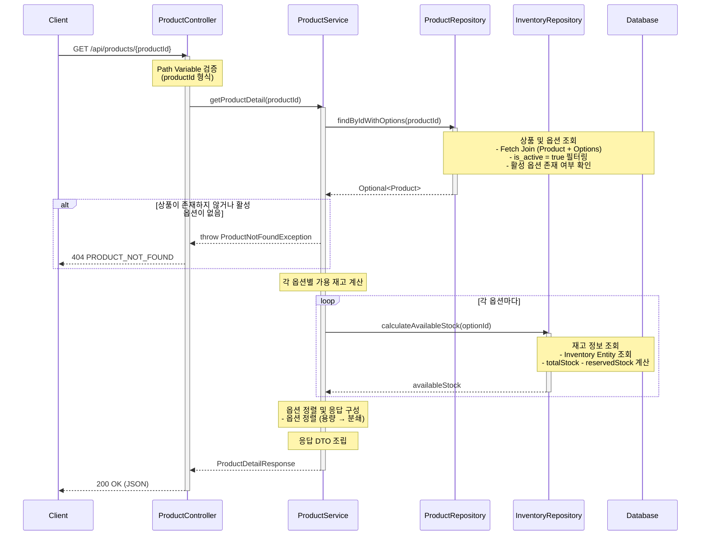

# 상품 상세 조회 API 설계

## 1. 개요
- **목적**: 특정 상품의 상세 정보와 옵션별 가격/재고 정보를 조회
- **사용 시나리오**: 고객이 상품 목록에서 특정 상품을 클릭하여 상세 페이지로 이동할 때
- **PRD 참고**: PROD-002, PROD-003
- **연관 테이블**: PRODUCT, PRODUCT_OPTION, INVENTORY, INVENTORY_RESERVATION

---

## 2. API 명세

### 2.1 Endpoint
```
GET /api/products/{productId}
```

### 2.2 Path Parameters
| 파라미터 | 타입 | 필수 | 설명 |
|---------|------|------|------|
| productId | Long | Y | 조회할 상품 ID |

### 2.3 Request Example
```http
GET /api/products/1
```

### 2.4 Response (Success)
```json
{
  "data": {
    "productId": 1,
    "name": "에티오피아 예가체프 G1",
    "description": "플로럴한 향과 밝은 산미가 특징인 에티오피아 대표 원두",
    "brand": "Bean Bliss",
    "createdAt": "2025-01-15T10:30:00",
    "options": [
      {
        "optionId": 1,
        "optionCode": "ETH-WB-200",
        "origin": "Ethiopia",
        "grindType": "WHOLE_BEANS",
        "weightGrams": 200,
        "price": 18000,
        "availableStock": 50
      },
      {
        "optionId": 2,
        "optionCode": "ETH-HD-200",
        "origin": "Ethiopia",
        "grindType": "HAND_DRIP",
        "weightGrams": 200,
        "price": 21000,
        "availableStock": 8
      },
      {
        "optionId": 3,
        "optionCode": "ETH-WB-500",
        "origin": "Ethiopia",
        "grindType": "WHOLE_BEANS",
        "weightGrams": 500,
        "price": 42000,
        "availableStock": 0
      },
      {
        "optionId": 4,
        "optionCode": "ETH-HD-500",
        "origin": "Ethiopia",
        "grindType": "HAND_DRIP",
        "weightGrams": 500,
        "price": 48000,
        "availableStock": 15
      }
    ]
  }
}
```

### 2.5 Response Schema
```
{
  "data": {
    "productId": long,              // 상품 ID
    "name": string,                 // 상품명
    "description": string,          // 상품 설명
    "brand": string,                // 브랜드명
    "createdAt": datetime,          // 상품 등록일시
    "options": [
      {
        "optionId": long,           // 옵션 ID
        "optionCode": string,       // 옵션 코드 (SKU)
        "origin": string,           // 원산지
        "grindType": string,        // 분쇄 타입 (WHOLE_BEANS, HAND_DRIP, ESPRESSO)
        "weightGrams": int,         // 용량 (그램)
        "price": int,               // 가격 (원)
        "availableStock": int       // 가용 재고 수량
      }
    ]
  }
}
```

### 2.6 HTTP Status Codes
| 상태 코드 | 설명 |
|-----------|------|
| 200 OK | 정상 조회 |
| 404 Not Found | 존재하지 않는 상품 ID |
| 400 Bad Request | 잘못된 요청 (productId 형식 오류) |
| 500 Internal Server Error | 서버 내부 오류 |

### 2.7 Error Codes
| 에러 코드 | 설명 | HTTP Status |
|-----------|------|-------------|
| PRODUCT_NOT_FOUND | 요청한 상품을 찾을 수 없음 | 404 |
| INVALID_PRODUCT_ID | 상품 ID 형식이 유효하지 않음 | 400 |

---

## 3. 비즈니스 로직

### 3.1 가용 재고 계산
- `availableStock`은 실시간으로 계산되어 반환됩니다
- 계산식: `INVENTORY.stock_quantity - SUM(INVENTORY_RESERVATION.quantity WHERE status = 'RESERVED')`
- 참고: `docs/concurrency/inventory.md`

### 3.2 필터링 조건
- **옵션 레벨**: `PRODUCT_OPTION.is_active = true`인 옵션만 포함
  - 비활성 옵션은 응답에서 제외
- **최소 옵션 조건**: 최소 1개 이상의 활성 옵션이 있어야 조회 가능
  - 모든 옵션이 비활성인 경우 `PRODUCT_NOT_FOUND` 에러 반환
- **품절 옵션 포함**: `availableStock = 0`인 옵션도 응답에 포함
  - 프론트엔드에서 품절 여부 판단 가능 (availableStock <= 0)

### 3.3 정렬 규칙
- 옵션은 용량(weightGrams) 오름차순 → 분쇄 타입(grindType) 오름차순으로 정렬

---

## 4. 구현 시 고려사항

### 4.1 성능 최적화
- 상품과 옵션을 한 번의 쿼리로 조회 (N+1 문제 방지)
  - JPA Fetch Join 활용
- 가용 재고는 별도 서브쿼리 또는 조인으로 계산
- productId에 인덱스 활용 (Primary Key)

### 4.2 동시성 제어
- 가용 재고는 조회 시점 기준 계산값
- 실제 주문 시 재고 재검증 필요 (주문 API에서 처리)
- 조회 API는 읽기 전용이므로 낙관적 락 불필요

### 4.3 데이터 일관성
- 비활성 옵션(`PRODUCT_OPTION.is_active = false`)은 응답에서 제외
- 모든 옵션이 비활성인 상품은 `PRODUCT_NOT_FOUND` 처리
- 존재하지 않는 상품 ID 조회 시 `PRODUCT_NOT_FOUND` 처리

---

## 5. 레이어드 아키텍처 흐름



### 5.1 트랜잭션 범위
- **격리 수준**: READ_COMMITTED
- **읽기 전용**: `@Transactional(readOnly = true)`
- 별도의 데이터 수정이 없으므로 트랜잭션 롤백 불필요

### 5.2 예외 처리
1. **상품 조회 실패**
   - 존재하지 않는 productId → `PRODUCT_NOT_FOUND` (404)
   - 활성 옵션이 없는 상품 → `PRODUCT_NOT_FOUND` (404)

2. **파라미터 검증 실패**
   - productId가 숫자가 아님 → `INVALID_PRODUCT_ID` (400)
   - productId가 음수 → `INVALID_PRODUCT_ID` (400)

3. **데이터베이스 오류**
   - DB 연결 실패 → `INTERNAL_SERVER_ERROR` (500)
   - 쿼리 실행 실패 → `INTERNAL_SERVER_ERROR` (500)

---

## 6. 추가 고려사항

### 6.1 옵션 조합 선택 시나리오
- 고객이 분쇄도와 용량을 선택하면, 프론트엔드에서 해당 조합에 맞는 optionId 를 찾아서 가격과 재고를 표시
- 예: "핸드드립 + 200g" 선택 → optionId=2의 가격(21,000원)과 재고(8개) 표시

### 6.2 품절 옵션 표시
- 품절된 옵션(`availableStock = 0`)도 응답에 포함하여 고객이 어떤 옵션이 있는지 확인 가능
- 프론트엔드에서 `availableStock <= 0`인 옵션은 비활성화(disabled) 처리
