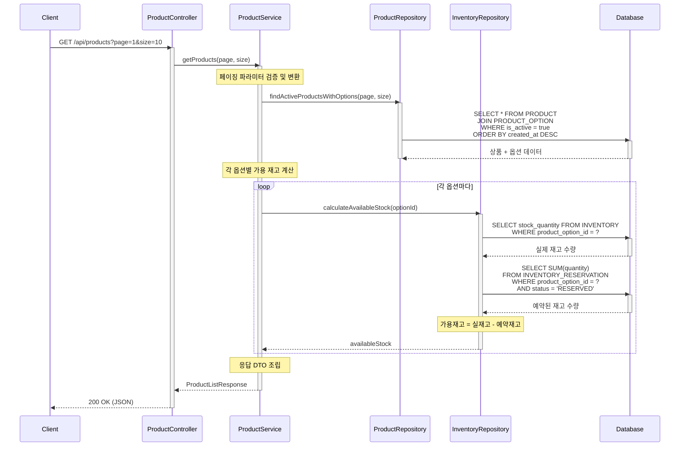

# 상품 API 설계

## 1. 상품 목록 조회 (옵션 포함)

### 1.1 개요
- **목적**: 주문 가능한 상품 목록과 각 상품의 옵션 정보를 함께 조회
- **사용 시나리오**: 고객이 쇼핑몰 메인 페이지 또는 상품 목록 페이지에서 상품을 탐색할 때
- **PRD 참고**: PROD-001, PROD-002, PROD-003
- **연관 테이블**: PRODUCT, PRODUCT_OPTION, INVENTORY, INVENTORY_RESERVATION

### 1.2 API 명세

#### Endpoint
```
GET /api/products
```

#### Request Parameters
| 파라미터 | 타입 | 필수 | 설명 | 기본값 |
|---------|------|------|------|--------|
| page | Integer | N | 페이지 번호 (1부터 시작) | 1 |
| size | Integer | N | 페이지 크기 | 20 |

#### Request Example
```http
GET /api/products?page=1&size=10
```

#### Response (Success)
```json
{
  "data": {
    "content": [
      {
        "productId": 1,
        "name": "에티오피아 예가체프 G1",
        "description": "플로럴한 향과 밝은 산미가 특징인 에티오피아 대표 원두",
        "brand": "Bean Bliss",
        "createdAt": "2025-01-15T10:30:00",
        "options": [
          {
            "optionId": 1,
            "optionCode": "ETH-WB-200",
            "origin": "Ethiopia",
            "grindType": "WHOLE_BEANS",
            "weightGrams": 200,
            "price": 18000,
            "availableStock": 50
          },
          {
            "optionId": 2,
            "optionCode": "ETH-HD-200",
            "origin": "Ethiopia",
            "grindType": "HAND_DRIP",
            "weightGrams": 200,
            "price": 21000,
            "availableStock": 8
          },
          {
            "optionId": 3,
            "optionCode": "ETH-WB-500",
            "origin": "Ethiopia",
            "grindType": "WHOLE_BEANS",
            "weightGrams": 500,
            "price": 42000,
            "availableStock": 0
          }
        ]
      },
      {
        "productId": 2,
        "name": "콜롬비아 수프리모",
        "description": "균형잡힌 바디감과 부드러운 맛",
        "brand": "Bean Bliss",
        "createdAt": "2025-01-14T09:20:00",
        "options": [
          {
            "optionId": 4,
            "optionCode": "COL-HD-500",
            "origin": "Colombia",
            "grindType": "HAND_DRIP",
            "weightGrams": 500,
            "price": 38000,
            "availableStock": 25
          }
        ]
      }
    ],
    "pageable": {
      "pageNumber": 1,
      "pageSize": 10,
      "totalElements": 2,
      "totalPages": 1
    }
  }
}
```

#### Response Schema
```
{
  "data": {
    "content": [
      {
        "productId": long,           // 상품 ID
        "name": string,              // 상품명
        "description": string,       // 상품 설명
        "brand": string,             // 브랜드명
        "createdAt": datetime,       // 상품 등록일시
        "options": [
          {
            "optionId": long,        // 옵션 ID
            "optionCode": string,    // 옵션 코드 (SKU)
            "origin": string,        // 원산지
            "grindType": string,     // 분쇄 타입 (WHOLE_BEANS, HAND_DRIP, ESPRESSO)
            "weightGrams": int,      // 용량 (그램)
            "price": int,            // 가격 (원)
            "availableStock": int    // 가용 재고 수량
          }
        ]
      }
    ],
    "pageable": {
      "pageNumber": int,             // 현재 페이지 번호
      "pageSize": int,               // 페이지 크기
      "totalElements": long,         // 전체 상품 수
      "totalPages": int              // 전체 페이지 수
    }
  }
}
```

#### HTTP Status Codes
| 상태 코드 | 설명 |
|-----------|------|
| 200 OK | 정상 조회 |
| 400 Bad Request | 잘못된 요청 파라미터 |
| 500 Internal Server Error | 서버 내부 오류 |

#### Error Codes
| 에러 코드 | 설명 | HTTP Status |
|-----------|------|-------------|
| INVALID_PARAMETER | 요청 파라미터가 유효하지 않음 | 400 |

### 1.3 비즈니스 로직

#### 가용 재고 계산
- `availableStock`은 실시간으로 계산되어 반환됩니다
- 계산식: `INVENTORY.stock_quantity - SUM(INVENTORY_RESERVATION.quantity WHERE status = 'RESERVED')`
- 참고: `docs/concurrency/inventory.md`

#### 정렬
- 기본 정렬: `created_at DESC` (최신 등록 상품이 먼저 노출)

#### 필터링 조건
- **상품 레벨**: `PRODUCT`의 `is_active = true`인 상품만 조회
- **옵션 레벨**: `PRODUCT_OPTION`의 `is_active = true`인 옵션만 포함
- 비활성 상품 및 옵션은 응답에 포함되지 않음
- 페이지네이션은 활성 상품에 대해서만 적용

### 1.4 구현 시 고려사항

1. **성능 최적화**
   - 상품과 옵션을 한 번의 쿼리로 조회 (N+1 문제 방지)
   - 가용 재고는 별도 서브쿼리 또는 조인으로 계산
   - 페이징 처리를 위한 인덱스 활용 (created_at, is_active)

2. **동시성 제어**
   - 가용 재고는 조회 시점 기준 계산값
   - 실제 주문 시 재고 재검증 필요

3. **데이터 일관성**
   - 비활성 상품(`PRODUCT.is_active = false`)은 조회 쿼리에서 제외
   - 비활성 옵션(`PRODUCT_OPTION.is_active = false`)은 응답에서 제외
   - 활성 상품이지만 활성 옵션이 없는 경우 빈 배열(`[]`)로 반환

4. **확장성**
   - 향후 필터링 파라미터 추가 가능 (원산지, 가격 범위 등)
   - 검색 기능 추가 가능

### 1.5 레이어드 아키텍처 흐름



#### 트랜잭션 범위
- **READ_COMMITTED**: 조회 전용 API로 트랜잭션 격리 수준은 READ_COMMITTED 사용
- 별도의 데이터 수정이 없으므로 트랜잭션 롤백 불필요

#### 예외 처리
- 페이징 파라미터 검증 실패 → `INVALID_PARAMETER` (400)
- 서버 내부 오류 → `INTERNAL_SERVER_ERROR` (500)
