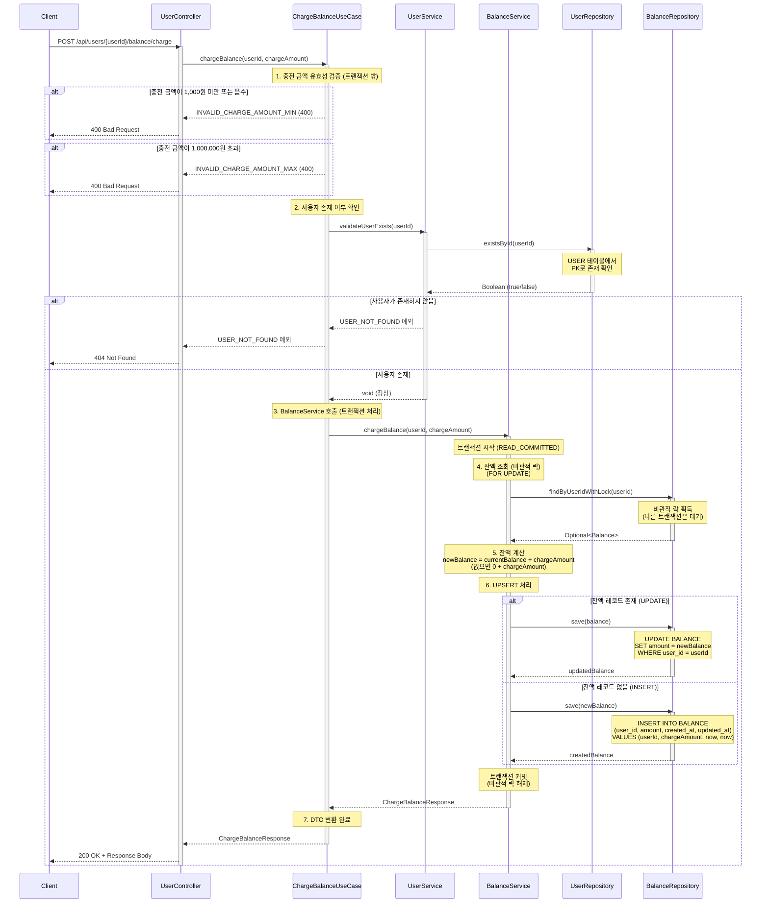

# 사용자 잔액 충전 API

## 1. 개요

### 목적
사용자 예치금(잔액)을 충전하여 주문 결제 시 사용할 수 있도록 합니다.

### 사용 시나리오
- 고객이 주문 결제를 위해 미리 잔액을 충전
- 충전된 금액은 주문 시 즉시 사용 가능
- 실시간 잔액 업데이트 및 조회

### PRD 참고
- **기능 ID**: USER-002 (잔액 충전)
- **시나리오**: (2) 주문 및 결제

### 연관 테이블
- `USER`: 사용자 정보
- `BALANCE`: 사용자별 잔액 정보 (1:1 관계)

---

## 2. API 명세

### Endpoint
```
POST /api/users/{userId}/balance/charge
```

### Request Parameters

#### Path Parameters
| Parameter | Type   | Required | Description     |
|-----------|--------|----------|-----------------|
| userId    | Long   | Yes      | 사용자 ID       |

#### Request Body
| Field         | Type    | Required | Description                                        |
|---------------|---------|----------|----------------------------------------------------|
| chargeAmount  | Integer | Yes      | 충전 금액 (양수, 최소 1,000원, 최대 1,000,000원)   |

### Request Example
```http
POST /api/users/123/balance/charge

{
  "chargeAmount": 50000
}
```

### Response (Success)

**HTTP Status**: `200 OK`

```json
{
  "data": {
    "userId": 123,
    "currentBalance": 80000,
    "chargedAt": "2025-11-04T14:30:00"
  }
}
```

### Response Schema

```
{
  "data": {
    "userId": "long",              // 사용자 ID
    "currentBalance": "int",       // 충전 후 현재 잔액
    "chargedAt": "datetime"        // 충전 시각
  }
}
```

### HTTP Status Codes

| Status Code | Description                                  |
|-------------|----------------------------------------------|
| 200         | 성공 (잔액 충전 완료)                        |
| 400         | 잘못된 요청 (유효하지 않은 입력값)           |
| 404         | 사용자를 찾을 수 없음                        |
| 500         | 서버 내부 오류                               |

### Error Codes

| Error Code                  | HTTP Status | Message                                                |
|-----------------------------|-------------|--------------------------------------------------------|
| USER_NOT_FOUND              | 404         | 사용자를 찾을 수 없습니다.                             |
| INVALID_CHARGE_AMOUNT_MIN   | 400         | 충전 금액은 1,000원 이상이어야 합니다.                 |
| INVALID_CHARGE_AMOUNT_MAX   | 400         | 1회 최대 충전 금액은 1,000,000원입니다.                |
| INVALID_INPUT               | 400         | 입력값이 올바르지 않습니다.                            |
| INTERNAL_SERVER_ERROR       | 500         | 서버 내부 오류가 발생했습니다.                         |

---

## 3. 비즈니스 로직

### 핵심 비즈니스 규칙

#### 1. 충전 금액 유효성 검증
- **최소 금액**: 1,000원 이상
- **최대 금액**: 1,000,000원 이하 (1회 충전 한도)
- **양수 검증**: 충전 금액은 양수여야 함
- **타입 검증**: Integer 타입 (음수, 0, 소수점 불가)
- **실패 시**:
  - 최소 금액 미만: `INVALID_CHARGE_AMOUNT_MIN` 예외 발생 (400)
  - 최대 금액 초과: `INVALID_CHARGE_AMOUNT_MAX` 예외 발생 (400)

#### 2. 사용자 존재 여부 확인
- **검증**: `USER` 테이블에서 `userId`로 사용자 조회
- **실패 시**: `USER_NOT_FOUND` 예외 발생 (404)

#### 3. 잔액 조회 또는 초기화 (비관적 락)
- **목적**: 동시 충전 요청 시 데이터 정합성 보장
- **방식**:
  ```sql
  SELECT * FROM BALANCE
  WHERE user_id = :userId
  FOR UPDATE;
  ```
- **동작**:
  - `FOR UPDATE`: 해당 행에 비관적 락 설정
  - 다른 트랜잭션은 락이 해제될 때까지 대기
  - 동시에 여러 충전 요청이 들어와도 순차적으로 처리
- **결과**:
  - **레코드 존재**: 기존 잔액 반환
  - **레코드 없음**: 0원으로 간주 (다음 단계에서 INSERT)

#### 4. 잔액 업데이트 (UPSERT)
- **계산식**: `new_balance = current_balance + charge_amount`
- **UPSERT 처리**:
  - **레코드 존재 시 (UPDATE)**:
    ```sql
    UPDATE BALANCE
    SET amount = :newBalance,
        updated_at = :now
    WHERE user_id = :userId;
    ```
  - **레코드 없을 시 (INSERT)**:
    ```sql
    INSERT INTO BALANCE (user_id, amount, created_at, updated_at)
    VALUES (:userId, :chargeAmount, :now, :now);
    ```
- **결과**: 업데이트 또는 생성된 잔액 정보 반환

#### 5. 트랜잭션 커밋 및 응답
- **트랜잭션 범위**: 1~4단계 전체
- **커밋 시점**: 모든 단계 성공 시
- **응답**: 충전 후 현재 잔액, 충전 시각 반환

### 유효성 검사

| 항목                   | 검증 조건                                          | 실패 시 예외                     |
|------------------------|----------------------------------------------------|----------------------------------|
| 충전 금액 최소값       | `chargeAmount >= 1000`                             | `INVALID_CHARGE_AMOUNT_MIN`      |
| 충전 금액 최대값       | `chargeAmount <= 1000000`                          | `INVALID_CHARGE_AMOUNT_MAX`      |
| 충전 금액 양수         | `chargeAmount > 0`                                 | `INVALID_CHARGE_AMOUNT_MIN`      |
| 사용자 존재 여부       | `USER.id = userId`                                 | `USER_NOT_FOUND`                 |

---

## 4. 구현 시 고려사항

### 동시성 제어

#### FOR UPDATE 비관적 락 전략
- **목적**: 동시 충전 요청 시 잔액 정합성 보장
- **특징**:
  - **데이터 정합성**: Lost Update 문제 방지
  - **순차 처리**: 락을 획득한 트랜잭션만 잔액 업데이트 수행
  - **대기 시간**: 다른 트랜잭션은 락 해제까지 대기

#### 락 대기 시간 설정
- **타임아웃**: 5초 (설정 가능)
- **초과 시**: `LockTimeoutException` 발생 → 재시도 또는 실패 응답

### 성능 최적화

#### 1. 인덱스 설정
```sql
-- BALANCE 테이블
CREATE UNIQUE INDEX idx_balance_user_id
ON BALANCE(user_id);
```

#### 2. 트랜잭션 범위 최소화
- 유효성 검증: 트랜잭션 밖에서 수행 (빠른 실패)
- 잔액 조회 ~ 업데이트: 트랜잭션 내에서 원자적으로 수행

#### 3. 쿼리 최적화
- `user_id` 인덱스 활용: O(1) 조회
- 단일 UPDATE 쿼리: 네트워크 오버헤드 최소화

### 데이터 일관성

#### 트랜잭션 보장
- **격리 수준**: `READ_COMMITTED`
  - Dirty Read 방지
  - `FOR UPDATE` 락으로 Lost Update 방지
- **원자성**: 잔액 조회 ~ 업데이트가 모두 성공하거나 모두 실패

#### UNIQUE 제약 조건
- `BALANCE(user_id)`: 사용자당 하나의 잔액 정보만 존재
- DB 레벨에서 1:1 관계 보장

---

## 5. 레이어드 아키텍처 흐름



### 트랜잭션 범위 및 격리 수준

#### 트랜잭션 범위
- **관리 계층**: BalanceService
- **시작**: BalanceService.chargeBalance() 진입 시 (잔액 조회 전)
- **종료**: 잔액 업데이트 완료 (6단계)
- **이유**:
  - UseCase는 유효성 검증과 사용자 확인을 트랜잭션 밖에서 수행 (빠른 실패 처리)
  - BalanceService는 잔액 조회부터 업데이트까지 원자적으로 처리

#### 격리 수준
- **레벨**: `READ_COMMITTED`
- **이유**:
  - Dirty Read 방지 (커밋된 데이터만 읽음)
  - `FOR UPDATE` 락으로 Lost Update 방지
  - 과도한 격리 수준(REPEATABLE_READ, SERIALIZABLE)은 성능 저하 유발

### 예외 처리 흐름

#### 1. 충전 금액 유효성 검증 실패

##### 1-1. 최소 금액 미만 (1,000원 미만)
- **예외**: `IllegalArgumentException` ("충전 금액은 1,000원 이상이어야 합니다")
- **Error Code**: `INVALID_CHARGE_AMOUNT_MIN`
- **HTTP Status**: 400 Bad Request
- **처리**: ChargeBalanceUseCase에서 검증 후 예외 발생 → GlobalExceptionHandler에서 일괄 처리
- **트랜잭션**: 시작 전이므로 롤백 불필요

##### 1-2. 최대 금액 초과 (1,000,000원 초과)
- **예외**: `IllegalArgumentException` ("1회 최대 충전 금액은 1,000,000원입니다")
- **Error Code**: `INVALID_CHARGE_AMOUNT_MAX`
- **HTTP Status**: 400 Bad Request
- **처리**: ChargeBalanceUseCase에서 검증 후 예외 발생 → GlobalExceptionHandler에서 일괄 처리
- **트랜잭션**: 시작 전이므로 롤백 불필요

#### 2. 사용자 존재 여부 확인 실패
- **예외**: `ResourceNotFoundException` ("사용자를 찾을 수 없습니다")
- **HTTP Status**: 404 Not Found
- **처리**: ChargeBalanceUseCase에서 UserService 호출 후 예외 발생 → GlobalExceptionHandler에서 일괄 처리
- **트랜잭션**: 시작 전이므로 롤백 불필요

#### 3. 락 타임아웃
- **예외**: `LockTimeoutException`
- **HTTP Status**: 503 Service Unavailable
- **처리**: 트랜잭션 자동 롤백, GlobalExceptionHandler에서 일괄 처리
- **권장**: 클라이언트에게 재시도 요청

#### 4. DB 오류
- **예외**: `DataAccessException`
- **HTTP Status**: 500 Internal Server Error
- **처리**: 트랜잭션 자동 롤백, GlobalExceptionHandler에서 일괄 처리
