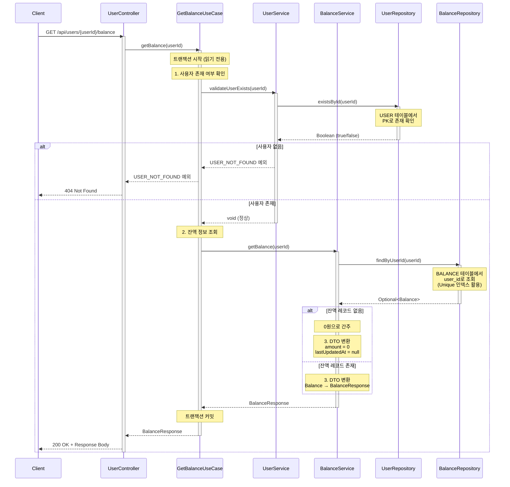

# 사용자별 잔액 조회 API

## 1. 개요

### 목적
사용자의 현재 사용 가능한 잔액(예치금)을 조회합니다. 주문 결제 전 잔액 확인 또는 충전 필요 여부 판단 시 사용됩니다.

### 사용 시나리오
- 고객이 주문 페이지에서 결제 수단으로 '잔액 결제'를 선택할 때 현재 잔액 확인
- 마이페이지에서 보유한 잔액 확인
- 잔액 부족 시 충전 안내

### PRD 참고
- **기능 ID**: USER-001 (잔액 조회)
- **시나리오**: (2) 주문 및 결제

### 연관 테이블
- `BALANCE`: 사용자별 현재 잔액 관리 (USER와 1:1 관계)
- `USER`: 사용자 정보

---

## 2. API 명세

### Endpoint
```
GET /api/users/{userId}/balance
```

### Request Parameters

#### Path Parameters
| Parameter | Type   | Required | Description     |
|-----------|--------|----------|-----------------|
| userId    | Long   | Yes      | 사용자 ID       |

### Request Example
```http
GET /api/users/123/balance
```

### Response (Success)

**HTTP Status**: `200 OK`

```json
{
  "data": {
    "userId": 123,
    "amount": 50000,
    "lastUpdatedAt": "2025-11-03T14:30:00"
  }
}
```

### Response Schema

```
{
  "data": {
    "userId": "long",                // 사용자 ID
    "amount": "decimal",             // 현재 잔액 (원 단위)
    "lastUpdatedAt": "datetime"      // 마지막 변경 일시
  }
}
```

### HTTP Status Codes

| Status Code | Description                                  |
|-------------|----------------------------------------------|
| 200         | 성공 (잔액 정보 반환)                        |
| 404         | 사용자를 찾을 수 없음                        |
| 500         | 서버 내부 오류                               |

### Error Codes

| Error Code             | HTTP Status | Message                                      |
|------------------------|-------------|----------------------------------------------|
| USER_NOT_FOUND         | 404         | 사용자를 찾을 수 없습니다.                   |
| INTERNAL_SERVER_ERROR  | 500         | 서버 내부 오류가 발생했습니다.               |

---

## 3. 비즈니스 로직

### 핵심 비즈니스 규칙

#### 1. 사용자 잔액 조회
- **조회 대상**: `BALANCE` 테이블에서 `user_id`로 조회
- **관계**: USER와 1:1 관계 (사용자당 1개의 잔액 레코드)
- **레코드 없을 시**: 0원 반환 (예외 발생 X)
- **레코드 생성**: 첫 충전 시 자동 생성 (UPSERT)

#### 2. 잔액 정보
- **amount**: 현재 사용 가능한 잔액 (원 단위, decimal)
- **최소값**: 0원 (음수 불가)
- **변경 사유**:
  - 증가: 잔액 충전 (USER-002)
  - 감소: 주문 결제 (ORD-003)

### 유효성 검사

| 항목                   | 검증 조건                                          | 실패 시 예외                  |
|------------------------|----------------------------------------------------|-------------------------------|
| 사용자 존재 여부       | `USER.id = userId`                                 | `USER_NOT_FOUND`              |

---

## 4. 구현 시 고려사항

### 성능 최적화

#### 1. 인덱스 설정
```sql
-- BALANCE 테이블
CREATE UNIQUE INDEX idx_balance_user_id
ON BALANCE(user_id);
```

- `user_id`는 Unique 제약 조건 (1:1 관계)
- 인덱스를 통해 빠른 조회 보장

#### 2. 캐싱 전략
- 잔액은 결제 시마다 변경되므로 **캐싱 부적합**
- 충전/사용 시마다 캐시 무효화 필요
- **실시간 조회 권장**

#### 3. 쿼리 최적화
- 단일 테이블 조회로 성능 우수
- PK 또는 Unique 인덱스 활용으로 O(1) 조회

### 동시성 제어

- **조회 작업**: 락 불필요
- **일관성**: `READ_COMMITTED` 격리 수준으로 충분
- **읽기 트랜잭션**: `@Transactional(readOnly = true)` 사용

### 데이터 일관성

- **BALANCE.amount**: 항상 0 이상 유지
  - 결제 시 잔액 부족 검증 필수 (ORD-005)
  - 트랜잭션으로 원자성 보장
- **초기화**:
  - 조회 시: 레코드 없으면 0원 반환
  - 충전 시: 레코드 없으면 자동 생성 (UPSERT)

### 확장성

- **향후 기능 고려**:
  - 잔액 변동 이력 조회 (별도 `BALANCE_HISTORY` 테이블 추가)
  - 포인트, 마일리지 등 다양한 결제 수단 확장
  - 잔액 만료 정책 (유효기간)

---

## 5. 레이어드 아키텍처 흐름



### 트랜잭션 범위 및 격리 수준

#### 트랜잭션 범위
- **시작**: UseCase 계층 진입 (`GetBalanceUseCase.getBalance()`)
- **종료**: DTO 반환 완료
- **속성**: 읽기 전용 (`@Transactional(readOnly = true)`)

#### 격리 수준
- **레벨**: `READ_COMMITTED` (기본값)
- **이유**:
  - 단순 조회 작업이므로 Dirty Read만 방지하면 충분
  - 잔액 변경은 결제/충전 시에만 발생하므로 높은 격리 수준 불필요

### 예외 처리 흐름

#### 1. 사용자 미존재
- **예외**: `ResourceNotFoundException` (from UserService)
- **HTTP Status**: 404 Not Found
- **처리**: GlobalExceptionHandler에서 일괄 처리
- **발생 시점**: UseCase에서 UserService.validateUserExists() 호출 시
- **전파 경로**: UserService → UseCase → Controller → GlobalExceptionHandler

#### 2. DB 오류
- **예외**: `DataAccessException`
- **HTTP Status**: 500 Internal Server Error
- **처리**: GlobalExceptionHandler에서 일괄 처리
