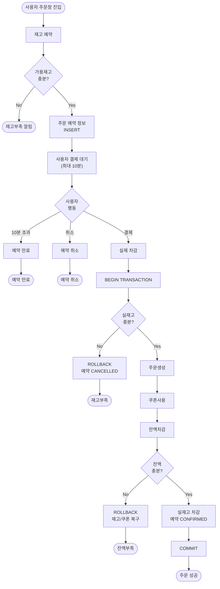

## 재고 관리

### 재고 선점(차감) 시점

- 실제 재고 차감(DB Update)은 **결제 직전**으로 결정
    - 주문창 진입 시 재고를 선점해놓으면 악의적인 사용자가 모든 재고를 선점할 수 있다는 위험성 고려
    - 결제 시점에 하나의 Transaction 으로 관리하면 결제가 실패할 때 재고도 롤백하는 직관적인 Flow 를 따를 수 있을 것이라 판단

### 재고 동시 구매 (동시성 제어)

- Lock 고려 사항
    - 재고에서 **오버셀링** 상황을 방지하기 위해 비관적 락을 통해 데이터 정확성이 유지되도록 하는 방향이 옳다고 판단
    - 하지만 **트래픽이 많은 환경**을 고려하면, 낙관적 락을 통한 성능 최적화를 고려해야한다고 생각
- 하이브리드 설계 적용
    - 재고 예약 테이블(INVENTORY_RESERVATION)을 추가한 동시성 제어 (ERD.md 문서 참고)
    - 비관적 Lock 기반으로 동작
    - 가용 재고 계산식 (재고(INVENTORY), 재고 예약(INVENTORY_RESERVATION)) 
        - `INVENTORY.stock_quantity - SUM(INVENTORY_RESERVATION.quantity)`
    1. 사용자가 주문 창 진입 시 재고 예약
        - 실제 재고를 차감하지 않음
        - 재고 예약 테이블에 주문/재고 정보 Insert (`주문 대기` 상태)
    2. 사용자가 주문 결제를 완료하면 실제 재고 차감 (비관적 Lock 적용)
        - 재고 예약 테이블 내 주문 예약 상태를 `결제 완료` 로 변경
    3. 주문 결제를 취소하면 주문 예약 상태를 `취소` 로 변경
    4. 주문 결제를 10분 이내에 완료하지 않으면 Timeout 으로 주문 예약 상태를 `만료` 로 변경 (MQ 이벤트 기반)
- 현 시점(v1.0)에서 주문 결제 만료 시나리오 기능 개발을 수행하지 않도록 제한

### 재고 관리 flow

